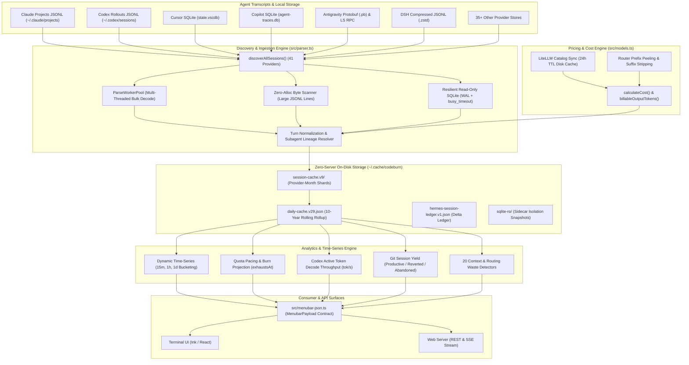

# Codeburn Architecture & Capabilities Reference

**Document Status:** Approved Reference Document  
**Target Audience:** AI Agents, Tool Builders, Systems Engineers  
**Primary Source Repository:** `repositories/codeburn`  
**Associated Research Documents:**
- [`docs/research/0061-codeburn-log-parsers-and-ingestion.md`](file:///Users/robin.a.paul/Proj/token-analyzer/docs/research/0061-codeburn-log-parsers-and-ingestion.md)
- [`docs/research/0062-codeburn-token-calculation-and-pricing-engine.md`](file:///Users/robin.a.paul/Proj/token-analyzer/docs/research/0062-codeburn-token-calculation-and-pricing-engine.md)
- [`docs/research/0063-codeburn-litellm-integration-architecture.md`](file:///Users/robin.a.paul/Proj/token-analyzer/docs/research/0063-codeburn-litellm-integration-architecture.md)
- [`docs/research/0064-codeburn-data-aggregation-and-metrics-model.md`](file:///Users/robin.a.paul/Proj/token-analyzer/docs/research/0064-codeburn-data-aggregation-and-metrics-model.md)

---

## 1. System Overview & Core Capabilities

`codeburn` is a high-performance, local-first token telemetry, AI spend analytics, and developer productivity monitoring engine. It operates passively by discovering and decoding log transcripts, SQLite state databases, and protobuf event streams generated by 41+ AI coding assistants across macOS, Linux, and Windows.



---

## 2. Ingestion Engine & Supported Formats

Codeburn supports **41 AI coding assistant and LLM provider formats** ([`src/providers/index.ts:L196-L254`](file:///Users/robin.a.paul/Proj/token-analyzer/repositories/codeburn/src/providers/index.ts#L196-L254)).

### 2.1 Storage Formats & Discovery Matrix

1. **Append-Only JSONL Transcripts:**
   - *Providers:* Claude Code (`~/.claude/projects/`), OpenAI Codex (`~/.codex/sessions/`), Droid (`~/.factory/sessions/`), Grok Build (`~/.grok/sessions/`), Qwen (`~/.qwen/projects/`), OpenClaude, Open Design, Mistral Vibe, Mux, Pi/OMP.
   - *Optimization:* Zero-allocation byte scanner (`src/parser.ts:L175-L940`) skips full JSON serialization on lines $>32\text{ KB}$, extracting keys (`type`, `timestamp`, `usage`, `cwd`) via forward byte searches.
2. **SQLite Database Stores:**
   - *Providers:* Cursor (`Cursor/User/globalStorage/state.vscdb`), GitHub Copilot (`agent-traces.db`, `session-store.db`), OpenCode (`opencode.db`), KiloCode, Forge, Goose, Warp (`warp.sqlite`), Zed (`threads.db`), Crush, Devin, Hermes.
   - *Resilience:* Uses `DatabaseSync` in `node:sqlite` with `PRAGMA busy_timeout = 1000`, readonly connection flags, and UTF-8 safe BLOB decoding (`CAST(... AS BLOB)`) to avoid process crashes on corrupted multi-byte chars ([`src/sqlite.ts:L9-L47`](file:///Users/robin.a.paul/Proj/token-analyzer/repositories/codeburn/src/sqlite.ts#L9-L47)).
3. **Compressed Streaming Archives (zstd):**
   - *Providers:* DeepSeek Harness (`dsh`, `session.jsonl.zstd`), Zed (`threads.db` compressed blobs).
   - *Implementation:* Iterative frame-by-frame decompressor (`scanZstdFrames`, [`src/providers/dsh.ts:L56-L99`](file:///Users/robin.a.paul/Proj/token-analyzer/repositories/codeburn/src/providers/dsh.ts#L56-L99)) tolerates trailing torn frames from interrupted processes.
4. **Protobuf Binaries & RPC:**
   - *Providers:* Antigravity (`~/.gemini/antigravity/conversations/*.pb`, SQLite `.db`, live LS RPC).
5. **REST API Ingestion:**
   - *Providers:* Vercel AI Gateway (`https://ai-gateway.vercel.sh/v1/report`).

### 2.2 Normalization & Turn Reconstruction Pipeline

- **Streaming Deduplication:** `dedupeStreamingMessageIds()` ([`src/parser.ts:L1526-L1548`](file:///Users/robin.a.paul/Proj/token-analyzer/repositories/codeburn/src/parser.ts#L1526-L1548)) binds the prompt start timestamp from the first chunk to the final token usage block from the last chunk.
- **Advisor Sub-calls:** Sub-turn advisor requests (`/advisor`) in Claude iterations are unpacked into separate `ParsedApiCall` records attributed to the advisor model ([`src/parser.ts:L1465-L1524`](file:///Users/robin.a.paul/Proj/token-analyzer/repositories/codeburn/src/parser.ts#L1465-L1524)).
- **Diff LOC Extraction:** `countStructuredPatchLoc()` and `countUnifiedDiffLoc()` extract added/removed lines from tool outputs ([`src/parser.ts:L1261-L1275`](file:///Users/robin.a.paul/Proj/token-analyzer/repositories/codeburn/src/parser.ts#L1261-L1275)).
- **Zero-Inference Lineage:** Work units (`CB-1`/`CB-2`) strictly require provider-recorded links (`parentAgentId`, sidechain `sessionId`, `agentSpawnLinks`) to bind subagents to orchestrators ([`src/work-units.ts:L74-L157`](file:///Users/robin.a.paul/Proj/token-analyzer/repositories/codeburn/src/work-units.ts#L74-L157)).
- **Git Worktree Canonicalization:** `.git` pointers and worktree references are traversed to group branch worktrees under the root repository project key ([`src/parser.ts:L124-L173`](file:///Users/robin.a.paul/Proj/token-analyzer/repositories/codeburn/src/parser.ts#L124-L173)).

---

## 3. Token Calculation & Cost Engine

### 3.1 Data Model
`TokenUsage` ([`src/types.ts:L1-L9`](file:///Users/robin.a.paul/Proj/token-analyzer/repositories/codeburn/src/types.ts#L1-L9)):
```typescript
export type TokenUsage = {
  inputTokens: number
  outputTokens: number
  cacheCreationInputTokens: number
  cacheReadInputTokens: number
  cachedInputTokens: number
  reasoningTokens: number
  webSearchRequests: number
}
```

### 3.2 Reasoning Token Output Invariant
To prevent double-billing on providers that bundle reasoning into output:
```typescript
const REASONING_INCLUDED_IN_OUTPUT = new Set(['claude', 'codex', 'copilot'])

export function billableOutputTokens(provider: string, outputTokens: number, reasoningTokens: number): number {
  return REASONING_INCLUDED_IN_OUTPUT.has(provider) ? outputTokens : outputTokens + reasoningTokens
}
```
([`src/models.ts:L27-L43`](file:///Users/robin.a.paul/Proj/token-analyzer/repositories/codeburn/src/models.ts#L27-L43)).

### 3.3 Prompt Caching & Cost Formula
Net turn cost is calculated via `calculateCost()` ([`src/models.ts:L1184-L1230`](file:///Users/robin.a.paul/Proj/token-analyzer/repositories/codeburn/src/models.ts#L1184-L1230)):
$$\text{Cost} = \text{Multiplier} \times \left( C_{\text{in}} + C_{\text{out}} + C_{\text{write,5m}} + C_{\text{write,1h}} + C_{\text{read}} + C_{\text{search}} \right)$$

Where:
- $C_{\text{in}} = \max(0, \text{inputTokens}) \times \text{rate}_{\text{input}}$
- $C_{\text{out}} = \max(0, \text{billableOutput}) \times \text{rate}_{\text{output}}$
- $C_{\text{write,5m}} = \text{tokens}_{\text{write,5m}} \times \text{rate}_{\text{write}}$
- $C_{\text{write,1h}} = \text{tokens}_{\text{write,1h}} \times \text{rate}_{\text{write}} \times 1.6$ (`ONE_HOUR_CACHE_WRITE_MULTIPLIER_FROM_FIVE_MINUTE_RATE = 1.6`)
- $C_{\text{read}} = \text{tokens}_{\text{read}} \times \text{rate}_{\text{read}}$ (default $0.10\times\text{rate}_{\text{input}}$)
- $C_{\text{search}} = \text{requests} \times \$0.01$
- $\text{Multiplier} = \text{speed} == \text{'fast'} \ ? \ \text{fastMultiplier} : 1.0$

### 3.4 Fallback Estimation Heuristics
When transcripts omit token metrics:
- Uses `estimateTokensFromChars(chars) = Math.ceil(chars / 4)` (`CHARS_PER_TOKEN = 4`, [`src/token-estimate.ts:L1-L5`](file:///Users/robin.a.paul/Proj/token-analyzer/repositories/codeburn/src/token-estimate.ts#L1-L5)).
- Flags call with `costIsEstimated: true` ([`src/types.ts:L139`](file:///Users/robin.a.paul/Proj/token-analyzer/repositories/codeburn/src/types.ts#L139)).
- Converts credit meters to USD: Kiro $1\text{ credit} = \$0.04$; Copilot $10^9\text{ nano-AIU} = \$0.01$.

---

## 4. LiteLLM Integration & Gateway Peeling

### 4.1 Ground-Truth Pricing Plane
Codeburn uses `BerriAI/litellm` as its primary pricing catalog source:
1. **Build-Time Bundling:** [`scripts/bundle-litellm.mjs`](file:///Users/robin.a.paul/Proj/token-analyzer/repositories/codeburn/scripts/bundle-litellm.mjs) merges LiteLLM `model_prices_and_context_window.json`, curated `MANUAL_ENTRIES`, `models.dev` first-party makers, and OpenRouter backstops into `src/data/litellm-snapshot.json` and `src/data/pricing-fallback.json`.
2. **Runtime 24-Hour Cache:** [`src/models.ts:L245-L327`](file:///Users/robin.a.paul/Proj/token-analyzer/repositories/codeburn/src/models.ts#L245-L327) checks `~/.cache/codeburn/litellm-pricing.json` (`CACHE_SCHEMA_VERSION = 3`). If older than 24 hours, fetches fresh rates asynchronously from raw GitHub.

### 4.2 Gateway Wrapper & Prefix Peeling
When completion logs contain routing wrappers:
- **Router Prefixes:** Iteratively peels `omniroute:`, `cp/`, `cline-pass/`, `cline-free/`, `cmd/`, `antigravity/`, `orcarouter/` ([`src/models.ts:L936-L975`](file:///Users/robin.a.paul/Proj/token-analyzer/repositories/codeburn/src/models.ts#L936-L975)).
- **Proxy Namespaces:** Strips recognized namespaces (`litellm_proxy/`, `openai_like/`, `zhipu/`, `mimo/`, `kimi/`).
- **Local Namespace Isolation:** Explicitly guards `LOCAL_NAMESPACES = ['ollama']` to prevent local runners from stripping down to commercial cloud rates.
- **Suffix Peeling:** Strips `:thinking`, `:cloud`, `-TEE`.

---

## 5. Storage Architecture & Analytics Model

### 5.1 Multi-Tier On-Disk Storage
- **`session-cache.v9/`:** Partitioned provider-month shards (`<provider>.<YYYY-MM>.json`) with envelope tracking (`envelope.json`), avoiding multi-megabyte rewrites on incremental turns ([`src/session-cache.ts:L415-L472`](file:///Users/robin.a.paul/Proj/token-analyzer/repositories/codeburn/src/session-cache.ts#L415-L472)).
- **`daily-cache.v29.json`:** 10-year rolling rollup with "never-lose history" that carries forward sourceless days (`carried: true`) when host tools purge old logs ([`src/daily-cache.ts:L105-L207`](file:///Users/robin.a.paul/Proj/token-analyzer/repositories/codeburn/src/daily-cache.ts#L105-L207)).
- **Midnight Split Alignment:** Prompts are anchored to the user-message timestamp; token and cost totals are bucketed by each assistant call's execution timestamp ([`src/day-aggregator.ts:L97-L115`](file:///Users/robin.a.paul/Proj/token-analyzer/repositories/codeburn/src/day-aggregator.ts#L97-L115)).

### 5.2 Advanced Metrics & Projections
- **Granular History:** Dynamic multi-resolution time series ($\le 48\text{h} \implies 15\text{m}$, $\le 8\text{d} \implies 1\text{h}$, $>8\text{d} \implies 1\text{d}$) in [`src/granular-history.ts`](file:///Users/robin.a.paul/Proj/token-analyzer/repositories/codeburn/src/granular-history.ts).
- **Quota Pacing Engine:** Computes `expectedFraction`, `deltaFraction`, `projectedAtReset`, and burnout ETA `exhaustsAt` with $\le 6\text{h}$ burst noise suppression ([`src/quota.ts:L10-L98`](file:///Users/robin.a.paul/Proj/token-analyzer/repositories/codeburn/src/quota.ts#L10-L98)).
- **Codex Throughput & Tool Clipping:** Computes active token generation rates and merges overlapping tool intervals ([`src/codex-throughput.ts`](file:///Users/robin.a.paul/Proj/token-analyzer/repositories/codeburn/src/codex-throughput.ts)).
- **Git Session Yield:** Analyzes `git log --all` to correlate sessions with commit survival (`productive`, `reverted`, `abandoned`) ([`src/yield.ts`](file:///Users/robin.a.paul/Proj/token-analyzer/repositories/codeburn/src/yield.ts)).
- **Behavioral Weighting:** Assigns weight 0 to non-interactive compaction/ledger records while preserving 100% of tokens and dollars ([`src/behavioral-weight.ts`](file:///Users/robin.a.paul/Proj/token-analyzer/repositories/codeburn/src/behavioral-weight.ts)).
