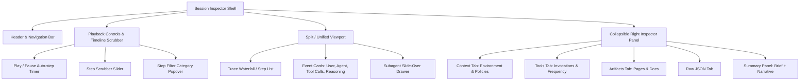

# Frontend Dashboard Routes, UI Components, and State Management for Astro Migration

**Document ID:** `0005-frontend-dashboard-astro-migration`  
**Author:** Robin Paul / TokenTelemetry Architecture Team  
**Date:** 2026-08-21  
**Status:** Completed  
**Referenced Workspaces:** `repositories/tokentelemetry/frontend/`  
**Target Architecture:** Single-binary Go backend with embedded Astro static dashboard + React/Preact client islands.

---

## 1. Executive Summary

This research document analyzes the entire frontend application located in [`repositories/tokentelemetry/frontend/`](file:///Users/robin.a.paul/Proj/token-analyzer/repositories/tokentelemetry/frontend/). The current frontend is built with **Next.js 16.3.0** (App Router), **React 19.2.8**, **Tailwind CSS v4**, **Recharts 3.10.1**, and **lucide-react**.

The target architecture is a **single deployable Go binary** that embeds a compiled, high-performance **Astro static site** with **client islands (React or Preact)** for dynamic and interactive views. Migrating from a full Next.js Node.js runtime to static Astro + Go `embed.FS` eliminates Node.js runtime dependencies, dramatically reduces bundle size, achieves sub-millisecond initial page loads, and removes CORS and multi-port coordination when Go serves both REST API endpoints and static frontend assets from a single port.

---

## 2. Complete Route & Page Inventory

The frontend exposes 21 distinct routes across 5 primary domains: Core Overview & Analytics, Project Observability, Deep Session Traces, Hermes Autonomous Agent Ecosystem, and System Settings.

### Route Inventory Summary Table

| Route | Source File Path | Lines | Purpose | Key API Endpoints & Polling | State / Interactivity |
| :--- | :--- | :--- | :--- | :--- | :--- |
| `/` | [`src/app/page.tsx`](file:///Users/robin.a.paul/Proj/token-analyzer/repositories/tokentelemetry/frontend/src/app/page.tsx) | 426 | Global dashboard: KPIs, connected agents, recent activity feed, agent/model breakdown | `GET /sessions` (15s)<br>`GET /agents` (30s)<br>`GET /analytics` (30s)<br>`GET /config/billing` (60s) | Live polling, scroll persistence, local power toggle |
| `/projects` | [`src/app/projects/page.tsx`](file:///Users/robin.a.paul/Proj/token-analyzer/repositories/tokentelemetry/frontend/src/app/projects/page.tsx) | 434 | Multi-project catalog with worktree grouping, search, sorting, grid/list toggle | `GET /projects` (on-mount) | Search filtering, sort key/desc, view mode in `sessionStorage` |
| `/projects/[path]` | [`src/app/projects/[path]/page.tsx`](file:///Users/robin.a.paul/Proj/token-analyzer/repositories/tokentelemetry/frontend/src/app/projects/%5Bpath%5D/page.tsx) | 7 | Index redirect to `/projects/[path]/activity` | None | Instant redirect |
| `/projects/[path]/activity` | [`src/app/projects/[path]/activity/page.tsx`](file:///Users/robin.a.paul/Proj/token-analyzer/repositories/tokentelemetry/frontend/src/app/projects/%5Bpath%5D/activity/page.tsx) | 99 | Project session history table, prompt previews, plan/tool indicators | Shared via `ProjectProvider` (`/projects`, `/sessions`) | Scroll persistence, links to trace viewer |
| `/projects/[path]/insights` | [`src/app/projects/[path]/insights/page.tsx`](file:///Users/robin.a.paul/Proj/token-analyzer/repositories/tokentelemetry/frontend/src/app/projects/%5Bpath%5D/insights/page.tsx) | 953 | Project heatmaps (sessions/tokens 365d), DOW/hour grid, agent stats, tools, loops, goals, budget card | Shared via `ProjectProvider`<br>`GET /budgets` (60s) | Metric switcher (`sessions` vs `tokens`), budget quick links |
| `/projects/[path]/plans` | [`src/app/projects/[path]/plans/page.tsx`](file:///Users/robin.a.paul/Proj/token-analyzer/repositories/tokentelemetry/frontend/src/app/projects/%5Bpath%5D/plans/page.tsx) | 63 | Architectural plans produced by agents (Claude Plan mode, etc.) rendered in Markdown | Shared via `ProjectProvider` | Markdown rendering (`react-markdown` + `remark-gfm`) |
| `/projects/[path]/artifacts` | [`src/app/projects/[path]/artifacts/page.tsx`](file:///Users/robin.a.paul/Proj/token-analyzer/repositories/tokentelemetry/frontend/src/app/projects/%5Bpath%5D/artifacts/page.tsx) | 339 | Hosted page deliverables (sandboxed iframe preview) & markdown documents | Shared via `ProjectProvider`<br>`HEAD/GET /artifacts?path=...` | Lazy iframe scaling, markdown toggle, grid/list view |
| `/projects/[path]/config` | [`src/app/projects/[path]/config/page.tsx`](file:///Users/robin.a.paul/Proj/token-analyzer/repositories/tokentelemetry/frontend/src/app/projects/%5Bpath%5D/config/page.tsx) | 581 | Project config inspector (skills, MCPs, memory, commands, subagents, plugins, budgets) | `GET /config?project=...`<br>`GET /analytics` | Budget editor modal, usage correlation overlays |
| `/analytics` | [`src/app/analytics/page.tsx`](file:///Users/robin.a.paul/Proj/token-analyzer/repositories/tokentelemetry/frontend/src/app/analytics/page.tsx) | 949 | Token consumption trends, daily AreaChart, agent share PieChart, model BarChart, delegation/subagents, loops | `GET /analytics?from=&to=&granularity=&agents=&models=` (30s)<br>`GET /agents` | Time window presets, granularity selector, multi-filter chips, theme-aware Recharts |
| `/local-models` | [`src/app/local-models/page.tsx`](file:///Users/robin.a.paul/Proj/token-analyzer/repositories/tokentelemetry/frontend/src/app/local-models/page.tsx) | 52 | Local AI models power consumption, battery/GPU discharge measurement, electricity rate config | `GET/POST /config/power`<br>`POST /power/measure` | Real-time 5s power draw sampling, rate configuration |
| `/sessions/[id]` | [`src/app/sessions/[id]/page.tsx`](file:///Users/robin.a.paul/Proj/token-analyzer/repositories/tokentelemetry/frontend/src/app/sessions/%5Bid%5D/page.tsx) | 3636 | Deep session inspection, timeline slider, step waterfall, dialogue vs thought cards, subagent slide-over, summarizer | `GET /sessions`<br>`GET /sessions/[id]?agent=`<br>`GET /sessions/[id]/hermes-overlay`<br>`GET /sessions/[id]/grok-forensics`<br>`GET /sessions/[id]/delegation` | Step scrubber, playback timer, filter popup portal, subagent drawer, artifact modal, AI summary generator |
| `/hermes` | [`src/app/hermes/page.tsx`](file:///Users/robin.a.paul/Proj/token-analyzer/repositories/tokentelemetry/frontend/src/app/hermes/page.tsx) | 890 | Hermes Autonomous Agent Hub: gateway state, cron jobs, multi-profile scope filter, telemetry buckets | `GET /sessions` (15s)<br>`GET /hermes/overview` (30s)<br>`GET /hermes/profiles` (60s) | Profile switcher, cost anomaly alerts, session breakdown tables |
| `/hermes/sessions` | [`src/app/hermes/sessions/page.tsx`](file:///Users/robin.a.paul/Proj/token-analyzer/repositories/tokentelemetry/frontend/src/app/hermes/sessions/page.tsx) | 26 | Dedicated Hermes session explorer shell | Delegated to `HermesSessionExplorer` | Suspense wrapper, header action |
| `/hermes/gateway` | [`src/app/hermes/gateway/page.tsx`](file:///Users/robin.a.paul/Proj/token-analyzer/repositories/tokentelemetry/frontend/src/app/hermes/gateway/page.tsx) | 74 | Live messaging gateway connections across platforms (Telegram, Discord, Slack, WhatsApp, etc.) | `GET /hermes/overview` (10s) | PID status, platform error indicators |
| `/hermes/kanban` | [`src/app/hermes/kanban/page.tsx`](file:///Users/robin.a.paul/Proj/token-analyzer/repositories/tokentelemetry/frontend/src/app/hermes/kanban/page.tsx) | 200 | Kanban task board per profile, task progression, cost/token stats, failure counters | `GET /hermes/kanban` (30s) | Multi-board status columns, task runs inspection |
| `/hermes/memory` | [`src/app/hermes/memory/page.tsx`](file:///Users/robin.a.paul/Proj/token-analyzer/repositories/tokentelemetry/frontend/src/app/hermes/memory/page.tsx) | 106 | Hermes persistent facts (`MEMORY.md`) and user profile (`USER.md`) inspector | `GET /hermes/memory` (30s) | Character limit bars, entry listing |
| `/hermes/profiles` | [`src/app/hermes/profiles/page.tsx`](file:///Users/robin.a.paul/Proj/token-analyzer/repositories/tokentelemetry/frontend/src/app/hermes/profiles/page.tsx) | 498 | Hermes multi-agent profile manager: gateway PID, unattended spend, 7d trends, budget limits | `GET /hermes/profiles`<br>`GET/PUT /budgets` | Profile budget editor, gateway status badges |
| `/hermes/schedules` | [`src/app/hermes/schedules/page.tsx`](file:///Users/robin.a.paul/Proj/token-analyzer/repositories/tokentelemetry/frontend/src/app/hermes/schedules/page.tsx) | 155 | Hermes cron and periodic background tasks listing, next-fire calculation, execution status | `GET /hermes/overview` (15s) | Cron schedule humanizer, error alerts |
| `/hermes/skills` | [`src/app/hermes/skills/page.tsx`](file:///Users/robin.a.paul/Proj/token-analyzer/repositories/tokentelemetry/frontend/src/app/hermes/skills/page.tsx) | 128 | Hermes prompt snapshot skill catalog grouped by category, search filtering | `GET /hermes/skills` (60s) | Live search filtering, category expansion |
| `/hermes/soul` | [`src/app/hermes/soul/page.tsx`](file:///Users/robin.a.paul/Proj/token-analyzer/repositories/tokentelemetry/frontend/src/app/hermes/soul/page.tsx) | 34 | Core persona and system prompt instructions defined in `SOUL.md` | `GET /hermes/soul` | Raw markdown / monospace code view |
| `/hermes/tools` | [`src/app/hermes/tools/page.tsx`](file:///Users/robin.a.paul/Proj/token-analyzer/repositories/tokentelemetry/frontend/src/app/hermes/tools/page.tsx) | 37 | Core CLI toolsets enabled in `config.yaml` | `GET /hermes/tools` | Tool badges list |
| `/settings` | [`src/app/settings/page.tsx`](file:///Users/robin.a.paul/Proj/token-analyzer/repositories/tokentelemetry/frontend/src/app/settings/page.tsx) | 313 | Configuration: AI summarizer backends, billing cost framing, feature flags, retention, update checks | `GET/PUT /config/summarizer`<br>`GET /config/billing`<br>`GET /version`<br>`GET/POST /config/retention` | Multi-backend selection, model dropdowns, save dirty check, retention modal |

---

## 3. UI Component Architecture & Design Token System

### 3.1 Design Tokens and Styling System

The application uses Tailwind CSS v4 configured in [`src/app/globals.css`](file:///Users/robin.a.paul/Proj/token-analyzer/repositories/tokentelemetry/frontend/src/app/globals.css#L1-L228). It defines an elevation and semantic color system supporting dark and light themes via the `[data-theme="light"]` selector:

```css
/* Surface Elevation System */
--tt-canvas:    #0a0c10;   /* App background */
--tt-sunken:    #07090d;   /* Inset surfaces (tracks, code blocks) */
--tt-panel:     #11141a;   /* Primary card surface */
--tt-raised:    #181c25;   /* Hover / popovers / nested cards */
--tt-overlay:   #1d2230;   /* Modals, menus, filter drawers */

/* Hairline Borders */
--tt-border:        rgba(255, 255, 255, 0.06);
--tt-border-strong: rgba(255, 255, 255, 0.10);
--tt-border-focus:  rgba(96, 165, 250, 0.45);

/* Agent Color Taxonomy */
--agent-claude:      #f97316;  --agent-codex:       #a855f7;
--agent-gemini:      #06b6d4;  --agent-antigravity: #10b981;
--agent-qwen:        #3b82f6;  --agent-vibe:        #f472b6;
--agent-cursor:      #60a5fa;  --agent-copilot:     #6366f1;
--agent-opencode:    #f59e0b;  --agent-hermes:      #eab308;
--agent-grok:        #d4d4d8;  --agent-muse:        #2563eb;
--agent-prime:       #D4FF47;  --agent-dsh:         #4D6BFE;
```

Theme-aware tint classes (`.tt-tint-1`, `.tt-tint-2`, `.tt-tint-3`, `.hover:tt-tint-1`) adapt opacity cleanly across dark and light modes.

### 3.2 UI Primitives (`src/components/ui/`)

The UI library contains atomic components in [`src/components/ui/`](file:///Users/robin.a.paul/Proj/token-analyzer/repositories/tokentelemetry/frontend/src/components/ui/):
1. **`Card` / `CardHeader` / `CardTitle` / `CardEyebrow`** ([`Card.tsx`](file:///Users/robin.a.paul/Proj/token-analyzer/repositories/tokentelemetry/frontend/src/components/ui/Card.tsx)): Surface container supporting `padding="none" | "sm" | "md" | "lg"` and `tone="panel" | "sunken" | "raised"`.
2. **`Badge` & `AgentBadge`** ([`Badge.tsx`](file:///Users/robin.a.paul/Proj/token-analyzer/repositories/tokentelemetry/frontend/src/components/ui/Badge.tsx)): Semantic status badges (`neutral`, `brand`, `success`, `warn`, `danger`, `info`) and brand-colored agent pills with icons.
3. **`Button`** ([`Button.tsx`](file:///Users/robin.a.paul/Proj/token-analyzer/repositories/tokentelemetry/frontend/src/components/ui/Button.tsx)): Primary, secondary, ghost, danger buttons with loading spinner support.
4. **`PageHeader`** ([`PageHeader.tsx`](file:///Users/robin.a.paul/Proj/token-analyzer/repositories/tokentelemetry/frontend/src/components/ui/PageHeader.tsx)): Standard page header with eyebrow, title, description, icon badge, back link, and action slot.
5. **`StatTile`** ([`StatTile.tsx`](file:///Users/robin.a.paul/Proj/token-analyzer/repositories/tokentelemetry/frontend/src/components/ui/StatTile.tsx)): Metric KPI tile with label, tabular value, accent bar, and icon.
6. **`Section`** ([`Section.tsx`](file:///Users/robin.a.paul/Proj/token-analyzer/repositories/tokentelemetry/frontend/src/components/ui/Section.tsx)): Content wrapper with section header and subtitle.
7. **`EmptyState`** ([`EmptyState.tsx`](file:///Users/robin.a.paul/Proj/token-analyzer/repositories/tokentelemetry/frontend/src/components/ui/EmptyState.tsx)): Standard zero-data view with dashed border, icon, title, description, and action button.
8. **`Skeleton`** ([`Skeleton.tsx`](file:///Users/robin.a.paul/Proj/token-analyzer/repositories/tokentelemetry/frontend/src/components/ui/Skeleton.tsx)): Pulse-animated placeholder for loading states.
9. **`Table` / `THead` / `TBody` / `TR` / `TH` / `TD`** ([`Table.tsx`](file:///Users/robin.a.paul/Proj/token-analyzer/repositories/tokentelemetry/frontend/src/components/ui/Table.tsx)): Tables with interactive row highlights and borders.

### 3.3 Domain Component Subsystems

* **Shell & Global Guards:**
  * [`Navigation.tsx`](file:///Users/robin.a.paul/Proj/token-analyzer/repositories/tokentelemetry/frontend/src/components/Navigation.tsx): Collapsible sidebar with active link indicator, connected agents status, notification bell, settings link, and theme toggle.
  * [`LayoutWrapper.tsx`](file:///Users/robin.a.paul/Proj/token-analyzer/repositories/tokentelemetry/frontend/src/components/LayoutWrapper.tsx): Ambient background glow (`.tt-canvas-glow`, `.tt-grid`), global notification toaster, update banner, and security gates.
  * [`TokenGate.tsx`](file:///Users/robin.a.paul/Proj/token-analyzer/repositories/tokentelemetry/frontend/src/components/TokenGate.tsx): Intercepts 401 Unauthorized API responses for remote device connections, stores tokens in `localStorage`, and strips `?token=` from the URL post-hydration.
  * [`TelemetryNotice.tsx`](file:///Users/robin.a.paul/Proj/token-analyzer/repositories/tokentelemetry/frontend/src/components/TelemetryNotice.tsx): First-run transparent disclosure banner.
  * [`WhatsNewBanner.tsx`](file:///Users/robin.a.paul/Proj/token-analyzer/repositories/tokentelemetry/frontend/src/components/WhatsNewBanner.tsx) & [`WhatsChangedDrawer.tsx`](file:///Users/robin.a.paul/Proj/token-analyzer/repositories/tokentelemetry/frontend/src/components/WhatsChangedDrawer.tsx): Compares local git commit to GitHub remote, displaying release notes from `UPDATE.json`.
  * [`ConnectDevice.tsx`](file:///Users/robin.a.paul/Proj/token-analyzer/repositories/tokentelemetry/frontend/src/components/ConnectDevice.tsx): Renders a QR code using `qrcode.react` for mobile/remote pairing.
* **Badges & Agent Icons:**
  * [`SourceBadge.tsx`](file:///Users/robin.a.paul/Proj/token-analyzer/repositories/tokentelemetry/frontend/src/components/SourceBadge.tsx): 38 Hermes session source variations (CLI, Telegram, Discord, Slack, Gateway, Cron, etc.).
  * [`CopilotSourceBadge.tsx`](file:///Users/robin.a.paul/Proj/token-analyzer/repositories/tokentelemetry/frontend/src/components/CopilotSourceBadge.tsx) & [`AntigravitySourceBadge.tsx`](file:///Users/robin.a.paul/Proj/token-analyzer/repositories/tokentelemetry/frontend/src/components/AntigravitySourceBadge.tsx): Sub-surface indicators (CLI vs VS Code / IDE / App).
  * [`AgentLogo.tsx`](file:///Users/robin.a.paul/Proj/token-analyzer/repositories/tokentelemetry/frontend/src/components/icons/AgentLogo.tsx): Master agent icon resolver dispatching to Lucide or custom SVG icons.
* **Budgets Subsystem:**
  * [`BudgetCard.tsx`](file:///Users/robin.a.paul/Proj/token-analyzer/repositories/tokentelemetry/frontend/src/components/budgets/BudgetCard.tsx): Spend progress bars against USD or Token thresholds.
  * [`BudgetEditor.tsx`](file:///Users/robin.a.paul/Proj/token-analyzer/repositories/tokentelemetry/frontend/src/components/budgets/BudgetEditor.tsx): Modal form to configure project and per-agent limits.
* **Trace Summarizer Subsystem:**
  * [`SummaryPanel.tsx`](file:///Users/robin.a.paul/Proj/token-analyzer/repositories/tokentelemetry/frontend/src/components/summarizer/SummaryPanel.tsx): Deterministic tool/file/error brief + LLM narrative (Intent, Efficiency, Actions, Notable).
  * [`BackendPicker.tsx`](file:///Users/robin.a.paul/Proj/token-analyzer/repositories/tokentelemetry/frontend/src/components/summarizer/BackendPicker.tsx): Radio selector for Claude, Ollama, Codex, and OpenAI-compatible summarizer backends.

---

## 4. State Management, Data Fetching, & Polling Lifecycles

### 4.1 Client-Side Data Fetching Layer (`src/lib/api.ts`)

The API client in [`src/lib/api.ts`](file:///Users/robin.a.paul/Proj/token-analyzer/repositories/tokentelemetry/frontend/src/lib/api.ts#L1-L185) handles remote authentication, dynamic URL resolution, and automated polling:

1. **`API_BASE` Resolution:** Checks `NEXT_PUBLIC_API_BASE`, then dynamically matches `window.location.protocol + "//" + window.location.hostname + ":" + port`. In Go single-binary mode, this simplifies to standard relative URLs (`/api/...` or root path endpoints) since Go serves both frontend and API on the exact same port.
2. **Bearer Token Authentication:** Reads and writes tokens to `localStorage` under `tt-token-${host}`. Attaches `Authorization: Bearer <token>` to `apiFetch`. If a 401 is received, it dispatches `window.dispatchEvent(new CustomEvent("tt-auth-required"))` to pop the `TokenGate` modal.
3. **`useResource<T>` Hook:**
   ```typescript
   export function useResource<T>(
     path: string | null,
     opts: { pollMs?: number; initial?: T } = {},
   ): ResourceState<T>
   ```
   Provides `{ data, loading, error, refetch }`. Automatically clears and sets `setInterval` timers for auto-polling, with in-flight cancellation when components unmount or queries change.

### 4.2 State & Scroll Restoration Patterns

* **`useSessionState<T>`** ([`src/lib/useSessionState.ts`](file:///Users/robin.a.paul/Proj/token-analyzer/repositories/tokentelemetry/frontend/src/lib/useSessionState.ts#L1-L47)): Persists search filters, sort criteria, and active views to `sessionStorage`. Registers keys with `pageState.ts`.
* **`useScrollState`** ([`src/lib/useScrollState.ts`](file:///Users/robin.a.paul/Proj/token-analyzer/repositories/tokentelemetry/frontend/src/lib/useScrollState.ts#L1-L99)): Captures debounced scroll offsets from `<main>` or inner overflow containers and restores position on re-mount once `isReady === true` (data loading finished).
* **`clearPageState`** ([`src/lib/pageState.ts`](file:///Users/robin.a.paul/Proj/token-analyzer/repositories/tokentelemetry/frontend/src/lib/pageState.ts#L1-L20)): Called on primary navigation clicks in `Navigation.tsx` to wipe previous scroll and filter states when moving between main sections.

### 4.3 Global React Contexts

1. **`ThemeProvider`** ([`src/components/ThemeProvider.tsx`](file:///Users/robin.a.paul/Proj/token-analyzer/repositories/tokentelemetry/frontend/src/components/ThemeProvider.tsx)): Stores `dark | light | system` mode in `localStorage` under `tt-theme`, mutating the `data-theme` attribute on `document.documentElement`. Injects an inline script in `<head>` to prevent Flash of Unstyled Content (FOUC).
2. **`NotificationProvider`** ([`src/components/notifications/NotificationProvider.tsx`](file:///Users/robin.a.paul/Proj/token-analyzer/repositories/tokentelemetry/frontend/src/components/notifications/NotificationProvider.tsx#L1-L102)): Polls `GET /notifications` every 60s, delivers one-time popups to `NotificationToaster`, and persists unread counts in the sidebar `NotificationBell`.
3. **`ProjectProvider`** ([`src/app/projects/[path]/_lib/project-context.tsx`](file:///Users/robin.a.paul/Proj/token-analyzer/repositories/tokentelemetry/frontend/src/app/projects/%5Bpath%5D/_lib/project-context.tsx)): Cascades project-scoped metadata and filtered sessions down to the 5 project subtabs.

---

## 5. Detailed Breakdown of Complex Interactive Views

### 5.1 Deep Session Inspector (`/sessions/[id]`)

Spanning 3,636 lines in [`src/app/sessions/[id]/page.tsx`](file:///Users/robin.a.paul/Proj/token-analyzer/repositories/tokentelemetry/frontend/src/app/sessions/%5Bid%5D/page.tsx), this is the most interactive component in the ecosystem.



**Key Capabilities:**
* **Event Normalization:** Normalizes raw trace logs from Claude Code, OpenAI Codex, Gemini CLI, Antigravity, Hermes, Grok Build, DeepSeek Harness, OpenCode, and Copilot into a unified `Step` stream.
* **Timeline Scrubber & Playback:** Allows frame-by-frame replay or auto-playback of agent execution steps (`playbackIndex`), highlighting active events and auto-scrolling to step refs.
* **Reasoning Extraction:** Collapses and syntax-highlights chain-of-thought blocks (`reasoningEffortTimeline` and `coerceReasoningText`).
* **Tool Waterfall & Modals:** Displays tool arguments, outputs, execution duration, and image/document artifacts with full-screen zoom modals.
* **Subagent Trace Slide-over (`SubagentTraceModal`):** Opens linked child/spawn traces in an overlay without resetting parent session state.
* **Agent Overlays:** Specialized cards for Hermes (per-API latency & cache hits), Grok (build phases & permissions), and Claude (subagent delegation cost attribution).

### 5.2 Token Analytics (`/analytics`)

Spanning 949 lines in [`src/app/analytics/page.tsx`](file:///Users/robin.a.paul/Proj/token-analyzer/repositories/tokentelemetry/frontend/src/app/analytics/page.tsx):
* **Recharts Visualizations:**
  * **Daily Consumption (`AreaChart`):** Token volume and cost over time with cubic spline interpolation and linear gradients.
  * **Agent Share (`PieChart`):** Proportional donut chart using agent brand colors.
  * **Model Distribution (`BarChart`):** Horizontal bar chart ranking consumption across detected LLM models.
* **Filter Bar:** Multi-select agent and model filter pills, date range presets (`7d`, `30d`, `90d`, `month`, `year`, `all`), custom `from/to` date inputs, and bucket granularity (`day`, `week`, `month`).
* **Ecosystem Attributions:** Displays subagent spawn costs, skills invoked (`/skill-name`), and MCP server tool usage.
* **Recurring Loops Section:** Attributes fires and costs for background cron/heartbeat-scheduled agent runs.

### 5.3 Project Observability (`/projects/[path]/*`)

The project workspace uses a shell layout ([`ProjectShellLayout.tsx`](file:///Users/robin.a.paul/Proj/token-analyzer/repositories/tokentelemetry/frontend/src/app/projects/%5Bpath%5D/layout.tsx)) with sticky tab navigation:
1. **Worktree Grouping:** Automatically detects git worktrees and rolls up session counts and token costs to the repository root while allowing direct navigation to individual worktrees.
2. **Activity Tab:** Interactive session log table with plan and tool usage icons.
3. **Insights Tab:** 365-day SVG/CSS contribution heatmaps for sessions and tokens, 24-hour daily distribution, and day-of-week hour matrices.
4. **Plans Tab:** Renders extracted agent plans in GitHub-flavored markdown.
5. **Artifacts Tab:** Live scaled iframe thumbnails of local HTML deliverables with sandbox restrictions, plus markdown doc expandable previews.
6. **Config Tab:** Project skills, MCPs, rules, memory files, and subagent declarations cross-linked with actual recorded usage stats.

---

## 6. Astro Static Component + Client Island Architecture Design

### 6.1 Architecture Overview

In the target architecture, Astro handles the static HTML shell, layout templates, typography, and initial styling. Dynamic, stateful, and charting components are ported to **React or Preact client islands** using Astro hydration directives (`client:load`, `client:idle`, `client:visible`).

```
┌────────────────────────────────────────────────────────┐
│                   Go Web Server                        │
│   (Serves REST API / WebSocket & embeds Astro Dist)    │
└──────────────────────────┬─────────────────────────────┘
                           │
             ┌─────────────┴─────────────┐
             ▼                           ▼
    ┌─────────────────┐         ┌─────────────────┐
    │  REST API Layer │         │  Embedded FS    │
    │  /api/v1/...    │         │  dist/* (Astro) │
    └─────────────────┘         └────────┬────────┘
                                         │
 ┌───────────────────────────────────────┴────────────────────────────────────────┐
 │ Astro Static Shell (BaseLayout.astro, globals.css, Theme Init Script)          │
 │                                                                               │
 │  ┌────────────────────────┐  ┌──────────────────────────────────────────────┐ │
 │  │ Navigation Island      │  │ Page Content (Astro Shell)                   │ │
 │  │ (client:load)          │  │                                              │ │
 │  │ • Sidebar toggle       │  │  ┌─────────────────────────────────────────┐ │ │
 │  │ • Connected agents     │  │  │ Interactive Page Island                 │ │ │
 │  │ • Notification bell    │  │  │ (client:load / client:idle)             │ │ │
 │  └────────────────────────┘  │  │ • Recharts / Filters / Live Pollers     │ │ │
 │                              │  │ • Session Trace Scrubber & Modals       │ │ │
 │  ┌────────────────────────┐  │  │ • Heatmaps & Budget Editors             │ │ │
 │  │ Global Security Islands│  │  └─────────────────────────────────────────┘ │ │
 │  │ • TokenGate (client:load) │                                              │ │
 │  │ • Toaster (client:idle)│  └──────────────────────────────────────────────┘ │ │
 │  └────────────────────────┘                                                   │ │
 └───────────────────────────────────────────────────────────────────────────────┘
```

### 6.2 Target Directory Structure

```
repositories/tokentelemetry/frontend/
├── astro.config.mjs                 # Astro configuration with @astrojs/react & tailwind
├── package.json
├── tsconfig.json
├── src/
│   ├── layouts/
│   │   ├── BaseLayout.astro         # HTML <head>, font preloads, FOUC theme script, background glow
│   │   └── ProjectLayout.astro      # Project breadcrumbs, header card, worktree strip, tabs
│   ├── pages/
│   │   ├── index.astro              # Dashboard overview page
│   │   ├── analytics.astro          # Token analytics page
│   │   ├── local-models.astro       # Local models & power configuration
│   │   ├── settings.astro           # System & summarizer settings
│   │   ├── projects/
│   │   │   ├── index.astro          # Project catalog list/grid
│   │   │   └── [...path].astro      # Catch-all project routing (SPA fallback or Astro dynamic)
│   │   ├── sessions/
│   │   │   └── [id].astro           # Catch-all session inspector page
│   │   └── hermes/
│   │       ├── index.astro          # Hermes overview
│   │       ├── sessions.astro       # Hermes session explorer
│   │       ├── gateway.astro        # Hermes gateway status
│   │       ├── kanban.astro         # Hermes Kanban boards
│   │       ├── memory.astro         # Hermes memory files
│   │       ├── profiles.astro       # Hermes profiles manager
│   │       ├── schedules.astro      # Hermes schedules
│   │       ├── skills.astro         # Hermes skills registry
│   │       ├── soul.astro           # Hermes SOUL.md viewer
│   │       └── tools.astro          # Hermes tools config
│   ├── components/
│   │   ├── static/                  # Pure Astro static components
│   │   │   ├── StatTile.astro
│   │   │   ├── Section.astro
│   │   │   ├── PageHeader.astro
│   │   │   └── Card.astro
│   │   └── islands/                 # Interactive React / Preact client components
│   │       ├── NavigationIsland.tsx
│   │       ├── DashboardRecentActivityIsland.tsx
│   │       ├── AnalyticsIsland.tsx
│   │       ├── SessionInspectorIsland.tsx
│   │       ├── ProjectCatalogIsland.tsx
│   │       ├── ProjectActivityIsland.tsx
│   │       ├── ProjectInsightsIsland.tsx
│   │       ├── ProjectConfigIsland.tsx
│   │       ├── HermesOverviewIsland.tsx
│   │       ├── HermesExplorerIsland.tsx
│   │       ├── HermesKanbanIsland.tsx
│   │       ├── SettingsIsland.tsx
│   │       ├── TokenGate.tsx
│   │       ├── NotificationBell.tsx
│   │       ├── NotificationToaster.tsx
│   │       ├── WhatsNewBanner.tsx
│   │       └── ThemeToggle.tsx
│   └── lib/                         # Shared utilities, stores, and API clients
│       ├── api.ts                   # Framework-agnostic fetch & polling
│       ├── stores.ts                # Nano Stores / Signals for cross-island reactivity
│       ├── format.ts                # formatTokens, formatCost
│       ├── agents.ts                # AGENTS registry & brand metadata
│       └── ...
```

### 6.3 Static vs Island Decomposition Matrix

| Component / Subsystem | Target Implementation | Hydration Directive | Rationale |
| :--- | :--- | :--- | :--- |
| **`BaseLayout` / Shell Background** | `BaseLayout.astro` | Static HTML | Zero JS overhead; ambient gradients & grid textures render in pure CSS. |
| **Theme Init Script** | Inline `<script>` in `<head>` | Immediate execution | Prevents dark/light theme FOUC prior to CSS paint. |
| **`Navigation` Sidebar** | `NavigationIsland.tsx` | `client:load` | Required on first paint for sidebar collapse state and active route highlights. |
| **`NotificationBell` & `Toaster`** | `NotificationBell.tsx`, `NotificationToaster.tsx` | `client:idle` | Non-blocking background poller; loads after main content paint. |
| **`TokenGate`** | `TokenGate.tsx` | `client:load` | Must be active immediately to catch 401s and prompt for remote access tokens. |
| **`WhatsNewBanner` & Drawer** | `WhatsNewBanner.tsx` | `client:idle` | Version check against GitHub is non-critical for initial render. |
| **Dashboard Recent Feed** | `DashboardRecentActivityIsland.tsx` | `client:load` | 15s live polling, interactive agent badge routing, scroll restoration. |
| **Analytics Dashboard** | `AnalyticsIsland.tsx` | `client:load` | Heavy interactive filtering, Recharts Area/Pie/Bar chart rendering. |
| **Session Detail Inspector** | `SessionInspectorIsland.tsx` | `client:load` | 3,600+ lines of step scrubbing, playback timers, slide-over modals, markdown. |
| **Project Catalog** | `ProjectCatalogIsland.tsx` | `client:load` | Instant search filtering, sorting, view-mode switching. |
| **Project Insights Heatmap** | `ProjectInsightsIsland.tsx` | `client:visible` | 365-day SVG calculations; can hydrate as user scrolls into view. |
| **Project Artifacts Preview** | `ProjectArtifactsIsland.tsx` | `client:visible` | Lazy-loads sandboxed iframes only when scrolled near viewport. |
| **Hermes Kanban Board** | `HermesKanbanIsland.tsx` | `client:load` | Real-time task board updates and status card management. |
| **Hermes Session Explorer** | `HermesExplorerIsland.tsx` | `client:load` | Real-time multi-criteria filtering, search debouncing, limit expansion. |
| **Settings & Summarizer** | `SettingsIsland.tsx` | `client:load` | Form state, backend health check testing, dirty state tracking. |

### 6.4 Go Single-Binary Embedding & SPA Routing Fallback

Because TokenTelemetry runs locally with dynamic session IDs (`/sessions/[id]`) and arbitrary filesystem paths (`/projects/[path]/...`), Astro should be built in static mode (`output: 'static'`):

1. **Static Build Output:** `astro build` outputs pure static HTML, JS, CSS, and SVG files into `dist/`.
2. **Go `embed.FS` Integration:**
   ```go
   //go:embed all:dist
   var frontendFS embed.FS
   ```
3. **Route Handling in Go HTTP Server:**
   * **Exact File Match:** If a requested path exists in `embed.FS` (e.g. `/assets/index.css`, `/analytics/index.html`, `/favicon.svg`), serve it with caching headers.
   * **Dynamic Parameterized Routes:**
     * For `/sessions/*`, serve `/sessions/[id]/index.html` (the client island parses `window.location.pathname` and `window.location.search` for `id`, `agent`, and `tab`).
     * For `/projects/*`, serve `/projects/[...path]/index.html` (the client island decodes the path segment from `window.location.pathname`).
   * **API Routes:** Routed directly to the Go backend API router (`/api/...`, `/sessions`, `/projects`, `/analytics`, `/config/...`).
   * **Single Port:** Eliminates CORS configuration and port mismatches since the dashboard and REST API share the same origin.

---

## 7. Migration Roadmap & Key Recommendations

1. **Adopt Tailwind CSS v4 & Preserve Design Tokens:** Keep `globals.css` intact as the single source of truth for surface elevations, borders, and agent brand colors.
2. **Migrate React Hooks to Framework-Agnostic Core:**
   * Extract `formatTokens`, `formatCost`, `getAgent`, and `projectBasename` into a shared zero-dependency TypeScript library.
   * Refactor `useResource`, `useSessionState`, and `useScrollState` into lightweight custom hooks or Nano Stores for use in Astro React/Preact islands.
3. **Chart Library Compatibility:** Recharts works seamlessly in React client islands. Ensure chart theme values are derived from CSS variables or JavaScript theme tokens to preserve dark/light theme switching.
4. **Unified API Client:** Simplify `API_BASE` in `src/lib/api.ts` to default to `""` (relative paths) when served by the single Go binary, while preserving the optional remote Bearer token header for remote network binds.
5. **Phase-by-Phase Component Porting:**
   * **Phase 1:** Astro base layout, design tokens, navigation island, UI primitives (`src/components/ui/`), and `TokenGate`.
   * **Phase 2:** Dashboard (`/`) and Project Catalog (`/projects`).
   * **Phase 3:** Analytics (`/analytics`) with Recharts integration.
   * **Phase 4:** Deep Session Inspector (`/sessions/[id]`) with scrubber, audio/playback controls, and subagent drill-ins.
   * **Phase 5:** Hermes autonomous agent hub and all Hermes sub-views (`/hermes/*`).
   * **Phase 6:** Settings, AI summarizer configuration, and power measurement (`/settings`, `/local-models`).
