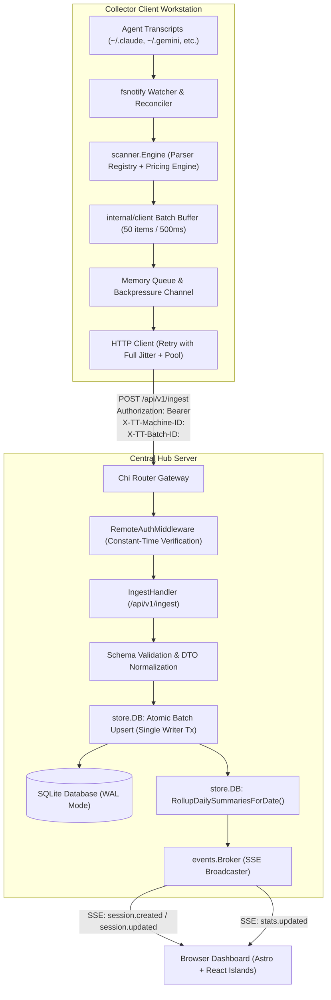

# Research Report: HTTP Ingestion REST API Contract, Idempotency, and Batching Schema Between Collector and Hub

**Document ID:** `0026-http-ingestion-api-and-idempotency`  
**Ticket:** Research Ticket #26 for TokenTelemetry Go  
**Target File:** `docs/research/0026-http-ingestion-api-and-idempotency.md`  
**Status:** Complete  

---

## 1. Executive Summary & Distributed System Topology

TokenTelemetry is architected as a high-performance, single-binary Go application that monitors AI coding agent telemetry. In distributed development environments (e.g., enterprise engineering fleets, remote workstations, CI runner clusters), the system operates across a **Collector-Hub topology**:

1. **TokenTelemetry Collector (`tokentelemetry-collector` or `tokentelemetry --collector`)**: A lightweight background daemon deployed on developer workstations or CI environments. It monitors local transcript roots (`~/.claude`, `~/.codex`, `~/.gemini`, `~/.cursor`, etc.) via `fsnotify` and fallback reconciler sweeps, parses and costs message turns, buffers batches in memory, and pushes telemetry over HTTP to a centralized Hub.
2. **TokenTelemetry Hub (`tokentelemetry --hub` or standard single-binary server)**: The central telemetry aggregator. It validates HTTP ingestion batches, enforces Bearer token authentication, commits session turns idempotently into SQLite (WAL mode), recalculates daily summary rollups, and dispatches real-time Server-Sent Events (SSE) to connected web dashboards.



---

## 2. REST API Contract for `POST /api/v1/ingest`

### 2.1 Endpoint Specification
- **Method:** `POST`
- **Path:** `/api/v1/ingest`
- **Content-Type:** `application/json`
- **Accept:** `application/json`
- **Supported Encodings:** `identity`, `gzip` (`Content-Encoding: gzip` supported for compressed batch transmission)

### 2.2 JSON Request Payload Schema (`IngestionBatch`)

```json
{
  "metadata": {
    "machine_id": "c8f9b2d0-5e3a-4a7b-8f1c-9d2e3f4a5b6c",
    "hostname": "mbp-m3-workstation.local",
    "client_version": "1.0.0",
    "user": "robin.a.paul",
    "os": "darwin/arm64",
    "sent_at": "2026-08-23T18:58:23.123456Z",
    "batch_id": "a1b2c3d4-e5f6-7890-abcd-ef1234567890"
  },
  "sessions": [
    {
      "id": "claude_code:/Users/robin.a.paul/.claude/projects/token-analyzer/sess_abc123.jsonl:sess_abc123",
      "session_id": "sess_abc123",
      "agent_name": "claude_code",
      "project_name": "token-analyzer",
      "file_path": "/Users/robin.a.paul/.claude/projects/token-analyzer/sess_abc123.jsonl",
      "created_at": "2026-08-23T18:30:00Z",
      "updated_at": "2026-08-23T18:58:00Z",
      "start_time": "2026-08-23T18:30:00Z",
      "end_time": "2026-08-23T18:57:45Z",
      "duration_seconds": 1665.0,
      "model_raw": "claude-3-7-sonnet-20250219",
      "model_resolved": "claude-3-7-sonnet",
      "input_tokens": 125000,
      "output_tokens": 4200,
      "cache_read_tokens": 850000,
      "cache_creation_tokens": 15000,
      "gross_cost_usd": 0.438000,
      "net_cost_usd": 0.124500,
      "electricity_cost_usd": 0.0,
      "hardware_profile": "apple_m3_max",
      "status": "completed",
      "git_branch": "main",
      "is_subagent": false,
      "parent_session_id": "",
      "subagent_type": "",
      "turns": [
        {
          "id": "claude_code:/Users/robin.a.paul/.claude/projects/token-analyzer/sess_abc123.jsonl:sess_abc123:0",
          "session_id": "claude_code:/Users/robin.a.paul/.claude/projects/token-analyzer/sess_abc123.jsonl:sess_abc123",
          "turn_index": 0,
          "timestamp": "2026-08-23T18:30:15Z",
          "role": "assistant",
          "model_name": "claude-3-7-sonnet-20250219",
          "input_tokens": 4500,
          "output_tokens": 320,
          "cache_read_tokens": 0,
          "cache_creation_tokens": 4500,
          "cost_usd": 0.018300,
          "tools_invoked": ["view_file", "grep_search"]
        }
      ],
      "subagent_runs": [
        {
          "id": "subrun_987654",
          "parent_session_id": "claude_code:/Users/robin.a.paul/.claude/projects/token-analyzer/sess_abc123.jsonl:sess_abc123",
          "child_session_id": "claude_code:/Users/robin.a.paul/.claude/projects/token-analyzer/sess_abc123/subagents/agent-1.jsonl:agent-1",
          "agent_type": "research",
          "tokens": 45000,
          "cost_usd": 0.045000,
          "created_at": "2026-08-23T18:35:00Z"
        }
      ]
    }
  ]
}
```

---

## 3. Hub Database Persistence & Idempotency Semantics

The Hub uses SQLite WAL mode single-writer transactions with upsert semantics:
- `INSERT INTO sessions (...) VALUES (...) ON CONFLICT(id) DO UPDATE SET ...`
- Turn synchronization replacing turns atomically per session or upserting by `turn_id` (`fmt.Sprintf("%s:%d", sessionID, turnIndex)`).
- Recomputation of `daily_summaries` rollups on the fly for affected dates.
- Bearer token authentication validated via `crypto/subtle.ConstantTimeCompare`.
