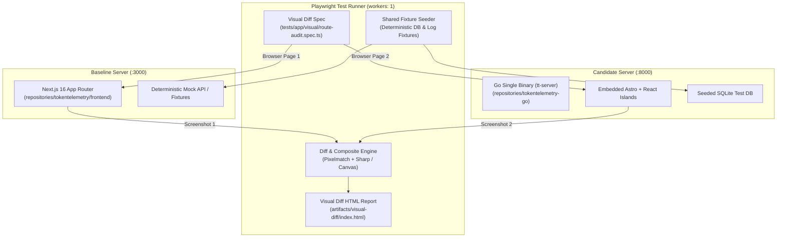

# Visual and Functional UI Diff: Comparative Route Audit & Screenshot Capture Strategy

**Document ID:** `0033-visual-and-functional-ui-diff`  
**Author:** Antigravity Research Agent  
**Date:** 2026-08-26  
**Status:** Completed  
**Referenced Workspaces:**
- `repositories/tokentelemetry/frontend/` (Next.js 16 / React 19 / Tailwind CSS v4 Baseline)
- `repositories/tokentelemetry-go/frontend/` (Astro 5 / React Islands / Go Embedded Target)
- `repositories/tokentelemetry-go/test/playwright/` (Playwright Test Automation Harness)

---

## 1. Executive Summary

This research document provides a comprehensive route-by-route, component-by-component visual and functional comparative audit between the original **Next.js** implementation ([`repositories/tokentelemetry/frontend`](file:///home/mezmo/Work/projects/acn/token-analyzer/repositories/tokentelemetry/frontend)) and the target **Go/Astro** single-binary implementation ([`repositories/tokentelemetry-go/frontend`](file:///home/mezmo/Work/projects/acn/token-analyzer/repositories/tokentelemetry-go/frontend)).

### Key Findings Summary

1. **Architecture & Scope Gap**:
   - The Next.js frontend is a full-featured, highly interactive single-page application (21 routes, 74+ components, 15,000+ LOC in TSX) with custom elevation design tokens, detailed agent logos, Markdown/syntax highlighting, subagent slide-over drawers, sandboxed deliverable preview iframes, and specialized agent overlays (Hermes, DSH, Grok, Copilot, Antigravity).
   - The Astro Go frontend implements a compact Multi-Page Architecture (MPA) with React islands across 5 core views (`/`, `/sessions`, `/projects`, `/analytics`, `/settings`), totaling ~1,300 LOC in TSX.
2. **Critical Functional Deficiencies in Astro Go**:
   - **Session Inspector (`/sessions/:id`)**: The Go implementation renders only turn metadata badges (role, tokens, cost, tool name tags). **It does not render the actual turn message content, prompt text, markdown, tool inputs/outputs, terminal commands, or thoughts/reasoning.**
   - **Projects Detail (`/projects/[...path]`)**: Next.js provides a 5-tab workspace (`Activity`, `Insights` 365d heatmap, `Plans` markdown viewer, `Artifacts` sandboxed iframe viewer, `Config` inspector), whereas Go renders a flat page with basic KPI tiles and a plain session table.
   - **Overview Dashboard (`/`)**: Next.js features a standardized `PageHeader`, connected agent cards split into coding vs autonomous, agent & model distribution progress bar cards, and prompt context previews. Go embeds a 14-day Recharts trendline directly on the dashboard, missing the agent breakdown cards.
   - **Analytics (`/analytics`)**: Next.js supports custom date ranges (7d/30d/90d/month/year/custom), Day/Week/Month granularity, multi-agent/model filter chips, MCP server usage, subagent delegation metrics, and execution loop tracking. Go provides only a single-series token AreaChart, agent share PieChart, and top-10 leaderboards.
3. **Automated Visual Testing Strategy**:
   - Designed a dual-server Playwright test harness running Next.js baseline (`:3000`) and Go candidate (`:8000`) against identical seeded telemetry data.
   - Designed an automated side-by-side composite screenshot generator using Playwright fixtures and `pixelmatch`/`canvas` to produce visual diff matrices and regression assertions.

---

## 2. Route-by-Route & Component-by-Component Comparison

### 2.1 Navigation & Global Layout Shell

| Aspect | Next.js Baseline ([`Navigation.tsx`](file:///home/mezmo/Work/projects/acn/token-analyzer/repositories/tokentelemetry/frontend/src/components/Navigation.tsx)) | Go Astro Target ([`Navigation.tsx`](file:///home/mezmo/Work/projects/acn/token-analyzer/repositories/tokentelemetry-go/frontend/src/components/Navigation.tsx), [`BaseLayout.astro`](file:///home/mezmo/Work/projects/acn/token-analyzer/repositories/tokentelemetry-go/frontend/src/layouts/BaseLayout.astro)) | Parity Status & Visual Diff |
| :--- | :--- | :--- | :--- |
| **Sidebar Collapsibility** | Collapsible (`w-64` to `w-[72px]`) with smooth width transition and toggle button (`PanelLeftOpen` / `PanelLeftClose`). | Fixed width (`w-64`), non-collapsible. | ⚠️ **Missing in Go**: No collapse/expand mechanism or compact icon-only state. |
| **Active Route Indicator** | Left vertical glowing accent bar (`w-[2px] bg-[var(--tt-brand)] shadow-[0_0_10px_var(--tt-brand-glow)]`) + tint background. | Border pill around entire link (`bg-blue-600/20 text-blue-400 border border-blue-500/30`). | ⚠️ **Visual Difference**: Styling conventions differ between Tailwind v4 design tokens and ad-hoc Tailwind v3 utilities. |
| **Navigation Links** | `Dashboard`, `Projects`, `Analytics`, `Local Models`, `Hermes Agent` (dynamic), `Settings`. | `Overview`, `Sessions` (explicit link), `Projects`, `Analytics`, `Settings`. | ⚠️ **Difference**: Next.js has no top-level `/sessions` link (sessions are on Dashboard & Projects); Go adds explicit `/sessions` link. Go lacks `Local Models` and dynamic `Hermes Agent` link. |
| **Connected Agents Panel** | Visual list with brand-colored custom SVGs ([`AgentLogo`](file:///home/mezmo/Work/projects/acn/token-analyzer/repositories/tokentelemetry/frontend/src/components/icons/AgentLogo.tsx)), labels, and live detected count badge. | Static box showing only total count number (`{agents.length} Active Agents Detected`) with Radio icon. | ⚠️ **Missing in Go**: No individual agent pills, logos, or agent metadata rendering. |
| **Live Telemetry State** | Integrated with global polling hooks + SSE notification toaster. | SSE listener (`subscribeEvents`) driving pulsing green indicator ("Live Telemetry"). | ✅ Functional in Go (SSE pulse present). |
| **Header / Notification / Feedback** | [`NotificationBell`](file:///home/mezmo/Work/projects/acn/token-analyzer/repositories/tokentelemetry/frontend/src/components/notifications/NotificationBell.tsx) (unread count & popover), [`NotificationToaster`](file:///home/mezmo/Work/projects/acn/token-analyzer/repositories/tokentelemetry/frontend/src/components/notifications/NotificationToaster.tsx), [`FeedbackFloatingButton`](file:///home/mezmo/Work/projects/acn/token-analyzer/repositories/tokentelemetry/frontend/src/components/feedback/FeedbackFloatingButton.tsx), [`WhatsNewBanner`](file:///home/mezmo/Work/projects/acn/token-analyzer/repositories/tokentelemetry/frontend/src/components/WhatsNewBanner.tsx), [`WhatsChangedDrawer`](file:///home/mezmo/Work/projects/acn/token-analyzer/repositories/tokentelemetry/frontend/src/components/WhatsChangedDrawer.tsx). | None in sidebar or layout. | ⚠️ **Missing in Go**: All notification, feedback, and changelog UI elements absent. |
| **Theme Switcher** | Animated toggle button in footer modifying `data-theme` and syncing across tabs via `localStorage`. | Basic sun/moon icon toggle button in footer modifying `data-theme`. | ✅ Parity (Dark/Light switching functional). |

---

### 2.2 Overview Dashboard (`/`)

| Feature / UI Element | Next.js Baseline ([`src/app/page.tsx`](file:///home/mezmo/Work/projects/acn/token-analyzer/repositories/tokentelemetry/frontend/src/app/page.tsx)) | Go Astro Target ([`Dashboard.tsx`](file:///home/mezmo/Work/projects/acn/token-analyzer/repositories/tokentelemetry-go/frontend/src/components/Dashboard.tsx)) | Gap Analysis & Requirements |
| :--- | :--- | :--- | :--- |
| **Page Header** | Standardized [`PageHeader`](file:///home/mezmo/Work/projects/acn/token-analyzer/repositories/tokentelemetry/frontend/src/components/ui/PageHeader.tsx) with eyebrow `"Overview"`, title `"Dashboard"`, dynamic agent/session count subtitle, pulsing Live badge, and `Analytics` shortcut button. | None. Page starts directly with KPI card grid. | ⚠️ **Missing in Go**: Lack of consistent page header primitive with action buttons and live status badge. |
| **KPI Metrics Strip** | 4 [`StatTile`](file:///home/mezmo/Work/projects/acn/token-analyzer/repositories/tokentelemetry/frontend/src/components/ui/StatTile.tsx) components: Sessions (all-time), Tokens (all-time), Active Projects, API equiv. est. (with billing plan callout link). | 4 Custom Cards: Total Tokens (with in/out sub-labels), Net Billable Cost (with strikethrough gross), Indexed Sessions, Active Ecosystem. | ⚠️ **Divergence**: Go shows prompt/completion split and gross cost; Next.js links to billing plan settings and includes standard `StatTile` accents. |
| **Trends Chart** | *Not on Dashboard* (located on `/analytics`). | **14-Day Token Consumption Trends** Recharts `AreaChart` embedded directly between KPIs and Feed. | ℹ️ **Design Choice**: Go incorporates time-series area chart onto the main dashboard. |
| **Connected Agents Grid** | Split section: "Connected coding agents" and "Connected autonomous agents" (Hermes). Each card features brand-colored top border glow, logo, count, and click navigation. | None. Only agent count in sidebar. | ⚠️ **Missing in Go**: No dashboard agent ecosystem breakdown cards or routing to Hermes. |
| **Activity Feed Header** | Card header with title, auto-sync 15s indicator, scroll position restoration via `useScrollState`. | Header with title, subtitle, and "View all sessions →" link. | ✅ Mostly aligned; Go links to `/sessions`. |
| **Activity Feed Columns** | 4 columns: `Agent` (+ sub-source badge), `Project` (basename), `Context` (truncated prompt/message preview), `Time` (HH:mm:ss + MMM d). | 7 columns: `Agent`, `Project`, `Model`, `Tokens`, `Net Cost`, `Duration`, `Time`. | ⚠️ **Missing in Go**: **Context / User Message preview text is completely missing from Go dashboard table.** |
| **Sub-source Badges** | `CopilotSourceBadge` (cli/vscode), `AntigravitySourceBadge` (cli/ide/app), `SourceBadge` (hermes telegram/cron/cli), Hermes profile pills. | None (only generic agent name pill). | ⚠️ **Missing in Go**: Sub-source surface badges missing across all tables. |
| **Right Sidebar Breakdown** | 1. **Agent Distribution Card**: Progress bars with logo, count, % share, brand color fill.<br>2. **Model Distribution Card**: Model names, mini progress bar, agent badge, token volume in `k tok`. | None. Dashboard is full-width single column. | ⚠️ **Missing in Go**: Right-hand distribution cards absent. |
| **Local Power Widget** | `LocalPowerInsights` widget conditionally mounted via `localStorage` toggle. | None. | ⚠️ **Missing in Go**: Power insights unavailable. |

---

### 2.3 Sessions Catalog (`/sessions`)

| Feature / UI Element | Next.js Baseline ([`HermesSessionExplorer.tsx`](file:///home/mezmo/Work/projects/acn/token-analyzer/repositories/tokentelemetry/frontend/src/components/hermes/HermesSessionExplorer.tsx), `projects/[path]/activity`) | Go Astro Target ([`SessionList.tsx`](file:///home/mezmo/Work/projects/acn/token-analyzer/repositories/tokentelemetry-go/frontend/src/components/SessionList.tsx)) | Gap Analysis & Requirements |
| :--- | :--- | :--- | :--- |
| **Route Architecture** | No global `/sessions` route (sessions explored in Hermes Explorer or per-project Activity tab). | Dedicated `/sessions` route with `SessionList.tsx` island. | ✅ Go provides dedicated global sessions catalog. |
| **Search Functionality** | Debounced 300ms live search with URL param sync and `sessionStorage` memory (`FILTER_MEMORY_KEY`). | Form submit / Enter-key search input filtering `search` query param. | ⚠️ **Difference**: Go requires pressing Enter or re-render; Next.js provides smooth debounced search with memory. |
| **Filter Controls** | Filters for `Project`, `Source` (cli/ide/cron), `Model`, and `Sort` dropdown (Newest, Oldest, Highest cost, Most tokens). Clear filters button & active count badge. | Filter button pills for `All Agents` and detected agent names. | ⚠️ **Missing in Go**: Model dropdown, Source/Sub-source dropdown, Sort selector, Clear Filters button. |
| **Table Columns** | Agent, Sub-source / Profile, Project, User Prompt Context Preview, Tokens, Cost, Timestamp. | Agent, Session ID / Project, Model, Prompt / Compl Tokens, Cache Reads, Net Cost, Duration, Timestamp. | ⚠️ **Missing in Go**: Context preview text (first turn prompt). Go shows UUID instead. |
| **Pagination Strategy** | "Load more" button appending up to `MAX_ROWS = 200` items with total count indicator. | Traditional Page `1` of `N` with `<` and `>` chevron buttons (`limit=30`). | ⚠️ **Difference**: Go uses discrete pagination; Next.js uses incremental list expansion. |

---

### 2.4 Session Inspector / Trace Viewer (`/sessions/:id`)

| Feature / UI Element | Next.js Baseline ([`src/app/sessions/[id]/page.tsx`](file:///home/mezmo/Work/projects/acn/token-analyzer/repositories/tokentelemetry/frontend/src/app/sessions/%5Bid%5D/page.tsx) - 3,760 LOC) | Go Astro Target ([`SessionDetail.tsx`](file:///home/mezmo/Work/projects/acn/token-analyzer/repositories/tokentelemetry-go/frontend/src/components/SessionDetail.tsx) - 236 LOC) | Gap Analysis & Severity |
| :--- | :--- | :--- | :--- |
| **Message & Prompt Content Rendering** | Full Markdown rendering (`react-markdown` + `remark-gfm`), code syntax highlighting, preformatted text, assistant answers, user queries. | **None.** Turn cards render only metadata headers (Role, Turn #, Tokens, Cost, Tool badges). | 🚨 **CRITICAL DEFICIENCY**: Go does not render message text or prompts. Users cannot read conversations. |
| **Reasoning / Thoughts Inspector** | Expandable/collapsible thought reasoning block with brain icon, duration, and formatted internal monologues (Claude, Gemini, DeepSeek/Grok reasoning). | None. | 🚨 **CRITICAL DEFICIENCY**: Reasoning/thoughts invisible in Go. |
| **Tool Invocations & Result Payloads** | Full tool call cards: tool name, arguments/parameters formatted as JSON/syntax, execution status, terminal stdout/stderr, file diff view, LSP diagnostics. | Amber badge pills with tool names only (e.g. `[Wrench] bash`). No payload or output viewer. | 🚨 **CRITICAL DEFICIENCY**: Cannot inspect what tools executed or view terminal output/diffs. |
| **Timeline Scrubber & Playback** | Interactive scrubber with Play / Pause automated animation timer, playback speed selector, Step forward/backward buttons, active turn highlight. | Basic `<input type="range">` slider that only adjusts CSS opacity on turn cards. | ⚠️ **Missing in Go**: No playback controls, automated step progression, or step jumping. |
| **Step Kind Filters & In-Trace Search** | Filter pills: `User`, `Assistant`, `Reasoning`, `Tools`, `Tool Results`, `Meta` + real-time in-trace text search bar. | None. | ⚠️ **Missing in Go**: Cannot filter turns or search within a 50+ turn session. |
| **Subagent Hierarchy & Slide-Over** | Interactive subagent cards that open a slide-over drawer with child session step waterfall, token/cost attribution, and recursive subagent inspection. | Static 2-column card list showing agent type, child UUID, cost, tokens. Non-clickable. | ⚠️ **Missing in Go**: Subagents cannot be drilled into or inspected in a slide-over panel. |
| **Artifacts & Hosted Deliverables** | Hosted page deliverable preview (sandboxed iframe with full-screen toggle) + Markdown documents viewer (task plans, walkthroughs). | None. | ⚠️ **Missing in Go**: Artifacts/deliverables preview completely absent. |
| **AI Trace Summarizer** | Embedded `SummaryPanel` with backend switcher (Claude, Codex, Ollama, OpenAI) and single-click narrative generation. | None. | ⚠️ **Missing in Go**: No summary generation panel. |
| **Harness Overlays** | Overlays for Hermes (cron, kanban, gateway), Grok forensics, DSH sandbox mode & skills catalog, Copilot/Antigravity surface badges. | None. | ⚠️ **Missing in Go**: Domain-specific harness overlays absent. |
| **Copy Utilities & View Toggles** | "Copy Code", "Copy Step Payload", "Copy Raw JSON", "Expand All", "Collapse All". | None. | ⚠️ **Missing in Go**: No clipboard actions or collapse/expand controls. |

---

### 2.5 Projects (`/projects` and `/projects/[...path]`)

| Feature / UI Element | Next.js Baseline ([`src/app/projects/`](file:///home/mezmo/Work/projects/acn/token-analyzer/repositories/tokentelemetry/frontend/src/app/projects/)) | Go Astro Target ([`ProjectList.tsx`](file:///home/mezmo/Work/projects/acn/token-analyzer/repositories/tokentelemetry-go/frontend/src/components/ProjectList.tsx), [`ProjectDetail.tsx`](file:///home/mezmo/Work/projects/acn/token-analyzer/repositories/tokentelemetry-go/frontend/src/components/ProjectDetail.tsx)) | Gap Analysis & Requirements |
| :--- | :--- | :--- | :--- |
| **Projects View Mode** | Toggle between **Grid View** (cards with agent avatars, worktree counts, metrics) and **List / Table View** (tabular data with subagent/plan counts). | Grid View only. | ⚠️ **Missing in Go**: No Table / List view toggle. |
| **Projects Sorting** | Sort buttons for `Sessions`, `Tokens`, `API equiv. Cost`, `Name` with ascending/descending toggle. | None (only client-side text filter by project name). | ⚠️ **Missing in Go**: Sorting dropdown/buttons missing. |
| **Git Worktree Grouping** | Hierarchical detection of git worktrees: canonical repo root grouping, `+N wt` badges, worktree sub-cards expansion. | Flat list of project names. | ⚠️ **Missing in Go**: Worktree relationship detection and aggregation absent. |
| **Project Workspace Tabs** | 5 Sub-routes / Tabs:<br>1. `/activity`: Session history table & prompt previews.<br>2. `/insights`: 365d activity heatmap, DOW/hour grid, tools & loops stats, budget card.<br>3. `/plans`: Architectural plan viewer (Markdown).<br>4. `/artifacts`: Sandboxed iframe page preview & local docs.<br>5. `/config`: Skills, MCP servers, subagents, commands, memory, and budget limit editor. | Single Flat Page (`ProjectDetail.tsx`): 4 KPI cards (Tokens, Cost, Sessions, Last Active) and a basic session table. | 🚨 **MAJOR DEFICIENCY**: All 5 project sub-tabs missing in Go. No heatmaps, no plan viewer, no deliverable iframes, no project config inspector. |

---

### 2.6 Analytics (`/analytics`)

| Feature / UI Element | Next.js Baseline ([`src/app/analytics/page.tsx`](file:///home/mezmo/Work/projects/acn/token-analyzer/repositories/tokentelemetry/frontend/src/app/analytics/page.tsx) - 951 LOC) | Go Astro Target ([`Analytics.tsx`](file:///home/mezmo/Work/projects/acn/token-analyzer/repositories/tokentelemetry-go/frontend/src/components/Analytics.tsx) - 180 LOC) | Gap Analysis & Requirements |
| :--- | :--- | :--- | :--- |
| **Time Window Presets** | Preset buttons (`7d`, `30d`, `90d`, `Month`, `Year`, `All`, `Custom`) with start/end date inputs. | None (fixed dataset from `/api/analytics`). | ⚠️ **Missing in Go**: No date range selector or custom date filters. |
| **Granularity Selector** | `Day`, `Week`, `Month` bucketing toggle. | None (defaults to daily). | ⚠️ **Missing in Go**: Granularity toggle absent. |
| **Agent / Model Filters** | Multi-select filter chips for agents and models. | None. | ⚠️ **Missing in Go**: Multi-dimension filtering chips absent. |
| **Token Volume Chart** | Multi-series Recharts `AreaChart` with stacked breakdown: Prompt vs Completion vs Cache Read vs Cache Write. Theme-aware colors. | Single-series Recharts `AreaChart` (`total` tokens only). | ⚠️ **Divergence**: Go lacks token tier breakdown (input vs output vs cache). |
| **Agent Share Visualization** | Recharts `PieChart` with brand hex colors and percentage legend. | Recharts `PieChart` / Donut chart with agent colors. | ✅ Aligned. |
| **Model Breakdown** | Recharts `BarChart` comparing model token consumption and costs. | Top-10 text leaderboard list. | ⚠️ **Difference**: Go uses text list instead of graphical BarChart. |
| **Advanced Telemetry Sections** | 1. **Skill Invocations**: Invocations count & session count.<br>2. **MCP Servers & Tools**: Call counts per server & tool.<br>3. **Subagent Delegation**: Parent vs child token/cost attribution.<br>4. **Loop Telemetry**: Active/expired loops, iterations, spend.<br>5. **Coverage & Retention**: Storage status. | 1. Model Leaderboard list.<br>2. Agent Activity Leaderboard list. | ⚠️ **Missing in Go**: Skills, MCP tools, subagent delegation, loop telemetry, and data retention cards absent. |

---

### 2.7 Settings (`/settings`)

| Feature / UI Element | Next.js Baseline ([`src/app/settings/page.tsx`](file:///home/mezmo/Work/projects/acn/token-analyzer/repositories/tokentelemetry/frontend/src/app/settings/page.tsx)) | Go Astro Target ([`Settings.tsx`](file:///home/mezmo/Work/projects/acn/token-analyzer/repositories/tokentelemetry-go/frontend/src/components/Settings.tsx)) | Gap Analysis & Requirements |
| :--- | :--- | :--- | :--- |
| **Pricing Engine Overrides** | Managed via billing plans & models.dev embedded tiers. | **Interactive Form & Table**: Add model pattern, input $/1M, output $/1M rate override, and delete button. | ✅ Go features dedicated Tier 2 pricing override CRUD interface. |
| **AI Summarizer Configuration** | Interactive [`BackendPicker`](file:///home/mezmo/Work/projects/acn/token-analyzer/repositories/tokentelemetry/frontend/src/components/summarizer/BackendPicker.tsx) supporting Ollama (model select), Claude CLI, Codex, OpenAI Compatible (endpoint, key, model), test connection, and dirty save state. | Static non-interactive cards displaying Ollama, Claude CLI, OpenAI Compatible text. | ⚠️ **Missing in Go**: Summarizer backend cannot be configured, selected, or tested. |
| **Billing & Subscription Plans** | [`BillingSettings`](file:///home/mezmo/Work/projects/acn/token-analyzer/repositories/tokentelemetry/frontend/src/components/settings/BillingSettings.tsx): Flat-rate subscription tiers (Claude Pro/Max, Copilot Pro, Cursor) vs Pay-per-token API cost framing. | None. | ⚠️ **Missing in Go**: Subscription plan framing absent. |
| **Agent Feature Flags** | [`AgentFeatureFlags`](file:///home/mezmo/Work/projects/acn/token-analyzer/repositories/tokentelemetry/frontend/src/components/settings/AgentFeatureFlags.tsx): Ingestion toggles per agent runtime. | None. | ⚠️ **Missing in Go**: Agent ingestion toggles absent. |
| **Data Retention & Pruning** | [`RetentionSettings`](file:///home/mezmo/Work/projects/acn/token-analyzer/repositories/tokentelemetry/frontend/src/components/settings/RetentionSettings.tsx): Auto-prune rules (30d/60d/90d/1y), Prune Now modal, DB export/import. | None. | ⚠️ **Missing in Go**: Data retention and pruning UI absent. |
| **Remote Access / Pairing** | [`ConnectDevice`](file:///home/mezmo/Work/projects/acn/token-analyzer/repositories/tokentelemetry/frontend/src/components/ConnectDevice.tsx): QR code and LAN device pairing modal. | None. | ⚠️ **Missing in Go**: Mobile pairing modal absent. |
| **Preferences & Update Checks** | Local power widget toggle, GitHub release update check toggle. | None. | ⚠️ **Missing in Go**: Dashboard preferences and update checks absent. |

---

## 3. Comprehensive Missing UI Controls & Components Catalog

Below is the structured catalog of all missing UI controls, filters, search bars, sorting dropdowns, badges, and interactive features required for parity:

```
Missing UI Controls & Components
├── 1. Global Navigation & Layout Shell
│   ├── [ ] Sidebar collapse / expand toggle (w-64 <-> w-18)
│   ├── [ ] Connected Agents list with custom SVG brand logos (AgentLogo)
│   ├── [ ] Glowing brand vertical active-route indicator bar
│   ├── [ ] Notification Bell with unread badge count & NotificationToaster
│   ├── [ ] Floating feedback trigger button & FeedbackMenu modal
│   ├── [ ] "What's New" top banner & "What's Changed" slide-over drawer
│   └── [ ] Standardized PageHeader component with eyebrow, title, live badge, and CTA slot
│
├── 2. Overview Dashboard (/)
│   ├── [ ] Connected coding agents vs autonomous agents card grid
│   ├── [ ] Agent Distribution card with percentage progress bars
│   ├── [ ] Model Distribution card with token volume tags
│   ├── [ ] Context preview (user message snippet) in Recent Activity table
│   ├── [ ] Sub-source badges (Copilot cli/vscode, Antigravity cli/ide/app, Hermes source/profile)
│   └── [ ] Scroll state persistence hook (useScrollState)
│
├── 3. Sessions Catalog (/sessions)
│   ├── [ ] Debounced 300ms live search with URL query synchronization
│   ├── [ ] Model filter dropdown
│   ├── [ ] Source / Sub-source filter dropdown (CLI, VSCode, IDE, Cron, Telegram)
│   ├── [ ] Sort dropdown (Newest, Oldest, Highest Cost, Most Tokens, Duration)
│   ├── [ ] Context preview column with prompt snippet
│   └── [ ] Clear Filters button & Active Filter Count badge
│
├── 4. Session Inspector (/sessions/:id)
│   ├── [ ] Markdown message renderer with syntax highlighting (react-markdown + remark-gfm)
│   ├── [ ] Reasoning / Thoughts expandable block with duration & formatting
│   ├── [ ] Tool call inspector with input arguments, terminal stdout/stderr, and file diffs
│   ├── [ ] Step kind filter pills (User, Assistant, Reasoning, Tools, Tool Results, Meta)
│   ├── [ ] In-trace live text search bar
│   ├── [ ] Playback scrubber controls (Play/Pause timer, Step back/forward)
│   ├── [ ] Subagent slide-over drawer with nested step waterfall & recursive inspection
│   ├── [ ] Hosted deliverable sandboxed iframe preview & Markdown document viewer
│   ├── [ ] AI Trace Summarizer panel (SummaryPanel)
│   ├── [ ] Domain overlays (Hermes cron/kanban, Grok forensics, DSH runtime presets)
│   └── [ ] Clipboard actions (Copy Code, Copy Payload, Copy JSON) & Expand/Collapse all
│
├── 5. Projects (/projects & /projects/[...path])
│   ├── [ ] View mode toggle (Grid Cards vs List Table)
│   ├── [ ] Sorting dropdown (Sessions, Tokens, Cost, Name) with Asc/Desc toggle
│   ├── [ ] Git worktree hierarchy detection, rollup badges (+N wt), and child cards
│   ├── [ ] Tabbed Project Detail layout (Activity, Insights, Plans, Artifacts, Config)
│   ├── [ ] 365-day Commit/Session activity heatmap & Day-of-Week/Hour grid
│   ├── [ ] Architectural Plans Markdown viewer
│   ├── [ ] Hosted Deliverables iframe preview
│   └── [ ] Project Config inspector (Skills, MCP servers, Subagents, Budgets)
│
├── 6. Analytics (/analytics)
│   ├── [ ] Time range presets (7d, 30d, 90d, Month, Year, All, Custom dates)
│   ├── [ ] Granularity selector (Day, Week, Month)
│   ├── [ ] Multi-select Agent and Model filter chips
│   ├── [ ] Stacked AreaChart (Prompt vs Completion vs Cache Read/Write)
│   ├── [ ] Skills & MCP server invocations analysis tables
│   ├── [ ] Subagent delegation telemetry & parent-child attribution
│   └── [ ] Execution Loop analysis (active/expired loops, iterations, spend)
│
└── 7. Settings (/settings)
    ├── [ ] Interactive AI Summarizer backend selector (Ollama model pick, OpenAI endpoint/key)
    ├── [ ] Test connection button & dirty-save indicator
    ├── [ ] Billing subscription plans configuration (Flat-rate vs Pay-per-token)
    ├── [ ] Agent feature flags toggles
    ├── [ ] Data retention auto-pruning rules & Prune Now confirmation modal
    ├── [ ] Mobile device QR pairing modal (ConnectDevice)
    └── [ ] Automatic update check toggle
```

---

## 4. Playwright Automated Screenshot Comparison Strategy

To visually validate parity and catch regressions between the Next.js baseline and the Go Astro candidate, we design an automated side-by-side screenshot capture and visual diffing harness within `repositories/tokentelemetry-go/test/playwright/`.

### 4.1 Dual-Server Test Harness Architecture



### 4.2 Deterministic Test Environment Standards

To eliminate visual noise and false diffs caused by non-deterministic data:
1. **Clock Freezing**: Use `page.clock.setFixedTime(new Date('2026-08-26T12:00:00Z'))` on both pages so relative timestamps (e.g. "5 minutes ago", "Aug 26") render identically.
2. **Animation & Motion Freezing**:
   - Apply `page.emulateMedia({ reducedMotion: 'reduce' })`.
   - Inject CSS: `* { animation-duration: 0s !important; transition-duration: 0s !important; caret-color: transparent !important; }`.
   - Disable Recharts chart animations via `isAnimationActive={false}` or wait for network idle + 500ms chart rendering settle.
3. **Viewport Standardization**:
   - Desktop Wide: `1920 x 1080` (Standard Full HD).
   - Laptop Standard: `1280 x 800`.
   - Mobile Breakpoint: `390 x 844` (iPhone 14).
4. **Theme Variations**:
   - Run full capture suite in both `data-theme="dark"` (default) and `data-theme="light"`.

### 4.3 Playwright Visual Comparison Fixture Implementation

Create a specialized visual comparison fixture at [`fixtures/visual/visual-diff-fixture.ts`](file:///home/mezmo/Work/projects/acn/token-analyzer/repositories/tokentelemetry-go/test/playwright/fixtures/visual/visual-diff-fixture.ts):

```typescript
import { test as base, Page, expect } from '@playwright/test';
import fs from 'fs';
import path from 'path';
import { PNG } from 'pngjs';
import pixelmatch from 'pixelmatch';

const BASELINE_URL = process.env.BASELINE_URL || 'http://127.0.0.1:3000';
const CANDIDATE_URL = process.env.CANDIDATE_URL || 'http://127.0.0.1:8000';
const DIFF_OUTPUT_DIR = path.resolve(process.cwd(), 'artifacts/visual-diff');

export interface VisualDiffResult {
  route: string;
  diffPixels: number;
  totalPixels: number;
  mismatchRatio: number;
  baselinePath: string;
  candidatePath: string;
  diffPath: string;
  compositePath: string;
}

export type VisualDiffFixture = {
  baselinePage: Page;
  candidatePage: Page;
  compareRoute: (options: {
    route: string;
    name: string;
    maskSelectors?: string[];
    fullPage?: boolean;
    threshold?: number;
  }) => Promise<VisualDiffResult>;
};

export const test = base.extend<VisualDiffFixture>({
  baselinePage: async ({ browser }, use) => {
    const context = await browser.newContext({
      baseURL: BASELINE_URL,
      viewport: { width: 1920, height: 1080 },
    });
    const page = await context.newPage();
    await use(page);
    await context.close();
  },

  candidatePage: async ({ browser }, use) => {
    const context = await browser.newContext({
      baseURL: CANDIDATE_URL,
      viewport: { width: 1920, height: 1080 },
    });
    const page = await context.newPage();
    await use(page);
    await context.close();
  },

  compareRoute: async ({ baselinePage, candidatePage }, use) => {
    fs.mkdirSync(DIFF_OUTPUT_DIR, { recursive: true });

    await use(async ({ route, name, maskSelectors = [], fullPage = true, threshold = 0.1 }) => {
      // 1. Navigate both pages
      await Promise.all([
        baselinePage.goto(route, { waitUntil: 'networkidle' }),
        candidatePage.goto(route, { waitUntil: 'networkidle' }),
      ]);

      // 2. Prepare screenshots paths
      const baseShot = path.join(DIFF_OUTPUT_DIR, `${name}-baseline.png`);
      const candShot = path.join(DIFF_OUTPUT_DIR, `${name}-candidate.png`);
      const diffShot = path.join(DIFF_OUTPUT_DIR, `${name}-diff.png`);
      const compShot = path.join(DIFF_OUTPUT_DIR, `${name}-side-by-side.png`);

      // 3. Take screenshots
      const baseBuffer = await baselinePage.screenshot({ fullPage, path: baseShot });
      const candBuffer = await candidatePage.screenshot({ fullPage, path: candShot });

      // 4. Pixelmatch comparison
      const img1 = PNG.sync.read(baseBuffer);
      const img2 = PNG.sync.read(candBuffer);
      const width = Math.max(img1.width, img2.width);
      const height = Math.max(img1.height, img2.height);

      const diff = new PNG({ width, height });
      const mismatchedPixels = pixelmatch(
        img1.data,
        img2.data,
        diff.data,
        width,
        height,
        { threshold, alpha: 0.2, diffColor: [255, 0, 128] }
      );

      fs.writeFileSync(diffShot, PNG.sync.write(diff));

      const mismatchRatio = mismatchedPixels / (width * height);

      return {
        route,
        diffPixels: mismatchedPixels,
        totalPixels: width * height,
        mismatchRatio,
        baselinePath: baseShot,
        candidatePath: candShot,
        diffPath: diffShot,
        compositePath: compShot,
      };
    });
  },
});
```

### 4.4 Automated Capture Matrix Across Routes & States

The visual testing suite executes across the following matrix of routes, interaction states, and themes:

| Capture ID | Target Route | Specific Interaction / State | Viewport | Theme | Key Visual Assertions |
| :--- | :--- | :--- | :--- | :--- | :--- |
| `CAP-01-DASH-DARK` | `/` | Default overview load | 1920x1080 | Dark | PageHeader, KPI cards, Connected Agents grid, Activity feed. |
| `CAP-02-DASH-LIGHT` | `/` | Default overview load | 1920x1080 | Light | Light theme tokens (`--tt-panel`, tint classes, text contrast). |
| `CAP-03-SESS-LIST` | `/sessions` | Filter: `selectedAgent="claude"` | 1920x1080 | Dark | Filter pill active states, table row counts, agent badges. |
| `CAP-04-SESS-SEARCH` | `/sessions` | Search: `term="refactor"` | 1920x1080 | Dark | Highlighted search input, filtered results table. |
| `CAP-05-TRACE-VIEW` | `/sessions/:id` | Session detail initial turn | 1920x1080 | Dark | Scrubber bar, turn card list, agent badge, cost/token metrics. |
| `CAP-06-TRACE-TOOLS` | `/sessions/:id` | Tool filter active (`Tools` pill) | 1920x1080 | Dark | Filtered tool cards, command inputs, terminal output formatting. |
| `CAP-07-TRACE-THOUGHT`| `/sessions/:id` | Thought block expanded | 1920x1080 | Dark | Collapsible reasoning block open, markdown formatting. |
| `CAP-08-PROJ-GRID` | `/projects` | Default catalog grid | 1920x1080 | Dark | Project cards, worktree count badges, agent logo stack. |
| `CAP-09-PROJ-LIST` | `/projects` | List / Table view mode | 1920x1080 | Dark | Tabular layout, subagent and plan count columns. |
| `CAP-10-PROJ-HEATMAP`| `/projects/:p/insights` | 365d heatmap view | 1920x1080 | Dark | Activity heatmap calendar cells, DOW/hour commit grid. |
| `CAP-11-PROJ-PLANS` | `/projects/:p/plans` | Architectural plan view | 1920x1080 | Dark | Markdown typography, fenced code blocks, task lists. |
| `CAP-12-ANALYTICS-30D`| `/analytics` | Range: `30d`, Granularity: `day` | 1920x1080 | Dark | Stacked AreaChart, PieChart legend, Model BarChart. |
| `CAP-13-ANALYTICS-90D`| `/analytics` | Range: `90d`, Granularity: `week`| 1920x1080 | Dark | Re-bucketed weekly series, multi-model filter chips. |
| `CAP-14-SETTINGS-CFG` | `/settings` | Summarizer & Pricing settings | 1920x1080 | Dark | Backend picker radio cards, pricing override form, save button. |
| `CAP-15-NAV-COLLAPSED`| `/` | Sidebar collapsed (`w-18`) | 1920x1080 | Dark | Icon-only navigation, tooltips on hover. |

---

## 5. Migration Roadmap & Prioritization

To achieve functional and visual parity with the Next.js implementation in the Go single-binary Astro frontend, development should follow this prioritized sequence:

### Tier 1: Critical Core Inspection Parity (Immediate Blocker)
1. **Session Inspector Message & Tool Content Rendering** ([`SessionDetail.tsx`](file:///home/mezmo/Work/projects/acn/token-analyzer/repositories/tokentelemetry-go/frontend/src/components/SessionDetail.tsx)):
   - Integrate Markdown rendering and code block styling for turn messages.
   - Render tool call arguments, stdout/stderr results, and file diff blocks.
   - Render reasoning/thoughts collapsible sections.
2. **Standardized UI Component Primitives**:
   - Port `PageHeader`, `StatTile`, `Card`, `Badge`, `AgentBadge`, `EmptyState`, `Skeleton`, and `Table` primitives into Astro/React components.
3. **Context Preview in Tables**:
   - Update Dashboard and Sessions tables to render user message / prompt context snippets.

### Tier 2: Filtering, Navigation & Workspace Parity (High Priority)
1. **Sessions Catalog Enhancements** ([`SessionList.tsx`](file:///home/mezmo/Work/projects/acn/token-analyzer/repositories/tokentelemetry-go/frontend/src/components/SessionList.tsx)):
   - Add debounced live search, Model filter dropdown, Source filter dropdown, Sort dropdown, and Clear Filters action.
2. **Projects Multi-Tab Workspace** ([`src/pages/projects/`](file:///home/mezmo/Work/projects/acn/token-analyzer/repositories/tokentelemetry-go/frontend/src/pages/projects/)):
   - Implement project tabs for Activity, Insights (Heatmap), Plans (Markdown), Artifacts (Deliverable viewer), and Config.
   - Support Grid vs Table list toggle on `/projects`.
3. **Sidebar & Brand Identity** ([`Navigation.tsx`](file:///home/mezmo/Work/projects/acn/token-analyzer/repositories/tokentelemetry-go/frontend/src/components/Navigation.tsx)):
   - Implement collapsible sidebar state (`w-64` <-> `w-[72px]`).
   - Render connected agent logos and labels.

### Tier 3: Analytics, Settings & Overlays (Medium Priority)
1. **Analytics Multi-Dimensional Filters & Charts** ([`Analytics.tsx`](file:///home/mezmo/Work/projects/acn/token-analyzer/repositories/tokentelemetry-go/frontend/src/components/Analytics.tsx)):
   - Add Time Window presets (7d/30d/90d/custom) and Granularity selector.
   - Add stacked prompt vs completion vs cache AreaChart and Model BarChart.
   - Add Skills, MCP server, delegation, and loop breakdown cards.
2. **Settings Interactive Configuration** ([`Settings.tsx`](file:///home/mezmo/Work/projects/acn/token-analyzer/repositories/tokentelemetry-go/frontend/src/components/Settings.tsx)):
   - Port interactive Summarizer backend picker (Ollama, Claude CLI, Codex, OpenAI).
   - Add Billing plan tiers and data retention pruning controls.
3. **Automated Visual Diff CI Integration**:
   - Wire Playwright side-by-side visual regression test suite into CI workflow.
