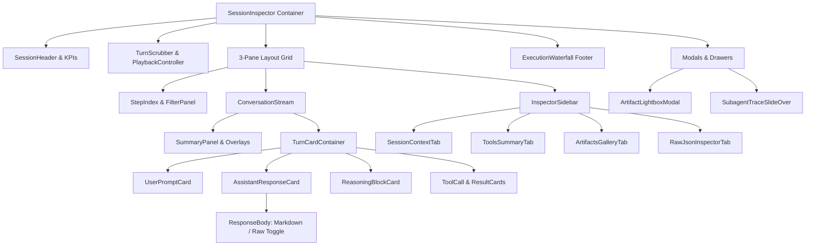
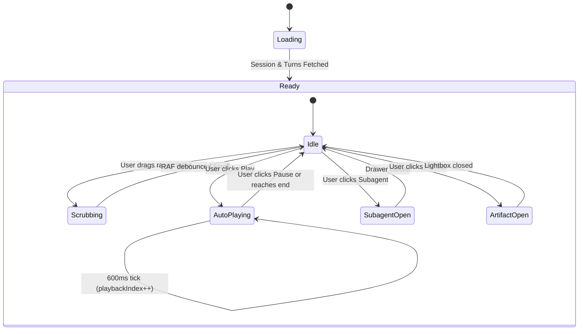

# Session Inspector Architecture, Turn Scrubber, and Artifact Rendering

**Document ID:** `0035-session-inspector-architecture`  
**Related Ticket:** Wayfinder Research Child Ticket #35 (Part of Map #1 / Go Rewrite Milestone)  
**Target Codebases:**  
- `repositories/tokentelemetry/frontend/src/app/sessions/[id]/page.tsx` (Original 3,760 LOC Monolith)  
- `repositories/tokentelemetry-go/frontend/src/components/SessionDetail.tsx` (Current Go Rewrite Shell)  
- `repositories/tokentelemetry-go/internal/models/` (`session.go`, `ingest.go`, `summary.go`)  
**Status:** Complete  

---

## 1. Executive Summary & Problem Analysis

In the original Next.js implementation of TokenTelemetry ([`repositories/tokentelemetry/frontend/src/app/sessions/[id]/page.tsx`](file:///home/mezmo/Work/projects/acn/token-analyzer/repositories/tokentelemetry/frontend/src/app/sessions/[id]/page.tsx)), the Session Detail view grew into an unwieldy **3,760-line monolithic React component**. It simultaneously managed:
1. Deep multi-source trace event normalization across 18+ agent ecosystems (Claude Code, Codex, Gemini CLI, Antigravity, OpenCode, Hermes, Grok Build, Copilot, Cursor, etc.).
2. Timeline playback, auto-scrolling choreography, and a scrubber slider with high-water mark state tracking.
3. A portalled multi-category step filter and real-time step category counts.
4. Dual-mode conversation rendering (Unified full-width stream vs. Split-Brain Dialogue/Reasoning mode with Compact vs. Timeline flow switches).
5. Rich agent-specific telemetry overlays (AI narrative summary, Hermes session chaining, Hermes performance/memory overlays, Grok Build forensics, Loop recurrence cards, Goal mode tracking, and Delegated subagent spend).
6. Multi-tab inspector sidebars (Session Context, Project Configuration, Dynamic Runtime Capabilities, Tool usage frequency rankings, and Artifact galleries).
7. Full-screen artifact lightboxes (interactive image zoom, HTML5 video player, markdown document parser) and slide-over subagent trace drill-downs.
8. Bottom tool execution Gantt/waterfall timeline with synchronized bi-directional seeking.

In the initial Go rewrite ([`repositories/tokentelemetry-go/frontend/src/components/SessionDetail.tsx`](file:///home/mezmo/Work/projects/acn/token-analyzer/repositories/tokentelemetry-go/frontend/src/components/SessionDetail.tsx)), the component was reduced to a 236-line basic placeholder. While functional for high-level token metrics and simple role cards, it lacks the deep trace inspection, split-brain filtering, rich tool I/O formatting, thinking blocks, artifact previews, subagent slide-overs, and waterfall visualization that make the Session Inspector indispensable for multi-agent observability.

This research document defines the **modular component architecture**, **state contracts**, **rendering specifications**, and **Go backend data models** necessary to implement a modular, high-performance Session Inspector in `tokentelemetry-go/frontend`.

---

## 2. Deconstruction of the 3,760 LOC Monolithic Inspector

The original monolith combines 10 distinct architectural concerns into a single file. Below is the deconstructed map of these subsystems into clean, decoupled React components.



### 2.1 Subsystem Inventory & Modular Boundaries

| Original Concern | Line Range in `page.tsx` | Target Modular Component | Core Responsibility |
| :--- | :--- | :--- | :--- |
| **Session Header & Metrics** | L1006–1156, L1700–1776 | `SessionHeader.tsx`<br>`SessionMetricsStrip.tsx` | Breadcrumb navigation, agent badge, session ID copy pill, model tags, KPI stat tiles (Steps, Tools, Tokens, Cost, Duration, Errors, Hermes outcome). |
| **Turn Scrubber & Playback** | L606–635, L868–905, L1158–1200 | `TurnScrubber.tsx`<br>`PlaybackControls.tsx` | Replay timer (600ms interval), prev/next step seeking, range track with high-water mark revelation, `requestAnimationFrame` debounced smooth scrolling. |
| **Step Index & Filter Portal** | L508–544, L683–712, L1234–1308 | `StepIndex.tsx`<br>`StepRow.tsx`<br>`StepFilterPopover.tsx` | Chronological step index, category aggregation (User, Response, Tool names, Reasoning), portalled filter dropdown, active step ring highlighting. |
| **Search & In-Session Filtering** | *New / Unified* | `TurnSearchInput.tsx` | Client-side fuzzy text filtering across user prompts, assistant text, tool arguments, reasoning thoughts, and outputs. |
| **Conversation Stream** | L922–968, L1310–1417 | `ConversationStream.tsx`<br>`SplitBrainContainer.tsx` | Manages single-column unified mode vs. two-column split-brain mode (compact flow vs. synchronized timeline flow with center vertical divider). |
| **Turn Card Renderers** | L2292–3032 | `UserTurnCard.tsx`<br>`AssistantTurnCard.tsx`<br>`ReasoningCard.tsx`<br>`ToolInvocationCard.tsx` | Role-specific card surfaces with agent-tinted accent bars, timestamp headers, copy buttons, and per-step token chips (`StepTokensChip`). |
| **Markdown & Text Body** | L3060–3101 | `ResponseBody.tsx` | Renders Markdown via `react-markdown` + `remark-gfm`, handles file URL protocol transformation, and provides a quick toggle to inspect raw model text. |
| **Specialized Agent Overlays** | L1318–1333, L3103–3751 | `SummaryPanel.tsx`<br>`GoalCard.tsx`<br>`LoopCard.tsx`<br>`DelegationCard.tsx`<br>`HermesOverlayCard.tsx`<br>`GrokForensicsCard.tsx` | Domain cards for `/goal` progress tracking, `/loop` iteration monitors, delegated subagent cost rollups, Hermes performance metrics, and Grok Build phase states. |
| **Inspector Sidebar** | L1420–1471, L1835–2070 | `InspectorSidebar.tsx`<br>`ContextPanel.tsx`<br>`ToolsPanel.tsx`<br>`ArtifactsPanel.tsx`<br>`RawTurnInspector.tsx` | Right slide-out tabbed panel inspecting environment/system prompts/runtime capabilities, tool duration histograms, session artifacts, and raw JSON. |
| **Tool Execution Waterfall** | L971–1000, L1475–1534 | `ExecutionWaterfall.tsx` | Bottom drawer showing tool invocations as a horizontal timeline/Gantt chart with duration bars and bi-directional active-step synchronization. |
| **Artifact Lightbox & Viewer** | L2072–2290 | `ArtifactLightboxModal.tsx`<br>`ArtifactViewer.tsx` | Modal lightbox supporting full-viewport image inspection, HTML5 MP4 video playback, and formatted Markdown/terminal document viewers. |
| **Subagent Trace Slide-Over** | L1553–1698 | `SubagentSlideOver.tsx` | Side drawer fetching and displaying child subagent transcripts on demand without unloading the parent session state. |

---

## 3. Component Hierarchy, State Contracts, and Props Interfaces

### 3.1 Component Tree Architecture

```
src/components/session/
├── SessionInspector.tsx              # Root container & orchestrator island
├── header/
│   ├── SessionHeader.tsx             # Breadcrumbs, agent badge, session title
│   ├── SessionMetricsStrip.tsx       # KPI stat tiles, token counter, net cost
│   └── ViewModeControls.tsx          # Unified / Split Brain toggle, timeline toggle
├── scrubber/
│   ├── TurnScrubber.tsx              # Slider track, step indicator, high-water mark
│   └── PlaybackControls.tsx          # Play, pause, step prev, step next
├── layout/
│   ├── SessionLayout.tsx             # 3-pane responsive grid (aside - main - aside)
│   ├── StepIndexAside.tsx            # Left column container
│   ├── ConversationMain.tsx          # Center column scroll container
│   └── InspectorAside.tsx            # Right collapsible inspector container
├── step-index/
│   ├── StepIndex.tsx                 # Step list manager
│   ├── StepRow.tsx                   # Individual step tile (index, icon, label, tokens)
│   ├── StepFilterPopover.tsx         # Portalled filter menu with counts
│   └── TurnSearchInput.tsx           # Text search input with clear button
├── stream/
│   ├── ConversationStream.tsx        # Conversation card orchestrator
│   ├── SplitBrainView.tsx            # Dual-column dialogue vs. reasoning layout
│   ├── UnifiedStreamView.tsx         # Single-column chronological layout
│   ├── cards/
│   │   ├── UserTurnCard.tsx          # User prompt surface
│   │   ├── AssistantTurnCard.tsx     # Agent message card with ResponseBody
│   │   ├── ReasoningCard.tsx         # Model thinking card with effort badges
│   │   ├── ToolInvocationCard.tsx    # Tool call args & tool result terminal output
│   │   └── SystemMetaCard.tsx        # Session metadata & environment changes
│   ├── common/
│   │   ├── ResponseBody.tsx          # ReactMarkdown renderer with raw text toggle
│   │   ├── StepTokensChip.tsx        # Per-step token footprint indicator
│   │   └── TimestampBadge.tsx        # Formatted turn timestamp pill
│   └── overlays/
│       ├── GoalCard.tsx              # Codex/Claude goal mode tracking
│       ├── LoopCard.tsx              # Recurring loop iteration status
│       ├── DelegationCard.tsx        # Subagent spend & spawn summary
│       ├── HermesOverlayCard.tsx     # Hermes latency & memory I/O
│       └── GrokForensicsCard.tsx     # Grok token growth & phase forensics
├── inspector/
│   ├── InspectorSidebar.tsx          # Right sidebar tab switcher
│   ├── ContextPanel.tsx              # CWD, model, sandbox, approval, system prompt
│   ├── ToolsPanel.tsx                # Tool invocation frequency & duration ranking
│   ├── ArtifactsPanel.tsx            # Published pages & local artifact gallery
│   └── RawJsonInspector.tsx          # Active step or full session JSON viewer
├── waterfall/
│   └── ExecutionWaterfall.tsx        # Bottom collapsible tool Gantt timeline
└── modals/
    ├── ArtifactLightboxModal.tsx     # Portalled full-screen media/doc modal
    ├── ArtifactViewer.tsx            # Dynamic markdown/terminal text loader
    └── SubagentSlideOver.tsx         # Side drawer for subagent trace inspection
```

---

### 3.2 State Contracts & Data Flow

To maintain high performance when scrubbing traces containing 1,000+ turns, the state is structured with strict separation between **playback position**, **revealed transcript slice**, and **active selected turn**:



#### Key State Invariants:
1. **`playbackIndex` vs `revealedCount`**:
   - `playbackIndex` ($0 \dots N$) is the current playhead position.
   - `revealedCount` ($\max(\text{playbackIndex}, \text{revealedCount})$) tracks the highest step ever reached. Seeking backwards moves the playhead and changes active step highlighting, but **does not destroy or unmount already-rendered DOM nodes**, preventing layout thrashing and scroll-anchor jumps.
2. **`activeStep`**:
   - The index ($0 \dots N-1$) of the currently focused step.
   - Bidirectionally synchronized across:
     - Left Step Index (row background and border ring).
     - Center Canvas (blue focus ring `stepRingClass`).
     - Bottom Waterfall Timeline (active timeline bar highlight).
     - Right Raw JSON Tab (displays `turns[activeStep]`).
3. **`requestAnimationFrame` Throttling**:
   - Continuous slider scrubbing triggers fast state updates, but DOM `scrollIntoView` calls are batched inside a single `requestAnimationFrame` handle (`seekScrollRaf.current`) to prevent browser frame drops.

---

### 3.3 TypeScript Type Contracts & Component Interfaces

#### Domain Types (`src/lib/types.ts` & `src/components/session/types.ts`)

```typescript
export type TurnRole = 'user' | 'assistant' | 'system' | 'tool';
export type StepKind = 'user' | 'assistant' | 'reasoning' | 'tool' | 'tool_result' | 'meta' | 'other';
export type InspectorTab = 'context' | 'tools' | 'artifacts' | 'raw';
export type SplitViewMode = 'unified' | 'split-compact' | 'split-timeline';

export interface StepTokens {
  input: number;
  output: number;
  cacheRead: number;
  cacheWrite: number;
}

export interface ToolCallData {
  id: string;
  name: string;
  args?: Record<string, unknown> | string;
  result?: string | Record<string, unknown>;
  isError?: boolean;
  durationMs?: number;
  timestamp?: string;
}

export interface ReasoningBlockData {
  subject?: string;
  text?: string;
  effort?: string;
  isEncrypted?: boolean;
  signature?: string;
}

export interface NormalizedTurn {
  id: string;
  index: number;
  timestamp: string;
  role: TurnRole;
  kind: StepKind;
  label: string;
  model?: string;
  tokens?: StepTokens | null;
  reasoningEffort?: string;
  textContent?: string;
  thoughts?: ReasoningBlockData[];
  toolCalls?: ToolCallData[];
  toolResults?: ToolCallData[];
  rawPayload?: unknown;
}

export interface SessionArtifact {
  name: string;
  path: string;
  type: 'image' | 'video' | 'document' | 'terminal';
  sizeBytes?: number;
  createdAt?: string;
}

export interface PublishedArtifact {
  kind: 'page' | 'document';
  url?: string;
  path?: string;
  title?: string;
  description?: string;
  favicon?: string;
  fileName?: string;
}
```

#### Component Props Contracts

```typescript
// 1. Root Orchestrator Island
export interface SessionInspectorProps {
  sessionId: string;
  agent?: string;
  fromParam?: string;
  initialTab?: InspectorTab;
}

// 2. Scrubber & Playback
export interface TurnScrubberProps {
  currentIndex: number;
  maxTurns: number;
  isPlaying: boolean;
  onSeek: (stepIndex: number) => void;
  onTogglePlay: () => void;
  onPrevStep: () => void;
  onNextStep: () => void;
}

// 3. Step Index Aside
export interface StepIndexProps {
  steps: NormalizedTurn[];
  activeStep: number | null;
  playbackIndex: number;
  selectedKinds: Set<string>;
  searchQuery: string;
  onSelectStep: (index: number) => void;
  onToggleKindFilter: (kind: string) => void;
  onResetFilters: () => void;
  onSearchChange: (query: string) => void;
}

// 4. Conversation Stream
export interface ConversationStreamProps {
  turns: NormalizedTurn[];
  visibleCount: number;
  activeStep: number | null;
  viewMode: SplitViewMode;
  agentName: string;
  onStepClick: (index: number) => void;
  registerCardRef: (index: number, el: HTMLDivElement | null) => void;
}

// 5. Individual Turn Cards
export interface TurnCardProps {
  turn: NormalizedTurn;
  isActive: boolean;
  agentName: string;
  mode: 'dialogue' | 'brain' | 'all';
  onClick?: () => void;
}

// 6. Response Body (Markdown / Raw)
export interface ResponseBodyProps {
  content: string;
  tone?: 'default' | 'muted';
  defaultMode?: 'md' | 'raw';
}

// 7. Inspector Sidebar
export interface InspectorSidebarProps {
  session: Session;
  activeTurn?: NormalizedTurn | null;
  activeTab: InspectorTab;
  isOpen: boolean;
  toolSummary: ToolSummaryItem[];
  artifacts: SessionArtifact[];
  publishedArtifacts: PublishedArtifact[];
  onTabChange: (tab: InspectorTab) => void;
  onToggleOpen: () => void;
  onJumpToTool: (toolName: string) => void;
  onOpenArtifact: (artifact: SessionArtifact) => void;
  onOpenSubagent: (subagent: SubagentRun) => void;
}

// 8. Tool Execution Waterfall Timeline
export interface ExecutionWaterfallProps {
  toolCalls: Array<{
    name: string;
    start: number;
    end: number;
    idx: number;
    isError?: boolean;
  }>;
  activeStep: number | null;
  isOpen: boolean;
  onToggleOpen: () => void;
  onSelectTurn: (index: number) => void;
}

// 9. Artifact Lightbox Modal
export interface ArtifactLightboxModalProps {
  artifact: SessionArtifact;
  onClose: () => void;
}

// 10. Subagent Trace Slide-Over
export interface SubagentSlideOverProps {
  subagent: SubagentRun;
  parentSessionId: string;
  agentName: string;
  onClose: () => void;
}
```

---

## 4. Clean Rendering Specifications for Rich Conversation Elements

### 4.1 User Turn Rendering
- **Surface Elevation**: Inset panel with 1px subtle border (`bg-[var(--tt-panel)] border-[var(--tt-border)]`).
- **Accent Indicator**: Left 4px vertical bar styled with user brand blue (`bg-blue-600`).
- **Header Structure**:
  - Left: User avatar icon (`lucide: User`), uppercase tracking label `USER PROMPT`.
  - Right: Timestamp in monospace with clock icon (`14:23:05`).
- **Body**: Pre-wrapped clean sans text or Markdown if formatted input contains markdown bullet points or backtick code spans.

```tsx
<div className="bg-[var(--tt-panel)] border border-[var(--tt-border)] rounded-[var(--tt-radius-lg)] p-6 relative overflow-hidden group hover:border-[var(--tt-border-strong)] transition-all">
  <div className="absolute top-0 left-0 w-1 h-full bg-blue-600" />
  <div className="flex justify-between items-start mb-4">
    <div className="flex items-center gap-2 text-[var(--tt-brand)] font-black text-[10px] uppercase tracking-[0.2em]">
      <User size={16} strokeWidth={3} /> User Prompt
    </div>
    <TimestampBadge timestamp={turn.timestamp} />
  </div>
  <div className="text-[var(--tt-fg)] whitespace-pre-wrap text-sm leading-relaxed font-medium">
    {turn.textContent}
  </div>
</div>
```

---

### 4.2 Assistant Responses & Markdown Body
- **Agent Taxonomy Theming**: Left accent bar and badge color adapted dynamically to agent brand identity (Claude: `#f97316`, Gemini: `#06b6d4`, Antigravity: `#10b981`, Codex: `#a855f7`, Hermes: `#eab308`).
- **Markdown Configuration**:
  - `react-markdown` + `remark-gfm` for full tables, task lists (`- [x]`), blockquotes, and fenced code blocks.
  - Code syntax highlighting with subtle line numbers and 1-click **Copy Code** button.
  - URL Protocol Rewriting: Intercepts `file://` local links and transforms them to `/artifacts?path=...` so local images embed directly without broken browser security blocks.
- **Raw / MD Switch**: A discreet floating toggle button in the bottom right corner allowing instant switching between parsed GFM typography and verbatim raw model tokens for forensic inspection.

```tsx
export const ResponseBody: React.FC<ResponseBodyProps> = ({ content, tone = "default" }) => {
  const [mode, setMode] = useState<"md" | "raw">("md");

  return (
    <div className="relative group/body">
      {mode === "md" ? (
        <div className="prose prose-sm max-w-none text-[var(--tt-fg)] text-sm leading-relaxed">
          <ReactMarkdown
            remarkPlugins={[remarkGfm]}
            urlTransform={(url) =>
              url.startsWith("file://")
                ? `/artifacts?path=${encodeURIComponent(decodeURIComponent(url.slice(7)))}`
                : defaultUrlTransform(url)
            }
          >
            {content}
          </ReactMarkdown>
        </div>
      ) : (
        <pre className="text-[var(--tt-fg-muted)] whitespace-pre-wrap text-xs font-mono bg-[var(--tt-sunken)] p-4 rounded-lg overflow-x-auto">
          {content}
        </pre>
      )}
      <button
        onClick={(e) => {
          e.stopPropagation();
          setMode(mode === "md" ? "raw" : "md");
        }}
        className="absolute -bottom-2 -right-2 text-[8px] font-semibold uppercase tracking-[0.16em] px-2 py-1 rounded-lg bg-[var(--tt-panel)]/80 backdrop-blur-md border border-[var(--tt-border)] text-[var(--tt-fg-dim)] hover:text-[var(--tt-brand)] transition-all opacity-0 group-hover/body:opacity-100 z-10"
      >
        {mode === "md" ? "View Raw" : "View MD"}
      </button>
    </div>
  );
};
```

---

### 4.3 Thinking & Reasoning Blocks
- **Styling**: Sunken amber/violet card with left 4px border (`bg-amber-500/5 border-amber-500/20 border-l-amber-500/50`).
- **Header**: Brain icon (`lucide: Brain`), title `Reasoning`, and model effort badge (`effort: high` or `thinking level: 3`).
- **Encrypted / Redacted Thinking**: When APIs seal extended thinking (e.g. Claude 3.7 Sonnet thinking mode without raw text returned or o3 redacted reasoning), detect signature presence and render a sealed cryptographic signature box instead of an empty card.
- **Typography**: Monospace italic with reduced opacity (`text-[11px] font-mono italic opacity-80 leading-relaxed`).

```tsx
<div className="bg-amber-500/5 border border-amber-500/20 rounded-[var(--tt-radius)] p-5 ml-4 border-l-4 border-l-amber-500/50 group">
  <div className="flex justify-between items-start mb-3">
    <div className="flex items-center gap-2 text-[var(--tt-warn-fg)] font-bold text-xs uppercase tracking-widest">
      <Brain size={16} /> Reasoning
      {effort && (
        <span className="px-1.5 py-0.5 rounded text-[9px] font-mono text-[var(--tt-warn-fg)] bg-amber-500/10 border border-amber-500/30">
          effort: {effort}
        </span>
      )}
      {isEncrypted && (
        <span className="text-[9px] font-mono text-amber-300 bg-amber-500/10 px-1.5 py-0.5 rounded border border-amber-500/30">
          sealed
        </span>
      )}
    </div>
    <TimestampBadge timestamp={turn.timestamp} />
  </div>
  {isEncrypted ? (
    <div className="text-[var(--tt-fg-dim)] italic text-[11px] leading-relaxed">
      Extended thinking is sealed by the provider — local log contains cryptographic signature only.
      <div className="mt-2 text-[9px] font-mono text-[var(--tt-fg-faint)] break-all opacity-60">sig: {signature?.slice(0, 64)}…</div>
    </div>
  ) : (
    <div className="text-[var(--tt-fg-muted)] whitespace-pre-wrap italic text-[11px] leading-relaxed font-mono opacity-80">
      {thoughtText}
    </div>
  )}
</div>
```

---

### 4.4 Tool Invocations and Results
- **O(1) Pairing**: Pair `tool_use` (call) and `tool_result` (output) in $O(1)$ time using a pre-indexed map keyed by `tool_use_id` / `call_id`.
- **Tool Call Card**:
  - Icon: Wrench / Code icon.
  - Tool Name: Monospace pill with status badge (running, complete, error).
  - Arguments: Collapsible JSON viewer with expandable `<details>` block.
- **Tool Result Card**:
  - Surface: Inset sunken terminal surface (`bg-[#07090d] border-white/5`).
  - Typography: Emerald / Cyan terminal font (`text-emerald-400 font-mono text-[11px]`).
  - Output Truncation: Max-height 320px scrollable area with character counter (`output · 4,210 chars`).
- **File Diff Highlight**: If tool name is `edit_file`, `replace_file_content`, `apply_patch`, or `write_to_file`, parse diff lines starting with `+` (green) and `-` (red) for instant syntax-highlighted visual diffs.

```tsx
<div className="space-y-3 ml-4">
  {/* Tool Call */}
  <div className="bg-[var(--tt-panel)]/70 border border-[var(--tt-border)] rounded-[var(--tt-radius)] p-4 group">
    <div className="flex items-center justify-between mb-2">
      <div className="flex items-center gap-2 text-[var(--tt-brand)] font-black text-[10px] uppercase tracking-[0.2em]">
        <Code size={14} strokeWidth={3} /> Tool Call: <span className="font-mono text-white">{tool.name}</span>
      </div>
      <TimestampBadge timestamp={tool.timestamp} />
    </div>
    <details open className="mt-2">
      <summary className="text-[10px] font-mono text-[var(--tt-fg-dim)] cursor-pointer hover:text-[var(--tt-fg)]">arguments ▸</summary>
      <pre className="mt-2 bg-[var(--tt-sunken)] text-[var(--tt-brand)] p-4 rounded-xl text-[11px] overflow-x-auto font-mono border border-[var(--tt-border)]">
        {JSON.stringify(tool.args, null, 2)}
      </pre>
    </details>
  </div>

  {/* Tool Result */}
  {tool.result && (
    <div className="bg-[var(--tt-panel)] border border-[var(--tt-border)] rounded-[var(--tt-radius)] p-4 ml-4 group hover:border-emerald-500/30 transition-all">
      <div className="flex justify-between items-start mb-3">
        <div className="flex items-center gap-2 text-[var(--tt-fg-dim)] font-bold text-xs uppercase tracking-widest group-hover:text-[var(--tt-success-fg)]">
          <Terminal size={14} /> Tool Output
        </div>
        <span className="text-[9px] font-mono text-[var(--tt-fg-dim)]">
          {typeof tool.result === 'string' ? `${tool.result.length.toLocaleString()} chars` : 'JSON object'}
        </span>
      </div>
      <pre className="bg-[var(--tt-sunken)] text-[var(--tt-success-fg)] p-4 rounded-xl text-[11px] overflow-x-auto font-mono border border-[var(--tt-border)] max-h-64 overflow-y-auto">
        {typeof tool.result === 'string' ? tool.result : JSON.stringify(tool.result, null, 2)}
      </pre>
    </div>
  )}
</div>
```

---

### 4.5 Artifact & Plan Rendering
- **Published Pages**: Cards with favicon, title, description, and direct external link icon opening in a new tab.
- **Images**: Interactive thumbnails with `cursor-zoom-in`, clicking opens full-screen `ArtifactLightboxModal`.
- **Videos**: Built-in HTML5 player `<video controls>` linked to `/artifacts?path=...`.
- **Markdown Plans & Walkthroughs**: Formatted inside `ArtifactViewer` using full GitHub Markdown style with custom task checklist support and table layout.

---

## 5. Go Backend Models Alignment & API Migration

### 5.1 Model Gap Analysis

The current Go backend models in [`repositories/tokentelemetry-go/internal/models/session.go`](file:///home/mezmo/Work/projects/acn/token-analyzer/repositories/tokentelemetry-go/internal/models/session.go) define:

```go
type MessageTurn struct {
    ID                  string     `json:"id"`
    SessionID           string     `json:"session_id"`
    TurnIndex           int        `json:"turn_index"`
    Timestamp           time.Time  `json:"timestamp"`
    Role                string     `json:"role"`
    ModelName           string     `json:"model_name"`
    InputTokens         int64      `json:"input_tokens"`
    OutputTokens        int64      `json:"output_tokens"`
    CacheReadTokens     int64      `json:"cache_read_tokens"`
    CacheCreationTokens int64      `json:"cache_creation_tokens"`
    CostUSD             float64    `json:"cost_usd"`
    ToolsInvokedJSON    string     `json:"tools_invoked_json"`
    ToolsInvoked        []string   `json:"tools_invoked,omitempty"`
}
```

#### Required Additions to `MessageTurn`:
To support rich conversation stream rendering without re-reading files on every turn render, `MessageTurn` in Go should be expanded with optional content and structure fields:
1. `Content string`: Primary text content of the message turn.
2. `Thinking string`: Reasoning thought block content (if emitted).
3. `ToolCallsJSON string`: Structured JSON array of tool calls (`[{id, name, args}]`).
4. `ToolResultsJSON string`: Structured JSON array of tool outputs (`[{id, content, is_error}]`).
5. `RawPayloadJSON string`: Complete original turn JSON for the Raw Inspector tab.

#### Recommended Enhanced Go `MessageTurn` Struct:

```go
type MessageTurn struct {
    ID                  string     `json:"id"`
    SessionID           string     `json:"session_id"`
    TurnIndex           int        `json:"turn_index"`
    Timestamp           time.Time  `json:"timestamp"`
    Role                string     `json:"role"`
    ModelName           string     `json:"model_name"`
    Content             string     `json:"content,omitempty"`
    Thinking            string     `json:"thinking,omitempty"`
    ReasoningEffort     string     `json:"reasoning_effort,omitempty"`
    InputTokens         int64      `json:"input_tokens"`
    OutputTokens        int64      `json:"output_tokens"`
    CacheReadTokens     int64      `json:"cache_read_tokens"`
    CacheCreationTokens int64      `json:"cache_creation_tokens"`
    CostUSD             float64    `json:"cost_usd"`
    ToolsInvokedJSON    string     `json:"tools_invoked_json,omitempty"`
    ToolsInvoked        []string   `json:"tools_invoked,omitempty"`
    ToolCallsJSON       string     `json:"tool_calls_json,omitempty"`
    ToolResultsJSON     string     `json:"tool_results_json,omitempty"`
    RawPayloadJSON      string     `json:"raw_payload_json,omitempty"`
}
```

### 5.2 API Endpoint Contracts for the Inspector

| Endpoint | Method | Response Payload | Usage in Session Inspector |
| :--- | :--- | :--- | :--- |
| `GET /api/sessions/{id}` | GET | `models.Session` (with `Turns` and `SubagentRuns`) | Primary session metadata, full turn trace, and subagent links. |
| `GET /artifacts?path={absPath}` | GET / HEAD | Binary stream / Text | Fetches image, video, markdown, or log content for artifact rendering. |
| `GET /sessions/{id}/subagents/{subId}/trace` | GET | `[]models.MessageTurn` | Fetches subagent child turn list for slide-over drawer viewer. |
| `GET /sessions/{id}/delegation` | GET | `DelegationSummary` | Returns parent-child rollup metrics and delegated token attribution. |
| `GET /config?project={cwd}` | GET | `ProjectConfig` | Inspects installed skills, MCP tools, and agent preferences for Context tab. |

---

## 6. Performance, Virtualization & Interaction Engineering

### 6.1 Performance Strategy for Large Traces (1,000+ Turns)
1. **DOM Virtualization vs. Stable Scrubbing**:
   - For traces $< 500$ turns, normal React rendering with `revealedCount` retention provides instant, fluid DOM navigation and native Ctrl+F browser search without virtualization jump bugs.
   - For massive traces ($> 500$ turns), the `TurnIndex` aside uses CSS `content-visibility: auto` and `contain-intrinsic-size` to defer rendering off-screen steps.
2. **RAF Debounced Seek Handler**:
   - Scrubbing the timeline slider emits high-frequency input events (60–120 Hz).
   - The seek handler sets React state instantly while scheduling at most **one** `scrollIntoView` call per animation frame via `requestAnimationFrame(seekScrollRaf)`:

```typescript
const handlePlayback = (idx: number) => {
  setPlaybackIndex(idx);
  setRevealedCount((r) => Math.max(r, idx));
  const targetIdx = idx > 0 ? idx - 1 : null;
  setActiveStep(targetIdx);

  if (targetIdx === null) return;
  if (seekScrollRaf.current !== null) {
    cancelAnimationFrame(seekScrollRaf.current);
  }
  seekScrollRaf.current = requestAnimationFrame(() => {
    seekScrollRaf.current = null;
    stepRefs.current[targetIdx]?.scrollIntoView({ behavior: 'auto', block: 'center' });
    stepIndexRefs.current[targetIdx]?.scrollIntoView({ behavior: 'auto', block: 'nearest' });
    waterfallRefs.current[targetIdx]?.scrollIntoView({ behavior: 'auto', block: 'nearest' });
  });
};
```

### 6.2 Deep Linking & Keyboard Navigation
- **URL Query Synchronization**: Support deep linking to specific steps and sidebar tabs via URL params:
  - `/sessions/abc-123?step=45&tab=tools&split=true`
- **Keyboard Shortcuts**:
  - `Space`: Toggle playback replay (Play / Pause).
  - `ArrowLeft` / `ArrowRight`: Step backwards / forwards by 1 turn.
  - `Digit1` to `Digit4`: Switch sidebar tab (1: Context, 2: Tools, 3: Artifacts, 4: Raw).
  - `Escape`: Close active Artifact Lightbox or Subagent Drawer.

---

## 7. Migration Roadmap for Implementation

| Phase | Milestone | Deliverables | Target Directory |
| :--- | :--- | :--- | :--- |
| **Phase 1** | **Component Modularization & Types** | Define all TypeScript contracts, sub-component directories, and atomic UI wrappers. | `tokentelemetry-go/frontend/src/components/session/` |
| **Phase 2** | **Scrubber & Layout Orchestration** | Implement `TurnScrubber`, `PlaybackControls`, and 3-pane `SessionLayout` with RAF seek syncing. | `.../session/scrubber/`<br>`.../session/layout/` |
| **Phase 3** | **Card Renderers & Markdown Engine** | Build `ResponseBody` (`react-markdown` + `remark-gfm`), `UserTurnCard`, `AssistantTurnCard`, `ReasoningCard`, and `ToolInvocationCard`. | `.../session/stream/cards/` |
| **Phase 4** | **Inspector Sidebars & Waterfall** | Implement `InspectorSidebar` (Context, Tools, Artifacts, Raw) and bottom `ExecutionWaterfall`. | `.../session/inspector/`<br>`.../session/waterfall/` |
| **Phase 5** | **Lightboxes & Subagent Slide-Over** | Integrate portalled `ArtifactLightboxModal`, `ArtifactViewer`, and `SubagentSlideOver`. | `.../session/modals/` |
| **Phase 6** | **Go Backend Model Extensions** | Update `models.MessageTurn` and SQLite schema migration in Go to persist rich turn content and tool I/O. | `tokentelemetry-go/internal/models/`<br>`tokentelemetry-go/internal/store/` |

---

## 8. References & Primary Sources

1. **Original Session Detail Monolith**: [`repositories/tokentelemetry/frontend/src/app/sessions/[id]/page.tsx`](file:///home/mezmo/Work/projects/acn/token-analyzer/repositories/tokentelemetry/frontend/src/app/sessions/[id]/page.tsx)
2. **Current Go Rewrite Component**: [`repositories/tokentelemetry-go/frontend/src/components/SessionDetail.tsx`](file:///home/mezmo/Work/projects/acn/token-analyzer/repositories/tokentelemetry-go/frontend/src/components/SessionDetail.tsx)
3. **Go Backend Session Models**: [`repositories/tokentelemetry-go/internal/models/session.go`](file:///home/mezmo/Work/projects/acn/token-analyzer/repositories/tokentelemetry-go/internal/models/session.go)
4. **Go Artifact Serving Handler**: [`repositories/tokentelemetry-go/internal/api/artifacts.go`](file:///home/mezmo/Work/projects/acn/token-analyzer/repositories/tokentelemetry-go/internal/api/artifacts.go)
5. **Go Subagent & Trace API**: [`repositories/tokentelemetry-go/internal/api/sessions.go`](file:///home/mezmo/Work/projects/acn/token-analyzer/repositories/tokentelemetry-go/internal/api/sessions.go)
6. **TokenTelemetry Design Tokens**: [`repositories/tokentelemetry-go/frontend/src/styles/globals.css`](file:///home/mezmo/Work/projects/acn/token-analyzer/repositories/tokentelemetry-go/frontend/src/styles/globals.css)
