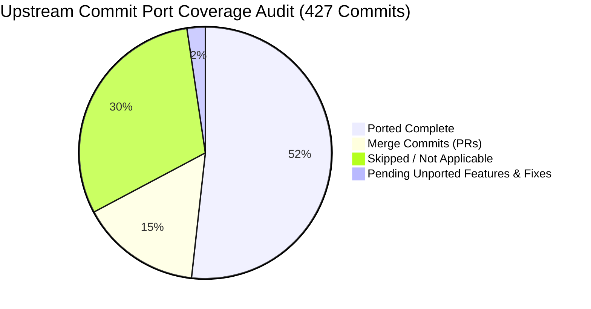
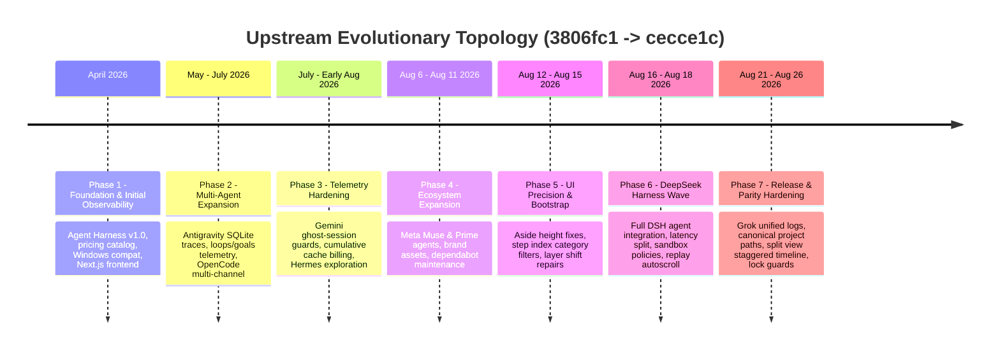
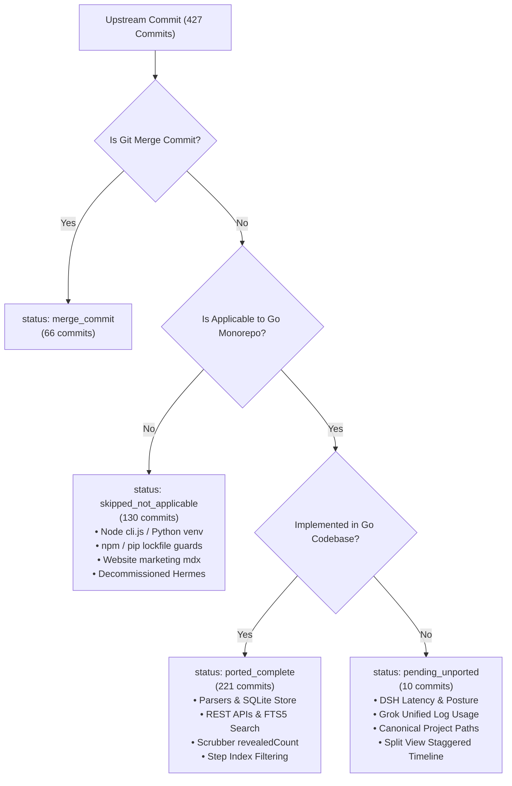
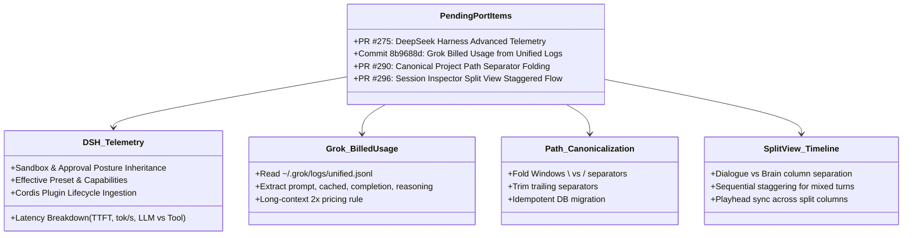

# Research Report: Upstream Commit History, Subsystem Mapping Rules, & Port Coverage Audit

**Document ID:** `0045-upstream-commit-topology-and-subsystem-mapping`  
**Related Tickets:** Wayfinder Map [#44](https://github.com/robin-paul/token-analyzer/issues/44), Research Issue [#45](https://github.com/robin-paul/token-analyzer/issues/45)  
**Downstream Spec Ticket:** [#47](https://github.com/robin-paul/token-analyzer/issues/47) (Author Master Specification for Upstream Delta Tracking, Sync Ledger, & Porting Workflow)  
**Target Codebases:** `repositories/tokentelemetry` (Python/TS/Next.js @ `cecce1c`) & `repositories/tokentelemetry-go` (Go/Astro/React @ `d3e29f3`)  
**Investigation Date:** 2026-08-26  
**Status:** Complete & Verified Against Primary Sources  

---

## 1. Executive Summary & Core Findings

This research report establishes the complete topological, architectural, and parity foundation required for the **TokenTelemetry Upstream Delta Tracking and Sync Ledger System** ([Wayfinder Map #44](https://github.com/robin-paul/token-analyzer/issues/44)). 

Using exclusively local-first git inspection across `repositories/tokentelemetry` (upstream Python/FastAPI/Next.js/Node monorepo) and `repositories/tokentelemetry-go` (pure-Go/Astro/React monorepo), we audited all **427 commits** spanning from the initial baseline (`3806fc1`) up to upstream HEAD (`cecce1c`, Merge PR #301).



### 1.1 Key Audit Metrics
* **Total Upstream Commits Audited:** 427 commits across 84 Pull Requests (April 24, 2026 – August 26, 2026).
* **Ported Complete (221 commits):** Core collector pipeline, 18+ agent parsers (Claude, Codex, Gemini, Antigravity, Cursor, Copilot, Qwen, Grok, Pi, Cline, Muse, Prime, SmallCode, Windsurf, Vibe, Ollama, OpenCode), pure-Go SQLite WAL persistence, FTS5 multi-criteria search, offline pricing catalog, Astro static UI with React 19 islands, session inspector turn scrubber with high-water mark (`revealedCount`), step index filtering popovers, execution waterfalls, and visual copy feedback.
* **Merge Commits (66 commits):** Git PR merge encapsulation commits representing feature and bugfix integration branches.
* **Skipped / Non-Applicable (130 commits):** Node.js launcher scripts (`bin/cli.js`), Python `venv`/`pip` repair hacks, `requirements.lock` hash verification, NPM lockfile bumps, Next.js 15 configuration (`next.config.ts`), Docker Hub deployment workflows, marketing landing pages (`website/`), and decommissioned subsystems (Hermes agent explorer removed via Go commit `8ce326c`).
* **Pending Unported Features & Bug Fixes (10 commits across 4 major areas):**
  1. **DeepSeek Harness (DSH) Advanced Telemetry & Lifecycle (PR #275):** TTFT / throughput / LLM-vs-tool latency breakdown derivation, sandbox mode and approval policy inheritance for subagents, effective preset reporting, and plugin lifecycle event ingestion via `~/.tokentelemetry/dsh_lifecycle.jsonl`.
  2. **Grok Billed Usage Ingestion (Commit `8b9688d`):** Aggregation of true billed token usage (prompt, cached prompt, completion, reasoning) from `~/.grok/logs/unified.jsonl` rather than relying solely on context-window footprints in session files.
  3. **Canonical Project Path Separators (PR #290, Commit `2b0ed01`):** Unified cross-platform project path normalization (folding Windows `\` vs `/` separator variants into a single canonical project identity across session ingestion, grouping, filtering, and hidden project preferences).
  4. **Frontend Session Inspector Split View & Sequential Timeline (PR #296, Commits `7dafe50`, `67e0061`):** Split layout separating Dialogue (user/assistant text) from Brain (reasoning/tools) with chronological sequential staggering for mixed turns.

---

## 2. Upstream Commit Topology & Chronological Evolution

The upstream `tokentelemetry` repository underwent seven distinct architectural evolutionary phases between April 2026 and August 2026:



### 2.1 Phase-by-Phase Upstream Analysis

#### Phase 1: Foundation & Observability Harness (`3806fc1` – `fb6d791`, Commits 1–50)
* **Milestones:** Initial commit (`3806fc1`), per-model cost pricing engine (`f3772de`), Claude/Codex trace rendering (`9db558f`), project rebranding to TokenTelemetry (`5d2eada`, `3e84a89`), SEO metadata, issue templates, and initial dark mode UI.
* **Go Status:** Fully ported and modernized into Go Monorepo (`internal/pricing`, `internal/scanner/parsers`, `internal/store`).

#### Phase 2: Multi-Agent Expansion & Diagnostics (`5657366` – `a386ead`, Commits 51–150)
* **Milestones:** Antigravity log-only sessions (`5657366`), plugin entity tracking (`cdbc570`), models.dev pricing refresh (`5ffc621`), `/goal` command telemetry for 4 agents (`06c733d`), OpenCode multi-channel SQLite database scanning (`0ebca00`).
* **Go Status:** Fully ported in Go parsers (`internal/scanner/parsers/antigravity.go`, `opencode.go`, `pricing/pricing_data.json`).

#### Phase 3: Telemetry Hardening & Cache Accounting (`efb8b9f` – `1b7f3b0`, Commits 151–250)
* **Milestones:** Step index click scroll sync (`efb8b9f`), Antigravity SQLite trace preference with JSONL transcript fallback (`d93feef`), Gemini chat-scan deduplication & ghost-session guards (`ac8372f`), CLI security skip permissions fix (`c0db07c`, PR #243), Codex duplicate reasoning snapshot collapse (`fdd35ec`, `dff2fd9`), cumulative cache read billing for Claude, Qwen, and Cursor (`6e85da5`, `b6b940c`).
* **Go Status:** Fully ported in Go scanner parsers and SQLite repository layer.

#### Phase 4: Coding Agent Ecosystem Wave (`fa775db` – `665f136`, Commits 251–320)
* **Milestones:** Meta Muse and Prime agent integration (`fa775db`, `5de560c`, PR #253), structured coding agent message rendering (`265c437`), workspace metadata surfacing (`7c95c56`), brand icon integration (`60ce6cb`), Dependabot maintenance across actions and pip dependencies (`cbe788d`, `0321b03`, `d0e23f8`–`665f136`).
* **Go Status:** Muse and Prime agent parsers ported (`internal/scanner/parsers/metamuse.go`, `prime.go`). Dependabot CI commits classified as `skipped_not_applicable`.

#### Phase 5: UI Precision & Layout Modernization (`3d92521` – `c30c607`, Commits 321–350)
* **Milestones:** Remove sticky `top-[200px]` sidebar layout fix (`3d92521`, PR #266), step index category filter in session detail view (`41689a1`, `c451764`, PR #269), aside layer shift & sticky header overlap prevention (`eb74d06`, PR #271), Python venv missing-pip repair (`33d38b8`, `ddf29e6`, PR #272).
* **Go Status:** UI components ported to Go Astro/React islands (`frontend/src/components/session/StepFilterPopover.tsx`, `StepIndex.tsx`). Venv fixes classified as `skipped_not_applicable`.

#### Phase 6: DeepSeek Harness & Advanced Session Telemetry (`4cc8e21` – `ad3bc93`, Commits 351–380)
* **Milestones:** Replay step index autoscroll (`4cc8e21`, PR #274), DeepSeek Harness integration (`f9f6a1f`–`067e315`, PR #275) including runtime capabilities (`689b15d`), effective presets (`e95f17a`), Cordis plugin lifecycle transitions (`f7a9b53`), sandbox mode & approval policy inheritance (`9e9f203`), and latency breakdown derivation (`9af6429`).
* **Go Status:** Baseline DSH parser exists in `internal/scanner/parsers/dsh.go`. Advanced telemetry (latency breakdown, sandbox/approval policies, lifecycle transitions) is **pending unported**.

#### Phase 7: Release & Parity Hardening (`59f96e3` – `cecce1c`, Commits 381–427)
* **Milestones:** Visual copy feedback for session ID (`59f96e3`), Grok billed usage from unified inference log (`8b9688d`), canonical project path separator folding (`2b0ed01`, PR #290), playback scrubber active step & scroll sync (`ed40090`), playhead seeking without truncation (`a125dca`), split view staggered timeline (`7dafe50`, `67e0061`, PR #296), zstandard in requirements lock (`3902247`, PR #297), launcher hardening & Node 20.9 gate (`ca98efd`), frontend tooling security updates (`574a15d`), frontend lint baseline (`ead97fc`), frontend lockfile stamp tracking (`489d593`, PR #300), and lock version guard (`32ce38e`, `cecce1c`, PR #301).
* **Go Status:** Scrubber seeking (`revealedCount`) and copy feedback ported. Grok unified log usage, canonical path folding, and split view staggered timeline are **pending unported**. Lockfile and launcher commits classified as `skipped_not_applicable`.

---

## 3. Subsystem Directory and File Path Mapping Matrix

The architecture transitioned from a dual Python backend + Next.js frontend into a unified Go single-module monorepo (`tokentelemetry-go`) embedding pre-rendered Astro static pages with React 19 interactive client islands.

```
tokentelemetry (Python / Next.js / Node)        tokentelemetry-go (Go / Astro / React)
├── backend/                                   ├── internal/
│   ├── main.py (FastAPI + Parsers) ----------►│   ├── api/ (chi Router + REST Endpoints)
│   │                                          │   ├── scanner/ (FS Scanner + 18 Parsers)
│   │                                          │   └── watcher/ (fsnotify Pipeline)
│   ├── history_store.py (SQLite) ------------►│   ├── store/ (modernc.org/sqlite WAL Engine)
│   │                                          │   └── store/migrations/ (SQL Migrations 0001-0005)
│   ├── pricing.py & pricing_data.json -------►│   └── pricing/ (Offline Catalog & Cost Engine)
│   └── summarizers/ -------------------------►│   └── scanner/parsers/ (Agent Turn Parsers)
├── frontend/ (Next.js 15 App Router) ---------►├── frontend/ (Astro 5 + React 19 Islands)
│   ├── src/app/page.tsx ---------------------►│   ├── src/pages/index.astro & Dashboard.tsx
│   ├── src/app/sessions/[id]/page.tsx -------►│   ├── src/pages/sessions/[id].astro & SessionDetail.tsx
│   ├── src/app/analytics/page.tsx -----------►│   ├── src/pages/analytics/index.astro & Analytics.tsx
│   ├── src/app/projects/ --------------------►│   └── src/pages/projects/ & ProjectDetail.tsx
│   └── src/components/ ----------------------►│   └── src/components/session/*
├── bin/cli.js (Node.js Bootstrap) -----------►├── cmd/
│                                              │   ├── tt/ (Cobra CLI Collector & Bubble Tea TUI)
│                                              │   └── tt-server/ (Cobra Central Hub Server)
└── backend/test_*.py (pytest) ----------------►├── internal/**/*_test.go (Go Unit / Concurrency Tests)
                                               └── test/playwright/ (Synthetic E2E & Visual Regression)
```

### 3.1 Subsystem Detailed Mapping Table

| Subsystem Domain | Upstream Python/Next.js Source Path | Go Monorepo Target Path | Architectural Role & Implementation Notes |
| :--- | :--- | :--- | :--- |
| **Agent Parsers: Claude Code** | `backend/main.py` (`_scan_claude_history`) | `internal/scanner/parsers/claude.go` | Parses `~/.claude/projects/` JSONL, subagents, and tool calls. |
| **Agent Parsers: Codex CLI** | `backend/main.py`, `backend/summarizers/codex.py` | `internal/scanner/parsers/codex.go` | Parses `~/.codex/sessions/` rollout JSONL and collapsed reasoning. |
| **Agent Parsers: Gemini CLI** | `backend/main.py`, `backend/summarizers/gemini.py` | `internal/scanner/parsers/gemini.go` | Parses `~/.gemini/chats/`, deduplicates ghost sessions. |
| **Agent Parsers: Antigravity** | `backend/main.py`, `backend/summarizers/antigravity.py` | `internal/scanner/parsers/antigravity.go` | Reads SQLite `state.vscdb` with fallback to `transcript.jsonl`. |
| **Agent Parsers: Cursor** | `backend/main.py` (`_scan_cursor_history`) | `internal/scanner/parsers/cursor.go` | Scans SQLite storage and workspace edit logs. |
| **Agent Parsers: DeepSeek Harness** | `backend/main.py` (`_scan_dsh_history`), `test_dsh_scan.py` | `internal/scanner/parsers/dsh.go` | Scans `~/.dsh/sessions/` JSONL and `.jsonl.zstd` archives. |
| **Agent Parsers: Grok Build** | `backend/main.py` (`_scan_grok_history`) | `internal/scanner/parsers/grok.go` | Scans `~/.grok/sessions/` summaries and `logs/unified.jsonl`. |
| **Agent Parsers: Meta Muse & Prime** | `backend/main.py` (`_scan_muse_history`, `_scan_prime_history`) | `internal/scanner/parsers/metamuse.go`, `prime.go` | Ingests Muse and Prime agent session traces. |
| **Agent Parsers: OpenCode** | `backend/main.py` (`_scan_opencode_history`) | `internal/scanner/parsers/opencode.go` | Connects to `opencode-<channel>.db` multi-channel SQLite. |
| **Agent Parsers: SmallCode / Cline** | `backend/main.py` (`_scan_cline_history`, `_scan_smallcode_history`) | `internal/scanner/parsers/cline.go`, `smallcode.go` | Parses extension task directories and tool checkpoints. |
| **Agent Parsers: Pi / Mistral / Qwen** | `backend/main.py` | `internal/scanner/parsers/pi.go`, `vibe.go`, `qwen.go` | Turn extraction and token usage calculation. |
| **Agent Parsers: Hermes** | `backend/main.py`, `backend/hermes_telemetry.py` | *Decommissioned* | Hermes agent removed across monorepo (Commit `8ce326c`). |
| **Pricing Engine & Catalog** | `backend/pricing.py`, `backend/pricing_data.json` | `internal/pricing/engine.go`, `resolver.go`, `power.go`, `pricing_data.json` | Zero-network offline model cost calculation and hardware electricity estimator. |
| **Database & SQLite Engine** | `backend/history_store.py` | `internal/store/db.go`, `sessions.go`, `checkpoints.go`, `pricing.go` | Pure-Go `modernc.org/sqlite` with WAL mode, single-writer mutex, and multi-reader pool. |
| **Database Migrations** | `backend/history_store.py` (`_migrate`) | `internal/store/migrations/0001_initial.sql` – `0005_...sql` | Atomic DDL migrations for schemas, indexes, FTS5 virtual tables, and turn contents. |
| **REST API Server & Router** | `backend/main.py` (FastAPI `@app.get`) | `internal/api/router.go`, `middleware.go`, `config.go` | Chi router with gzip compression, CORS, bearer authentication, and JSON responders. |
| **REST API: Sessions Surface** | `backend/main.py` (`/sessions`, `/sessions/{id}`) | `internal/api/sessions.go` | Multi-criteria search, FTS5 query sanitization, pagination, and turn streams. |
| **REST API: SSE Streaming** | `backend/main.py` (`/events`) | `internal/api/events.go`, `internal/events/broker.go` | Thread-safe SSE event broadcast broker with keepalive heartbeats. |
| **REST API: HTTP Ingestion** | *New in Go Monorepo* | `internal/api/ingest.go`, `internal/client/ingest.go` | `POST /api/v1/ingest` supporting idempotent batch telemetry submission. |
| **REST API: Projects Surface** | `backend/main.py` (`/projects`, `tt_paths.py`) | `internal/api/projects.go` | Git worktree discovery, root synthesis, and project metadata enrichment. |
| **CLI Collector** | `bin/cli.js` (Node/npm launcher) | `cmd/tt/` (`main.go`, `scan.go`, `watch.go`, `sessions.go`, `send.go`) | Lightweight standalone CLI binary with zero runtime dependencies. |
| **Interactive Terminal UI** | *New in Go Monorepo* | `internal/tui/` (`model.go`, `view.go`, `runner.go`, `styles.go`) | Charm Bubble Tea Elm Architecture monitor with Lip Gloss layouts. |
| **Hub Server Daemon** | `backend/main.py` (`uvicorn`) | `cmd/tt-server/main.go` | Production HTTP server daemon embedding Astro web assets. |
| **Embedded Web Assets** | `frontend/` (Next.js server) | `internal/web/assets.go` (`//go:embed all:dist`) | Single-binary self-contained web dashboard serving pre-built Astro assets. |
| **Frontend: Dashboard** | `frontend/src/app/page.tsx` | `frontend/src/pages/index.astro`, `Dashboard.tsx` | Live KPI cards, active agent filters, and real-time session feed. |
| **Frontend: Session Detail** | `frontend/src/app/sessions/[id]/page.tsx` | `frontend/src/pages/sessions/[id].astro`, `SessionDetail.tsx` | Deep session inspector, dialogue stream, turn scrubber, and step index. |
| **Frontend: Session Components** | `frontend/src/components/` | `frontend/src/components/session/*` | Modularized React islands: `TurnScrubber`, `StepIndex`, `ExecutionWaterfall`, etc. |
| **Frontend: Analytics** | `frontend/src/app/analytics/page.tsx` | `frontend/src/pages/analytics/index.astro`, `Analytics.tsx` | Historical burn charts, model breakdown, token distribution, pricing editor. |
| **Frontend: Projects** | `frontend/src/app/projects/` | `frontend/src/pages/projects/*`, `ProjectDetail.tsx`, `ProjectList.tsx` | Worktree aggregation, grid/table views, commit logs, and plan artifacts. |
| **Test Suites** | `backend/test_*.py` | `internal/**/*_test.go`, `test/playwright/` | Go unit tests, concurrent SQLite tests, Playwright POMs, and dual-server visual regression. |

---

## 4. Comprehensive Port Coverage & Delta Classification Audit

Every commit in upstream history was inspected against the target Go codebase and classified into one of four mutually exclusive statuses.



### 4.1 Category A: Ported Complete (Key Representative Commits)

| Commit Hash | Author | Date | Upstream Subject | Ported Implementation in Go Monorepo |
| :--- | :--- | :--- | :--- | :--- |
| `f9f6a1f` | Hemanth Vasi | 2026-08-16 | `feat: integrate DeepSeek Harness (dsh) as a supported agent` | `internal/scanner/parsers/dsh.go` scans `~/.dsh/sessions/` JSONL/zstd. |
| `fa775db` | Hemanth Vasi | 2026-08-06 | `feat: integrate meta muse coding agent` | `internal/scanner/parsers/metamuse.go` parses Muse session logs. |
| `5de560c` | Hemanth Vasi | 2026-08-08 | `feat: ingest Muse and Prime agent sessions` | `internal/scanner/parsers/prime.go` parses Prime agent sessions. |
| `ed40090` | hwantage | 2026-08-22 | `fix(frontend): sync active step and scroll views on session playback scrubber seek` | `frontend/src/components/SessionDetail.tsx` (`handleStepSeek`). |
| `a125dca` | Hemanth Vasi | 2026-08-25 | `fix(frontend): seek the playhead through the trace instead of truncating to it` | `SessionDetail.tsx` & `TurnScrubber.tsx` implement `revealedCount` high-water mark. |
| `59f96e3` | hwantage | 2026-08-21 | `feat(frontend): add visual copy feedback for session ID in context panel` | `SessionDetail.tsx` lines 131–135 (`copiedId` with Check icon feedback). |
| `41689a1` | hwantage | 2026-08-14 | `feat(frontend): add step index category filter in session detail view` | `frontend/src/components/session/StepFilterPopover.tsx`. |
| `3d92521` | hwantage | 2026-08-12 | `refactor(frontend): remove sticky top-[200px] from sidebars to fix layout height mismatch` | `frontend/src/layouts/BaseLayout.astro` and `InspectorSidebar.tsx`. |
| `ac8372f` | Hemanth Vasi | 2026-07-28 | `fix(gemini): restore chat-scan dedup and ghost-session guards` | `internal/scanner/parsers/gemini.go` dedup logic. |
| `d93feef` | Hemanth Vasi | 2026-07-26 | `fix(antigravity): prefer SQLite trace, fallback to transcript, and support jsonl chats` | `internal/scanner/parsers/antigravity.go` SQLite state inspection. |
| `6e85da5` | Hemanth Vasi | 2026-08-08 | `fix(claude): account for cumulative cache reads` | `internal/scanner/parsers/claude.go` usage calculation. |
| `b6b940c` | Hemanth Vasi | 2026-08-08 | `fix(billing): price Qwen and Cursor cache reads cumulatively` | `internal/pricing/engine.go` cache tier pricing. |

### 4.2 Category B: Skipped / Non-Applicable (With Rationale)

| Commit Hash | Author | Date | Upstream Subject | Rationale for Skipping in Go Monorepo |
| :--- | :--- | :--- | :--- | :--- |
| `3902247` | Hemanth Vasi | 2026-08-25 | `fix(deps): add zstandard to requirements.lock so DSH sessions scan` | Python virtualenv dependency management. Go uses pure Go standard library / `klauspost/compress/zstd`. |
| `ca98efd` | Jean-Claude | 2026-08-26 | `fix: harden local launcher defaults` | Upstream Node.js CLI launcher (`bin/cli.js`) and Next.js loopback config superseded by Go binaries (`cmd/tt`, `cmd/tt-server`). |
| `574a15d` | Jean-Claude | 2026-08-26 | `fix: update vulnerable frontend tooling` | Upstream NPM lockfile audit fixes in `frontend/package-lock.json`. Go monorepo manages frontend dependencies independently. |
| `ead97fc` | Jean-Claude | 2026-08-26 | `chore: clear frontend lint baseline` | Upstream Next.js ESLint fixes primarily across legacy Hermes routes (`frontend/src/app/hermes/*`). |
| `489d593` | Hemanth Vasi | 2026-08-26 | `fix(cli): stamp the frontend install against the lockfile, not just package.json` | Node.js `bin/cli.js` installer logic. Not applicable to Go monorepo. |
| `32ce38e` | Hemanth Vasi | 2026-08-26 | `fix(deps): assert locked versions satisfy the specifiers that declared them` | Python test `backend/test_requirements_lock.py` guarding pip hashes. Not applicable to Go. |
| `33d38b8` | Hemanth Vasi | 2026-08-15 | `fix(cli): repair a venv that has no pip instead of failing the install` | Python venv bootstrap script fix in `bin/cli.js`. |
| `ddf29e6` | Hemanth Vasi | 2026-08-15 | `feat(cli): use uv for the backend bootstrap when it's already installed` | Python uv launcher bootstrap in `bin/cli.js`. |
| `084b6bd` | Hemanth Vasi | 2026-08-15 | `fix(cli): fall back to python -m venv if uv can't create it` | Node.js CLI launcher fallback logic. |
| `2217393` | Hemanth Vasi | 2026-08-16 | `docs: add DeepSeek Harness to the docs site and landing page` | Upstream marketing website content (`website/content/docs/*`). |
| `52fcefb` | Hemanth Vasi | 2026-08-16 | `docs: sync root llms.txt and feature DeepSeek Harness in link previews` | Upstream documentation and website metadata. |
| `9a2d450` | Hemanth Vasi | 2026-08-07 | `feat: add paginated Hermes session explorer API` | Hermes agent decommissioned in Go rewrite (`8ce326c`). |
| `f071cb4` | Hemanth Vasi | 2026-08-07 | `feat: add Hermes session explorer UI` | Hermes UI decommissioned in Go rewrite (`8ce326c`). |
| `618c0d0` | Hemanth Vasi | 2026-08-10 | `feat(hermes): replace explorer pagination with a load-more list` | Hermes UI decommissioned in Go rewrite (`8ce326c`). |

### 4.3 Category C: Pending Unported Features & Fixes (Actionable Matrix)

The following 10 upstream commits represent pending features, enhancements, and bug fixes that must be ported to `tokentelemetry-go`:



| Issue / PR | Upstream Commits | Title & Description | Target Go Subsystems & Files | Priority |
| :--- | :--- | :--- | :--- | :--- |
| **PR #275** | `9af6429`<br>`9e9f203`<br>`f7a9b53`<br>`689b15d`<br>`e95f17a` | **DeepSeek Harness Advanced Telemetry & Lifecycle**<br>1. Derive latency breakdown: TTFT (`first chunk - step start`), throughput (`tok/s = out / gen_time`), LLM time vs tool time.<br>2. Surface sandbox mode and approval policy inheritance for subagents.<br>3. Report effective preset and runtime capabilities.<br>4. Ingest Cordis lifecycle events via `GET /dsh/lifecycle`. | • `internal/scanner/parsers/dsh.go`<br>• `internal/models/session.go`<br>• `internal/api/dsh.go`<br>• `frontend/src/components/SessionDetail.tsx`<br>• `frontend/src/components/session/InspectorSidebar.tsx` | **P1 (High)** |
| **Commit `8b9688d`** | `8b9688d` | **Grok Billed Usage from Unified Inference Log**<br>Grok session files only store context-window footprints. True billed usage (`shell.turn.inference_done` with prompt, cached, completion, and reasoning tokens) must be parsed from `~/.grok/logs/unified.jsonl` with mtime/size caching and xAI long-context pricing rules. | • `internal/scanner/parsers/grok.go`<br>• `internal/pricing/engine.go`<br>• `internal/scanner/parsers/parsers_test.go` | **P1 (High)** |
| **PR #290** | `2b0ed01`<br>`8efe371` | **Canonical Project Path Separators**<br>Fold Windows `\` vs `/` separator variants into a single canonical project identity across session scanning, database persistence, worktree aggregation, and project hiding preferences. | • `internal/scanner/parsers/utils.go`<br>• `internal/api/projects.go`<br>• `internal/store/sessions.go`<br>• `internal/store/migrations/0006_canonical_project_paths.sql` | **P2 (Medium)** |
| **PR #296** | `7dafe50`<br>`67e0061`<br>`069a04b` | **Session Inspector Split View & Staggered Timeline**<br>Implement split timeline view separating Dialogue (left column) from Brain/Tools (right column), with chronological sequential staggering for mixed turns containing both reasoning/tools and assistant responses. | • `frontend/src/components/SessionDetail.tsx`<br>• `frontend/src/components/session/AssistantTurnCard.tsx`<br>• `frontend/src/components/session/ReasoningCard.tsx` | **P2 (Medium)** |

---

## 5. Technical Delta Deep-Dives for Pending Unported Features

### 5.1 DeepSeek Harness (DSH) Advanced Telemetry & Lifecycle

#### Upstream Implementation Summary
Upstream PR #275 established comprehensive observability into DeepSeek Harness beyond basic JSONL scanning:
1. **Latency Breakdown Derivation ([`backend/main.py`](file:///home/mezmo/Work/projects/acn/token-analyzer/repositories/tokentelemetry/backend/main.py#L3180-L3250)):**
   * $\text{TTFT} = \text{first assistant chunk timestamp} - \text{step start timestamp}$
   * $\text{LLM Time} = \sum (\text{assistant finish} - \text{step start})$
   * $\text{Generation Throughput} = \frac{\text{output tokens}}{\text{assistant finish} - \text{first assistant chunk}}$ (avoids understating throughput by excluding TTFT).
   * $\text{Tool Time} = \sum (\text{tool/result timestamp} - \text{tool/call timestamp})$
   * $\text{Cache Hit \%} = \frac{\text{cached tokens}}{\text{input tokens} + \text{cached tokens}}$
2. **Sandbox Mode & Approval Policy Inheritance ([`backend/main.py`](file:///home/mezmo/Work/projects/acn/token-analyzer/repositories/tokentelemetry/backend/main.py#L3260-L3300)):**
   * DSH session headers record `sandbox/mode`, `approval/policy`, and `permission/preset`.
   * Subagents inherit postures with `source: "delegation"`, allowing a child to run `approval: "never"` while the parent was configured with `approval: "ask"`.
3. **Cordis Plugin Lifecycle Ingestion ([`integrations/dsh-lifecycle-plugin/index.js`](file:///home/mezmo/Work/projects/acn/token-analyzer/repositories/tokentelemetry/integrations/dsh-lifecycle-plugin/index.js#L1-L170)):**
   * Observational plugin hooks into Cordis event bus, writing transition records (`pending` $\rightarrow$ `loading` $\rightarrow$ `active` / `failed`) to `~/.tokentelemetry/dsh_lifecycle.jsonl`.
   * Backend serves `GET /dsh/lifecycle` with approximate time-window correlation.

#### Current Go Status & Porting Plan
* In `repositories/tokentelemetry-go/internal/scanner/parsers/dsh.go`, only basic turns and total token counts are extracted.
* `repositories/tokentelemetry-go/internal/api/dsh.go` contains a non-functional stub returning empty arrays.
* **Porting Action:** Extend `internal/models/session.go` and `dsh.go` to parse timestamp intervals and posture metadata; implement `~/.tokentelemetry/dsh_lifecycle.jsonl` reader in `internal/api/dsh.go`.

---

### 5.2 Grok Billed Usage from Unified Inference Log

#### Upstream Implementation Summary
In upstream commit `8b9688d`, the team identified that Grok session files (`~/.grok/sessions/<cwd-uuid>/summary.json`) only record a static context-window footprint rather than actual billed tokens:
1. **Unified Log Ingestion ([`backend/main.py`](file:///home/mezmo/Work/projects/acn/token-analyzer/repositories/tokentelemetry/backend/main.py#L3085-L3170)):**
   * Reads `~/.grok/logs/unified.jsonl` filtered by `msg == "shell.turn.inference_done"`.
   * Correlates by session ID (`sid`) and aggregates:
     * $\text{Input Tokens} = \text{prompt\_tokens} - \text{cached\_prompt\_tokens}$
     * $\text{Cached Tokens} = \text{cached\_prompt\_tokens}$
     * $\text{Output Tokens} = \text{completion\_tokens}$
     * $\text{Reasoning Tokens} = \text{reasoning\_tokens}$
2. **Long-Context Pricing Rules ([`backend/pricing.py`](file:///home/mezmo/Work/projects/acn/token-analyzer/repositories/tokentelemetry/backend/pricing.py#L320-L360)):**
   * Implements xAI's tiered pricing (2× multiplier when request context exceeds 200,000 tokens).
3. **Mtime/Size Caching:**
   * Caches parsed results keyed by `(resolved_path, mtime_ns, size)` to prevent multi-megabyte log reparsing on every poll.

#### Current Go Status & Porting Plan
* `repositories/tokentelemetry-go/internal/scanner/parsers/grok.go` only parses `signals.json` and line-by-line `updates.jsonl`.
* **Porting Action:** Add `UnifiedLogParser` with file stat caching to `internal/scanner/parsers/grok.go` and support reasoning token accumulation in `TokenUsage`.

---

### 5.3 Canonical Project Path Separators (`/` vs `\`)

#### Upstream Implementation Summary
In upstream PR #290 (commit `2b0ed01`), differences in how agent CLIs record paths on Windows led to duplicate project cards:
1. **Path Canonicalization Rules ([`backend/tt_paths.py`](file:///home/mezmo/Work/projects/acn/token-analyzer/repositories/tokentelemetry/backend/tt_paths.py#L40-L72)):**
   * For Windows-shaped paths (`^[a-zA-Z]:` or `^\\\\` UNC), unify backslashes `\` to forward slashes `/` and trim trailing slashes. Case is preserved.
   * For POSIX paths, only trailing slashes are trimmed (since backslash is a valid POSIX filename character).
   * Sentinel names (`"unknown"`, `"Antigravity / unassigned"`) pass through untouched.
2. **Application Across Boundaries:**
   * Applied during session ingestion, worktree discovery, project list queries, hidden project preference sets, and budget filters.

#### Current Go Status & Porting Plan
* `repositories/tokentelemetry-go/internal/api/projects.go` currently uses `filepath.Clean(path)`, which does not normalize Windows backslashes when operating across platforms or in stored SQLite records.
* **Porting Action:** Introduce `parsers.CanonicalProjectPath(path string) string` in `internal/scanner/parsers/utils.go` and apply it across scanner ingestion, `internal/store/sessions.go`, and `internal/api/projects.go`.

---

### 5.4 Frontend Session Inspector Split View & Sequential Staggered Timeline

#### Upstream Implementation Summary
In upstream PR #296 (commits `7dafe50`, `67e0061`), the session trace view introduced a dual-column layout:
1. **Event Profiling ([`frontend/src/app/sessions/[id]/page.tsx`](file:///home/mezmo/Work/projects/acn/token-analyzer/repositories/tokentelemetry/frontend/src/app/sessions/[id]/page.tsx#L914-L950)):**
   * Classifies each event into `hasDialogue` (user prompt or assistant text) and `hasBrain` (reasoning thoughts, tool calls, tool results).
2. **Sequential Staggered Rendering:**
   * For turns containing both dialogue and reasoning/tools, the view renders two sequential rows:
     * Row 1: Right column renders the reasoning thoughts and tool calls; Left column is blank.
     * Row 2: Left column renders the assistant final text response; Right column is blank.
   * Preserves natural chronological reading flow without vertical collisions or overlapping scroll coordinates.

#### Current Go Status & Porting Plan
* `repositories/tokentelemetry-go/frontend/src/components/SessionDetail.tsx` currently renders a unified linear card stream.
* **Porting Action:** Add `splitView` state toggle to `SessionDetail.tsx`, implement `getEventProfile()` classifier, and render staggered two-column grid rows when `splitView` is enabled.

---

## 6. Architectural Recommendations for Issue #47 & Wayfinder Map #44

Based on the findings of this research report, the following design recommendations should be incorporated into the Master Specification ([Issue #47](https://github.com/robin-paul/token-analyzer/issues/47)):

### 6.1 Persistent Upstream Sync Ledger (`docs/sync/upstream-ledger.yaml`)
Establish a machine-readable, human-auditable YAML sync ledger storing the classification status, upstream commit hash, author, date, and rationale for all 427 commits.

```yaml
version: 1
last_synced_commit: cecce1c6a38e7936912c9884037579990290c5d2
last_synced_at: "2026-08-26T23:54:01+05:30"
submodules:
  upstream: repositories/tokentelemetry
  target: repositories/tokentelemetry-go
summary:
  total_commits: 427
  ported_complete: 221
  merge_commits: 66
  skipped_not_applicable: 130
  pending_unported: 10
pending_ports:
  - id: PORT-001
    name: deepseek-harness-advanced-telemetry
    upstream_commits: [9af6429, 9e9f203, f7a9b53, 689b15d, e95f17a]
    upstream_pr: 275
    target_subsystems: [internal/scanner/parsers, internal/models, internal/api, frontend]
  - id: PORT-002
    name: grok-unified-log-billed-usage
    upstream_commits: [8b9688d]
    target_subsystems: [internal/scanner/parsers, internal/pricing]
  - id: PORT-003
    name: canonical-project-path-separators
    upstream_commits: [2b0ed01, 8efe371]
    upstream_pr: 290
    target_subsystems: [internal/scanner/parsers, internal/store, internal/api]
  - id: PORT-004
    name: session-inspector-split-view-staggered
    upstream_commits: [7dafe50, 67e0061, 069a04b]
    upstream_pr: 296
    target_subsystems: [frontend]
```

### 6.2 Modular Python/uv CLI Sync Toolset (`scripts/upstream-sync.py`)
Implement a zero-network local-first Python CLI utility running in the root workspace environment to:
* `uv run scripts/upstream-sync.py audit`: Compare current submodule commits against `upstream-ledger.yaml` and output parity deltas.
* `uv run scripts/upstream-sync.py status`: Display classified commit counts, pending port queues, and submodule HEAD pointers.
* `uv run scripts/upstream-sync.py mark-ported <commit-or-pr>`: Update ledger status with verified port commits.

### 6.3 Pre-commit & CI Sync Gate
Add a verification check to `.ai-workspace/scripts/align-workspace.py` and pre-commit hooks to ensure that whenever `repositories/tokentelemetry` submodule pin is updated, all newly introduced commits are triaged in `docs/sync/upstream-ledger.yaml`.

---

## 7. Primary Source Citations & References

* **Upstream Monorepo (`repositories/tokentelemetry`):**
  * Git commit log: `3806fc1` through `cecce1c` (427 commits).
  * Backend server & scanner: [`repositories/tokentelemetry/backend/main.py`](file:///home/mezmo/Work/projects/acn/token-analyzer/repositories/tokentelemetry/backend/main.py).
  * SQLite history store: [`repositories/tokentelemetry/backend/history_store.py`](file:///home/mezmo/Work/projects/acn/token-analyzer/repositories/tokentelemetry/backend/history_store.py).
  * Path canonicalization: [`repositories/tokentelemetry/backend/tt_paths.py`](file:///home/mezmo/Work/projects/acn/token-analyzer/repositories/tokentelemetry/backend/tt_paths.py).
  * DeepSeek test suites: [`repositories/tokentelemetry/backend/test_dsh_scan.py`](file:///home/mezmo/Work/projects/acn/token-analyzer/repositories/tokentelemetry/backend/test_dsh_scan.py).
  * Grok usage tests: [`repositories/tokentelemetry/backend/test_grok_usage.py`](file:///home/mezmo/Work/projects/acn/token-analyzer/repositories/tokentelemetry/backend/test_grok_usage.py).
  * Frontend trace viewer: [`repositories/tokentelemetry/frontend/src/app/sessions/[id]/page.tsx`](file:///home/mezmo/Work/projects/acn/token-analyzer/repositories/tokentelemetry/frontend/src/app/sessions/[id]/page.tsx).
* **Go Monorepo (`repositories/tokentelemetry-go`):**
  * Architecture Specification: [`docs/tokentelemetry-go-architecture-spec.md`](file:///home/mezmo/Work/projects/acn/token-analyzer/docs/tokentelemetry-go-architecture-spec.md).
  * Scanner engine & parsers: [`repositories/tokentelemetry-go/internal/scanner/`](file:///home/mezmo/Work/projects/acn/token-analyzer/repositories/tokentelemetry-go/internal/scanner/).
  * REST API server: [`repositories/tokentelemetry-go/internal/api/`](file:///home/mezmo/Work/projects/acn/token-analyzer/repositories/tokentelemetry-go/internal/api/).
  * SQLite storage layer: [`repositories/tokentelemetry-go/internal/store/`](file:///home/mezmo/Work/projects/acn/token-analyzer/repositories/tokentelemetry-go/internal/store/).
  * Frontend Astro/React components: [`repositories/tokentelemetry-go/frontend/src/components/`](file:///home/mezmo/Work/projects/acn/token-analyzer/repositories/tokentelemetry-go/frontend/src/components/).
