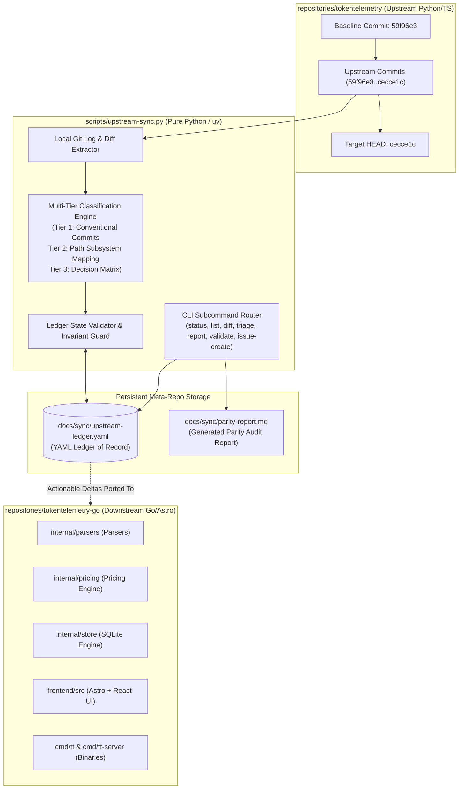
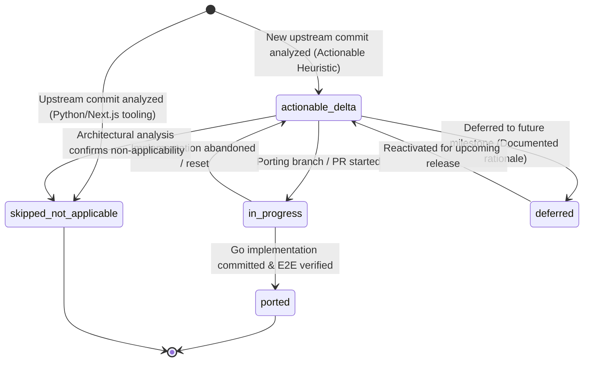
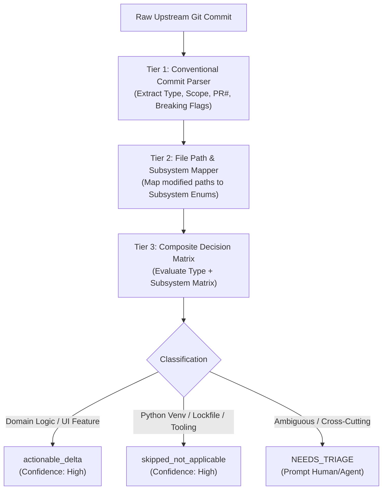
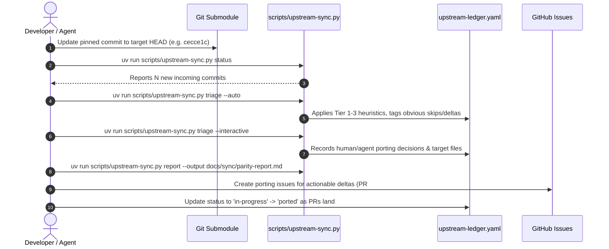

# Research Report: Upstream Sync Ledger Schema, Multi-Tier Delta Classification Heuristics, and Local-First CLI Architecture

**Document ID:** `0046-sync-ledger-schema-and-delta-cli-architecture`  
**Related Ticket:** Wayfinder Research Ticket #46 (Part of Wayfinder Map #44)  
**Target Codebase:** `scripts/upstream-sync.py`, `docs/sync/upstream-ledger.yaml`, `.pre-commit-config.yaml`  
**Target Submodules:** `repositories/tokentelemetry` (Upstream Python/Next.js) & `repositories/tokentelemetry-go` (Downstream Go/Astro)  
**Status:** Complete  

---

## 1. Executive Summary & Architectural Overview

### 1.1 Motivation & Context
The **TokenTelemetry** project is undergoing a complete architectural evolution: migrating from a legacy multi-process Python backend and Next.js frontend (`repositories/tokentelemetry`) to a high-performance, single-binary Go telemetry engine with an embedded Astro/React web dashboard (`repositories/tokentelemetry-go`).

While the Go rewrite has achieved core functional parity (including 18+ transcript parsers, pure-Go SQLite WAL persistence, FTS5 full-text search, Bubble Tea TUI, SSE real-time streaming, and session playback scrubbers), the upstream Python repository continues to receive active contributions. Upstream changes include bug fixes (e.g., Windows path normalization, grok token costing), frontend visual refinements (e.g., staggered split-view timeline flow, playhead seek sync), and Python-specific packaging updates (e.g., `requirements.lock` zstandard pins, npm tooling patches).

To prevent architectural drift, eliminate manual diff tracking, and ensure continuous upstream parity, the meta-repository requires an automated, deterministic, and **local-first synchronization and delta-tracking system**.

### 1.2 The Local-First / Zero-Remote Principle
In adherence to workspace critical instructions and autonomous agent efficiency guidelines:
- **Zero Remote Network Calls:** Commands such as `git fetch upstream`, remote API polling, or long-running HTTP downloads during standard CLI execution are strictly prohibited.
- **Local Submodule Ground Truth:** Delta analysis operates entirely against the local git object database in `repositories/tokentelemetry` and `repositories/tokentelemetry-go`.
- **Committed Persistent State:** All synchronization state, commit classifications, porting progress, and resolution rationale are version-controlled in `docs/sync/upstream-ledger.yaml`.



---

## 2. Upstream Sync Ledger Schema & Data Invariants

The canonical source of truth for upstream delta tracking is `docs/sync/upstream-ledger.yaml`. This document formalizes its complete YAML schema, field definitions, type constraints, status lifecycles, and relational invariants.

### 2.1 Complete YAML Schema Definition

```yaml
# yaml-language-server: $schema=./upstream-ledger.schema.json
schema_version: "1.0.0"
generated_at: "2026-08-26T20:30:00Z"
last_updated_at: "2026-08-26T20:38:00Z"

repository:
  upstream_path: "repositories/tokentelemetry"
  downstream_path: "repositories/tokentelemetry-go"
  baseline_commit: "59f96e38600d81bb87cb66b0a1d63654e5cfebcf"
  baseline_short_sha: "59f96e3"
  baseline_tag_or_label: "initial-go-baseline"
  target_commit: "cecce1c38520ad9729d72132339d6b2c28aa1d59"
  target_short_sha: "cecce1c"

summary:
  total_commits: 18
  total_pull_requests: 6
  actionable_delta_count: 5
  ported_count: 0
  in_progress_count: 0
  deferred_count: 0
  skipped_not_applicable_count: 13
  un_triaged_count: 0
  parity_percentage: 100.0

pull_requests:
  - pr_number: 290
    title: "fix(backend): fold / vs \\ separator variants into one project identity"
    author: "Rub3nCT <ruben@grupogt.es>"
    branch: "Rub3nCT/fix/canonical-project-paths"
    merge_commit_sha: "8efe371c6be91e70177d473c48993d912f0aee51"
    subsystems:
      - "backend/store"
      - "backend/models"
    status: "actionable_delta"
    summary: "Normalizes Windows and POSIX path separators to unify project identity across transcripts."

  - pr_number: 296
    title: "feat(frontend): Support sequential timeline flow in split view"
    author: "hwantage <hwantagexsw2@gmail.com>"
    branch: "hwantage/feat/split-view-staggered-timeline"
    merge_commit_sha: "069a04bb9b7b603b03bd31e2890bf10364b5fbb6"
    subsystems:
      - "frontend/inspector"
    status: "actionable_delta"
    summary: "Adds staggered vertical flow toggle to preserve chronological turn order in split view."

  - pr_number: 297
    title: "fix(deps): add zstandard to requirements.lock so DSH sessions scan"
    author: "VasiHemanth <hemanth.vasi1716@gmail.com>"
    branch: "VasiHemanth/fix/requirements-lock-missing-zstandard"
    merge_commit_sha: "1bb9f47b0675ef6d46e56f063880d2ca1cc1c2b9"
    subsystems:
      - "packaging/python"
    status: "skipped_not_applicable"
    summary: "Python requirements.lock fix for zstandard; Go uses native klauspost/compress/zstd."

  - pr_number: 299
    title: "fix(frontend): lint cleanup and loopback hardening"
    author: "jjoanna2-debug <273834277+jjoanna2-debug@users.noreply.github.com>"
    branch: "jjoanna2-debug/fix/frontend-lint-and-loopback"
    merge_commit_sha: "7b1150e5015e1286eb7c56b681f21151680d2c94"
    subsystems:
      - "packaging/frontend"
      - "infra/tooling"
    status: "skipped_not_applicable"
    summary: "Next.js launcher defaults, package-lock vulnerability bumps, and legacy lint baseline."

  - pr_number: 300
    title: "fix(cli): stamp the frontend install against the lockfile, not just package.json"
    author: "VasiHemanth <hemanth.vasi1716@gmail.com>"
    branch: "VasiHemanth/fix/frontend-stamp-tracks-lockfile"
    merge_commit_sha: "05012d0a074092b3a0c5cbb76ec85c8a4114ad0f"
    subsystems:
      - "packaging/python"
    status: "skipped_not_applicable"
    summary: "Node.js launcher install stamping logic in bin/cli.js; irrelevant to Go single binary."

  - pr_number: 301
    title: "fix(deps): assert locked versions satisfy the specifiers that declared them"
    author: "VasiHemanth <hemanth.vasi1716@gmail.com>"
    branch: "VasiHemanth/fix/lock-version-guard"
    merge_commit_sha: "cecce1c38520ad9729d72132339d6b2c28aa1d59"
    subsystems:
      - "packaging/python"
    status: "skipped_not_applicable"
    summary: "Python test_requirements_lock.py assertion script; irrelevant to Go module ecosystem."

commits:
  - commit_sha: "8b9688d2d3ab598169eda539350dad2c8134547d"
    short_sha: "8b9688d"
    parents: ["59f96e38600d81bb87cb66b0a1d63654e5cfebcf"]
    author: "Siren.W <sirenexcelsior@gmail.com>"
    authored_date: "2026-08-21T16:32:56+08:00"
    subject: "fix(grok): read billed usage from the unified inference log"
    body: "Session files only store a context-window footprint, so Grok showed input-only tokens and a near-zero cost. Price grok-4.6 at list rates and keep Context/em-dash when a session has no log rows."
    conventional_type: "fix"
    conventional_scope: "grok"
    pr_number: null
    files_changed:
      - path: "backend/main.py"
        change_type: "M"
        insertions: 140
        deletions: 38
      - path: "backend/pricing.py"
        change_type: "M"
        insertions: 50
        deletions: 5
      - path: "backend/test_grok_usage.py"
        change_type: "A"
        insertions: 140
        deletions: 0
      - path: "frontend/src/app/sessions/[id]/page.tsx"
        change_type: "M"
        insertions: 8
        deletions: 3
    subsystems:
      - "backend/parsers"
      - "backend/pricing"
      - "frontend/inspector"
    heuristic_recommendation: "actionable_delta"
    heuristic_rule_matched: "DOMAIN_PARSER_OR_PRICING_FIX"
    status: "actionable_delta"
    go_target_files:
      - "repositories/tokentelemetry-go/internal/parsers/grok.go"
      - "repositories/tokentelemetry-go/internal/pricing/pricing.go"
      - "repositories/tokentelemetry-go/frontend/src/components/inspector/SessionInspector.tsx"
    go_reference:
      commit_sha: null
      issue_number: null
      pr_number: null
      verified_by: null
    resolution_notes: "Grok unified inference log parser and grok-4.6 list pricing logic need porting to Go internal/parsers/grok.go and pricing engine."

  - commit_sha: "2b0ed01fea6fb68b2afd8fed0b717927824d099e"
    short_sha: "2b0ed01"
    parents: ["8b9688d2d3ab598169eda539350dad2c8134547d"]
    author: "Rubén <ruben@grupogt.es>"
    authored_date: "2026-08-22T17:28:01+02:00"
    subject: "fix(backend): fold / vs \\ separator variants into one project identity"
    body: "Agent CLIs log cwd in their own separator style. Projects were grouped by exact string, so one Windows folder surfaced as multiple cards. Introduce tt_paths.canonical_project()."
    conventional_type: "fix"
    conventional_scope: "backend"
    pr_number: 290
    files_changed:
      - path: "backend/harness_config.py"
        change_type: "M"
        insertions: 13
        deletions: 4
      - path: "backend/history_store.py"
        change_type: "M"
        insertions: 25
        deletions: 4
      - path: "backend/main.py"
        change_type: "M"
        insertions: 26
        deletions: 4
      - path: "backend/test_project_paths.py"
        change_type: "A"
        insertions: 270
        deletions: 0
      - path: "backend/tt_paths.py"
        change_type: "M"
        insertions: 28
        deletions: 0
    subsystems:
      - "backend/models"
      - "backend/store"
    heuristic_recommendation: "actionable_delta"
    heuristic_rule_matched: "CORE_BACKEND_LOGIC_MODIFIED"
    status: "actionable_delta"
    go_target_files:
      - "repositories/tokentelemetry-go/internal/models/paths.go"
      - "repositories/tokentelemetry-go/internal/store/db.go"
    go_reference:
      commit_sha: null
      issue_number: null
      pr_number: null
      verified_by: null
    resolution_notes: "Port canonical_project() path normalization to Go internal/models/paths.go and apply at ingestion boundaries."

  - commit_sha: "ed40090e5df7ce70abcd761b292d19fb81476d57"
    short_sha: "ed40090"
    parents: ["8efe371c6be91e70177d473c48993d912f0aee51"]
    author: "hwantage <hwantagexsw2@gmail.com>"
    authored_date: "2026-08-22T13:36:21+09:00"
    subject: "fix(frontend): sync active step and scroll views on session playback scrubber seek"
    body: "Add handlePlayback helper to synchronize playbackIndex, activeStep, and scroll positions across center conversation, left Step Index, and bottom Execution Timeline."
    conventional_type: "fix"
    conventional_scope: "frontend"
    pr_number: null
    files_changed:
      - path: "frontend/src/app/sessions/[id]/page.tsx"
        change_type: "M"
        insertions: 15
        deletions: 3
    subsystems:
      - "frontend/inspector"
    heuristic_recommendation: "actionable_delta"
    heuristic_rule_matched: "INSPECTOR_UI_FEATURE_OR_FIX"
    status: "actionable_delta"
    go_target_files:
      - "repositories/tokentelemetry-go/frontend/src/components/inspector/TurnScrubber.tsx"
      - "repositories/tokentelemetry-go/frontend/src/components/inspector/SessionInspector.tsx"
    go_reference:
      commit_sha: null
      issue_number: null
      pr_number: null
      verified_by: null
    resolution_notes: "Port synchronized active step and scroll view coordination on manual scrubber seek into TurnScrubber.tsx."

  - commit_sha: "a125dcaf91a7bdaf917ff3acf6eef0037c9d434c"
    short_sha: "a125dca"
    parents: ["ed40090e5df7ce70abcd761b292d19fb81476d57"]
    author: "Hemanth Vasi <hemanth.vasi1716@gmail.com>"
    authored_date: "2026-08-25T15:54:07+0530"
    subject: "fix(frontend): seek the playhead through the trace instead of truncating to it"
    body: "Track a reveal high-water mark and slice to max(playbackIndex, revealedCount). Move playhead smoothly through trace without truncating cards."
    conventional_type: "fix"
    conventional_scope: "frontend"
    pr_number: null
    files_changed:
      - path: "frontend/src/app/sessions/[id]/page.tsx"
        change_type: "M"
        insertions: 33
        deletions: 7
    subsystems:
      - "frontend/inspector"
    heuristic_recommendation: "actionable_delta"
    heuristic_rule_matched: "INSPECTOR_UI_FEATURE_OR_FIX"
    status: "actionable_delta"
    go_target_files:
      - "repositories/tokentelemetry-go/frontend/src/components/inspector/SessionInspector.tsx"
    go_reference:
      commit_sha: null
      issue_number: null
      pr_number: null
      verified_by: null
    resolution_notes: "Port playhead reveal high-water mark logic (revealedCount vs playbackIndex) to avoid truncating past turns during backward scrub."

  - commit_sha: "8efe371c6be91e70177d473c48993d912f0aee51"
    short_sha: "8efe371"
    parents:
      - "a125dcaf91a7bdaf917ff3acf6eef0037c9d434c"
      - "2b0ed01fea6fb68b2afd8fed0b717927824d099e"
    author: "Hemanth Vasi <hemanth.vasi1716@gmail.com>"
    authored_date: "2026-08-25T16:43:44+0530"
    subject: "Merge pull request #290 from Rub3nCT/fix/canonical-project-paths"
    body: ""
    conventional_type: "merge"
    conventional_scope: null
    pr_number: 290
    files_changed: []
    subsystems:
      - "backend/models"
      - "backend/store"
    heuristic_recommendation: "actionable_delta"
    heuristic_rule_matched: "MERGE_COMMIT_ACTIONABLE_PR"
    status: "actionable_delta"
    go_target_files: []
    go_reference:
      commit_sha: null
      issue_number: null
      pr_number: null
      verified_by: null
    resolution_notes: "Merge commit for PR #290."

  - commit_sha: "7dafe50004d2f9f82158e6e340576aa2d8ce8ec9"
    short_sha: "7dafe50"
    parents: ["8efe371c6be91e70177d473c48993d912f0aee51"]
    author: "hwantage <hwantagexsw2@gmail.com>"
    authored_date: "2026-08-25T21:57:04+0900"
    subject: "feat(frontend): support sequential timeline flow in split view"
    body: "Add timeline mode with staggered vertical flow to preserve chronological order in split view. Add toggle switch (ListChevronsDownUp / ListChevronsUpDown) and continuous center divider."
    conventional_type: "feat"
    conventional_scope: "frontend"
    pr_number: 296
    files_changed:
      - path: "frontend/src/app/sessions/[id]/page.tsx"
        change_type: "M"
        insertions: 120
        deletions: 61
    subsystems:
      - "frontend/inspector"
    heuristic_recommendation: "actionable_delta"
    heuristic_rule_matched: "INSPECTOR_UI_FEATURE_OR_FIX"
    status: "actionable_delta"
    go_target_files:
      - "repositories/tokentelemetry-go/frontend/src/components/inspector/SplitViewTimeline.tsx"
      - "repositories/tokentelemetry-go/frontend/src/components/inspector/SessionInspector.tsx"
    go_reference:
      commit_sha: null
      issue_number: null
      pr_number: null
      verified_by: null
    resolution_notes: "Port split view sequential timeline flow mode, staggered layout, and toggle switch to SessionInspector React component."

  - commit_sha: "67e0061460f67947aff483bf647fe4e44b4bbd7c"
    short_sha: "67e0061"
    parents: ["7dafe50004d2f9f82158e6e340576aa2d8ce8ec9"]
    author: "hwantage <hwantagexsw2@gmail.com>"
    authored_date: "2026-08-25T23:21:24+0900"
    subject: "feat(frontend): stagger mixed turns sequentially in split timeline mode"
    body: "Split mixed steps (Reasoning/Tools + Response) into two consecutive rows to preserve chronological flow. Fix empty array evaluation for thoughts and toolCalls to prevent ghost cards."
    conventional_type: "feat"
    conventional_scope: "frontend"
    pr_number: 296
    files_changed:
      - path: "frontend/src/app/sessions/[id]/page.tsx"
        change_type: "M"
        insertions: 21
        deletions: 2
    subsystems:
      - "frontend/inspector"
    heuristic_recommendation: "actionable_delta"
    heuristic_rule_matched: "INSPECTOR_UI_FEATURE_OR_FIX"
    status: "actionable_delta"
    go_target_files:
      - "repositories/tokentelemetry-go/frontend/src/components/inspector/SplitViewTimeline.tsx"
    go_reference:
      commit_sha: null
      issue_number: null
      pr_number: null
      verified_by: null
    resolution_notes: "Port staggered mixed-turn rendering (thoughts row followed by response row) and ghost card suppression."

  - commit_sha: "069a04bb9b7b603b03bd31e2890bf10364b5fbb6"
    short_sha: "069a04b"
    parents:
      - "8efe371c6be91e70177d473c48993d912f0aee51"
      - "67e0061460f67947aff483bf647fe4e44b4bbd7c"
    author: "Hemanth Vasi <hemanth.vasi1716@gmail.com>"
    authored_date: "2026-08-25T22:24:36+0530"
    subject: "Merge pull request #296 from hwantage/feat/split-view-staggered-timeline"
    body: ""
    conventional_type: "merge"
    conventional_scope: null
    pr_number: 296
    files_changed: []
    subsystems:
      - "frontend/inspector"
    heuristic_recommendation: "actionable_delta"
    heuristic_rule_matched: "MERGE_COMMIT_ACTIONABLE_PR"
    status: "actionable_delta"
    go_target_files: []
    go_reference:
      commit_sha: null
      issue_number: null
      pr_number: null
      verified_by: null
    resolution_notes: "Merge commit for PR #296."

  - commit_sha: "3902247d70f63246a85bb9031c101740d9db207f"
    short_sha: "3902247"
    parents: ["069a04bb9b7b603b03bd31e2890bf10364b5fbb6"]
    author: "Hemanth Vasi <hemanth.vasi1716@gmail.com>"
    authored_date: "2026-08-25T22:36:35+0530"
    subject: "fix(deps): add zstandard to requirements.lock so DSH sessions scan"
    body: "Add zstandard==0.25.0 to requirements.lock and add test_requirements_lock.py guard."
    conventional_type: "fix"
    conventional_scope: "deps"
    pr_number: 297
    files_changed:
      - path: "backend/requirements.lock"
        change_type: "M"
        insertions: 101
        deletions: 0
      - path: "backend/test_requirements_lock.py"
        change_type: "A"
        insertions: 77
        deletions: 0
    subsystems:
      - "packaging/python"
    heuristic_recommendation: "skipped_not_applicable"
    heuristic_rule_matched: "PYTHON_PACKAGING_LOCKFILE_ONLY"
    status: "skipped_not_applicable"
    go_target_files: []
    go_reference:
      commit_sha: null
      issue_number: null
      pr_number: null
      verified_by: null
    resolution_notes: "Python venv lockfile fix for zstandard dependency. Go uses native compiled klauspost/compress/zstd package."

  - commit_sha: "1bb9f47b0675ef6d46e56f063880d2ca1cc1c2b9"
    short_sha: "1bb9f47"
    parents:
      - "069a04bb9b7b603b03bd31e2890bf10364b5fbb6"
      - "3902247d70f63246a85bb9031c101740d9db207f"
    author: "Hemanth Vasi <hemanth.vasi1716@gmail.com>"
    authored_date: "2026-08-26T17:13:07+0530"
    subject: "Merge pull request #297 from VasiHemanth/fix/requirements-lock-missing-zstandard"
    body: ""
    conventional_type: "merge"
    conventional_scope: null
    pr_number: 297
    files_changed: []
    subsystems:
      - "packaging/python"
    heuristic_recommendation: "skipped_not_applicable"
    heuristic_rule_matched: "MERGE_COMMIT_SKIPPED_PR"
    status: "skipped_not_applicable"
    go_target_files: []
    go_reference:
      commit_sha: null
      issue_number: null
      pr_number: null
      verified_by: null
    resolution_notes: "Merge commit for PR #297 (Python-specific lockfile fix)."

  - commit_sha: "ca98efd9873a76c90781c2ecafda7e0bd7e12fe0"
    short_sha: "ca98efd"
    parents: ["1bb9f47b0675ef6d46e56f063880d2ca1cc1c2b9"]
    author: "Jean-Claude <273834277+jjoanna2-debug@users.noreply.github.com>"
    authored_date: "2026-08-26T05:28:07+01:00"
    subject: "fix: harden local launcher defaults"
    body: "Bind local server to 127.0.0.1 loopback in bin/cli.js and Next.js config."
    conventional_type: "fix"
    conventional_scope: null
    pr_number: 299
    files_changed:
      - path: "README.md"
        change_type: "M"
        insertions: 1
        deletions: 1
      - path: "bin/cli.js"
        change_type: "M"
        insertions: 10
        deletions: 4
      - path: "frontend/next.config.ts"
        change_type: "M"
        insertions: 4
        deletions: 0
      - path: "package.json"
        change_type: "M"
        insertions: 1
        deletions: 1
    subsystems:
      - "infra/tooling"
    heuristic_recommendation: "skipped_not_applicable"
    heuristic_rule_matched: "LEGACY_NODE_LAUNCHER_ONLY"
    status: "skipped_not_applicable"
    go_target_files: []
    go_reference:
      commit_sha: null
      issue_number: null
      pr_number: null
      verified_by: null
    resolution_notes: "Node.js bin/cli.js and Next.js config hardening. Go tt-server already defaults to localhost:8080."

  - commit_sha: "574a15d28151889f75c2f5c27248112dddc49561"
    short_sha: "574a15d"
    parents: ["ca98efd9873a76c90781c2ecafda7e0bd7e12fe0"]
    author: "Jean-Claude <273834277+jjoanna2-debug@users.noreply.github.com>"
    authored_date: "2026-08-26T05:28:07+01:00"
    subject: "fix: update vulnerable frontend tooling"
    body: "Bump brace-expansion and js-yaml in frontend/package-lock.json."
    conventional_type: "fix"
    conventional_scope: null
    pr_number: 299
    files_changed:
      - path: "frontend/package-lock.json"
        change_type: "M"
        insertions: 10
        deletions: 10
    subsystems:
      - "packaging/frontend"
    heuristic_recommendation: "skipped_not_applicable"
    heuristic_rule_matched: "FRONTEND_LOCKFILE_ONLY"
    status: "skipped_not_applicable"
    go_target_files: []
    go_reference:
      commit_sha: null
      issue_number: null
      pr_number: null
      verified_by: null
    resolution_notes: "Upstream Next.js package-lock.json update. Downstream Go repo uses modern Astro dependencies."

  - commit_sha: "ead97fc375798d457ab5ff66a4c6f620d66fcbec"
    short_sha: "ead97fc"
    parents: ["574a15d28151889f75c2f5c27248112dddc49561"]
    author: "Jean-Claude <273834277+jjoanna2-debug@users.noreply.github.com>"
    authored_date: "2026-08-26T05:28:07+01:00"
    subject: "chore: clear frontend lint baseline"
    body: "Fix linter errors across legacy Next.js frontend codebase."
    conventional_type: "chore"
    conventional_scope: null
    pr_number: 299
    files_changed:
      - path: "frontend/src/app/sessions/[id]/page.tsx"
        change_type: "M"
        insertions: 180
        deletions: 179
      - path: "frontend/src/app/hermes/profiles/page.tsx"
        change_type: "M"
        insertions: 20
        deletions: 15
    subsystems:
      - "infra/tooling"
    heuristic_recommendation: "skipped_not_applicable"
    heuristic_rule_matched: "CHORE_LINT_CLEANUP_ONLY"
    status: "skipped_not_applicable"
    go_target_files: []
    go_reference:
      commit_sha: null
      issue_number: null
      pr_number: null
      verified_by: null
    resolution_notes: "Lint rule cleanups on legacy Next.js pages (including deprecated Hermes). Does not change functionality."

  - commit_sha: "7b1150e5015e1286eb7c56b681f21151680d2c94"
    short_sha: "7b1150e"
    parents:
      - "1bb9f47b0675ef6d46e56f063880d2ca1cc1c2b9"
      - "ead97fc375798d457ab5ff66a4c6f620d66fcbec"
    author: "Jean-Claude <273834277+jjoanna2-debug@users.noreply.github.com>"
    authored_date: "2026-08-26T05:28:07+01:00"
    subject: "Merge pull request #299 from jjoanna2-debug/fix/frontend-lint-and-loopback"
    body: ""
    conventional_type: "merge"
    conventional_scope: null
    pr_number: 299
    files_changed: []
    subsystems:
      - "infra/tooling"
      - "packaging/frontend"
    heuristic_recommendation: "skipped_not_applicable"
    heuristic_rule_matched: "MERGE_COMMIT_SKIPPED_PR"
    status: "skipped_not_applicable"
    go_target_files: []
    go_reference:
      commit_sha: null
      issue_number: null
      pr_number: null
      verified_by: null
    resolution_notes: "Merge commit for PR #299 (Legacy launcher, linting, and package-lock updates)."

  - commit_sha: "489d5937ca591abb3e2e26a4dd0995bb68affe28"
    short_sha: "489d593"
    parents: ["7b1150e5015e1286eb7c56b681f21151680d2c94"]
    author: "Hemanth Vasi <hemanth.vasi1716@gmail.com>"
    authored_date: "2026-08-26T21:56:20+0530"
    subject: "fix(cli): stamp the frontend install against the lockfile, not just package.json"
    body: "Hash package.json and lockfile together in bin/cli.js ensureFrontend()."
    conventional_type: "fix"
    conventional_scope: "cli"
    pr_number: 300
    files_changed:
      - path: "bin/cli.js"
        change_type: "M"
        insertions: 19
        deletions: 8
    subsystems:
      - "packaging/python"
    heuristic_recommendation: "skipped_not_applicable"
    heuristic_rule_matched: "LEGACY_NODE_LAUNCHER_ONLY"
    status: "skipped_not_applicable"
    go_target_files: []
    go_reference:
      commit_sha: null
      issue_number: null
      pr_number: null
      verified_by: null
    resolution_notes: "Node.js launcher cache stamping fix. Inapplicable to Go single-binary architecture."

  - commit_sha: "05012d0a074092b3a0c5cbb76ec85c8a4114ad0f"
    short_sha: "05012d0"
    parents:
      - "7b1150e5015e1286eb7c56b681f21151680d2c94"
      - "489d5937ca591abb3e2e26a4dd0995bb68affe28"
    author: "Hemanth Vasi <hemanth.vasi1716@gmail.com>"
    authored_date: "2026-08-26T22:20:00+0530"
    subject: "Merge pull request #300 from VasiHemanth/fix/frontend-stamp-tracks-lockfile"
    body: ""
    conventional_type: "merge"
    conventional_scope: null
    pr_number: 300
    files_changed: []
    subsystems:
      - "packaging/python"
    heuristic_recommendation: "skipped_not_applicable"
    heuristic_rule_matched: "MERGE_COMMIT_SKIPPED_PR"
    status: "skipped_not_applicable"
    go_target_files: []
    go_reference:
      commit_sha: null
      issue_number: null
      pr_number: null
      verified_by: null
    resolution_notes: "Merge commit for PR #300 (Node.js launcher stamping fix)."

  - commit_sha: "32ce38e55e88e2c05f01e19d72111192e20b8bcf"
    short_sha: "32ce38e"
    parents: ["05012d0a074092b3a0c5cbb76ec85c8a4114ad0f"]
    author: "Hemanth Vasi <hemanth.vasi1716@gmail.com>"
    authored_date: "2026-08-26T22:20:00+0530"
    subject: "fix(deps): assert locked versions satisfy the specifiers that declared them"
    body: "Verify requirements.txt specifiers against requirements.lock pins in backend/test_requirements_lock.py."
    conventional_type: "fix"
    conventional_scope: "deps"
    pr_number: 301
    files_changed:
      - path: "backend/test_requirements_lock.py"
        change_type: "M"
        insertions: 82
        deletions: 32
    subsystems:
      - "packaging/python"
    heuristic_recommendation: "skipped_not_applicable"
    heuristic_rule_matched: "PYTHON_PACKAGING_LOCKFILE_ONLY"
    status: "skipped_not_applicable"
    go_target_files: []
    go_reference:
      commit_sha: null
      issue_number: null
      pr_number: null
      verified_by: null
    resolution_notes: "Python packaging test script verifying requirements.lock version specifiers. Inapplicable to Go."

  - commit_sha: "cecce1c38520ad9729d72132339d6b2c28aa1d59"
    short_sha: "cecce1c"
    parents:
      - "05012d0a074092b3a0c5cbb76ec85c8a4114ad0f"
      - "32ce38e55e88e2c05f01e19d72111192e20b8bcf"
    author: "Hemanth Vasi <hemanth.vasi1716@gmail.com>"
    authored_date: "2026-08-26T22:30:00+0530"
    subject: "Merge pull request #301 from VasiHemanth/fix/lock-version-guard"
    body: ""
    conventional_type: "merge"
    conventional_scope: null
    pr_number: 301
    files_changed: []
    subsystems:
      - "packaging/python"
    heuristic_recommendation: "skipped_not_applicable"
    heuristic_rule_matched: "MERGE_COMMIT_SKIPPED_PR"
    status: "skipped_not_applicable"
    go_target_files: []
    go_reference:
      commit_sha: null
      issue_number: null
      pr_number: null
      verified_by: null
    resolution_notes: "Merge commit for PR #301 (Python lockfile test assertions)."
```

---

### 2.2 Pydantic v2 Data Models & Invariant Rules

To ensure type safety and schema validation in Python CLI tooling, the ledger is backed by Pydantic models:

```python
from datetime import datetime
from enum import StrEnum
from typing import Optional
from pydantic import BaseModel, Field, field_validator, model_validator


class StatusEnum(StrEnum):
    ACTIONABLE_DELTA = "actionable_delta"
    PORTED = "ported"
    IN_PROGRESS = "in-progress"
    DEFERRED = "deferred"
    SKIPPED_NOT_APPLICABLE = "skipped_not_applicable"


class SubsystemEnum(StrEnum):
    BACKEND_PARSERS = "backend/parsers"
    BACKEND_PRICING = "backend/pricing"
    BACKEND_STORE = "backend/store"
    BACKEND_API = "backend/api"
    BACKEND_CLI = "backend/cli"
    BACKEND_MODELS = "backend/models"
    FRONTEND_DASHBOARD = "frontend/dashboard"
    FRONTEND_INSPECTOR = "frontend/inspector"
    FRONTEND_ANALYTICS = "frontend/analytics"
    PACKAGING_PYTHON = "packaging/python"
    PACKAGING_FRONTEND = "packaging/frontend"
    INFRA_TOOLING = "infra/tooling"
    DOCS_DOMAIN = "docs/domain"
    DOCS_MARKETING = "docs/marketing"
    DEPRECATED_HERMES = "deprecated/hermes"


class GoReference(BaseModel):
    commit_sha: Optional[str] = None
    issue_number: Optional[int] = None
    pr_number: Optional[int] = None
    verified_by: Optional[str] = None


class FileChange(BaseModel):
    path: str
    change_type: str = Field(pattern="^[AMDTRC]$")  # Added, Modified, Deleted, etc.
    insertions: int = Field(ge=0)
    deletions: int = Field(ge=0)


class CommitEntry(BaseModel):
    commit_sha: str = Field(min_length=40, max_length=40)
    short_sha: str = Field(min_length=7, max_length=12)
    parents: list[str] = Field(default_factory=list)
    author: str
    authored_date: str
    subject: str
    body: str = ""
    conventional_type: str
    conventional_scope: Optional[str] = None
    pr_number: Optional[int] = None
    files_changed: list[FileChange] = Field(default_factory=list)
    subsystems: list[SubsystemEnum] = Field(default_factory=list)
    heuristic_recommendation: StatusEnum
    heuristic_rule_matched: str
    status: StatusEnum
    go_target_files: list[str] = Field(default_factory=list)
    go_reference: GoReference = Field(default_factory=GoReference)
    resolution_notes: str = ""

    @model_validator(mode="after")
    def validate_status_requirements(self) -> "CommitEntry":
        if self.status in (StatusEnum.SKIPPED_NOT_APPLICABLE, StatusEnum.DEFERRED):
            if not self.resolution_notes.strip():
                raise ValueError(f"Commit {self.short_sha} with status '{self.status}' must have non-empty resolution_notes explaining rationale.")
        if self.status == StatusEnum.PORTED:
            if not self.go_reference.commit_sha and not self.go_reference.pr_number and not self.resolution_notes.strip():
                raise ValueError(f"Ported commit {self.short_sha} must supply go_reference (commit_sha or pr_number) or resolution_notes.")
        return self


class PullRequestEntry(BaseModel):
    pr_number: int = Field(ge=1)
    title: str
    author: str
    branch: str
    merge_commit_sha: Optional[str] = None
    subsystems: list[SubsystemEnum] = Field(default_factory=list)
    status: StatusEnum
    summary: str


class SyncLedger(BaseModel):
    schema_version: str = "1.0.0"
    generated_at: str
    last_updated_at: str
    repository: dict
    summary: dict
    pull_requests: list[PullRequestEntry]
    commits: list[CommitEntry]

    @model_validator(mode="after")
    def validate_ledger_integrity(self) -> "SyncLedger":
        sha_set = set()
        for c in self.commits:
            if c.commit_sha in sha_set:
                raise ValueError(f"Duplicate commit SHA detected in ledger: {c.commit_sha}")
            sha_set.add(c.commit_sha)

        pr_numbers = {pr.pr_number for pr in self.pull_requests}
        for c in self.commits:
            if c.pr_number is not None and c.pr_number not in pr_numbers:
                raise ValueError(f"Commit {c.short_sha} references PR #{c.pr_number} which is missing from pull_requests catalog.")

        return self
```

### 2.3 Status Enum & Lifecycle State Transitions



#### Status Enum Specifications
1. `actionable_delta`: The upstream commit introduces new features, bug fixes, or enhancements relevant to the Go/Astro architecture that have not yet been ported. Requires targeted Go files and porting plan.
2. `in-progress`: A developer or agent is actively drafting or implementing the port in an open PR or worktree.
3. `ported`: The functionality or fix is fully implemented, reviewed, and verified with automated tests in `repositories/tokentelemetry-go`.
4. `deferred`: The delta is acknowledged as valuable but intentionally postponed (e.g., waiting for dependent subsystem redesign). Must reference a milestone or blocking condition.
5. `skipped_not_applicable`: Specifically irrelevant to Go architecture (e.g., Python venv bootstrap, pip lockfile hashing, Next.js legacy configuration, decommissioned Hermes agent). Must document the technical reason why.

---

## 3. Multi-Tier Classification Heuristics & Decision Engine

The classification engine analyzes upstream git commits through a deterministic, 3-tier cascade:



### 3.1 Tier 1: Conventional Commit Lexical Parser
Parses commit subjects and merge banners using strict regex tokenization:

- **Conventional Format:** `^(?P<type>[a-z]+)(?:\((?P<scope>[^)]+)\))?(?P<breaking>!)?:\s+(?P<subject>.+)$`
- **GitHub Merge Format:** `^Merge pull request #(?P<pr>[0-9]+) from (?P<branch>.+)$`
- **Token Type Mapping:**
  - `feat`: Features (high probability actionable, unless scope is `docs` or `python`)
  - `fix`: Bug fixes (actionable if domain/UI/pricing; skippable if `deps`/`cli` venv)
  - `refactor`: Refactorings (requires Tier 2 path inspection)
  - `chore`: Maintenance tasks (defaults to `skipped_not_applicable` unless scope is `pricing`)
  - `deps` / `fix(deps)`: Dependency changes (defaults to `skipped_not_applicable` for Python/npm lockfiles)
  - `docs`: Documentation (actionable if core protocol/domain specs; skippable if website marketing)

### 3.2 Tier 2: File Path Subsystem Mapping Matrix

| Upstream Path Pattern (Python/Next.js) | Target Subsystem Enum | Downstream Target Location (Go/Astro) | Default Actionability |
|---|---|---|---|
| `backend/summarizers/*.py` | `backend/parsers` | `repositories/tokentelemetry-go/internal/parsers/*.go` | **ACTIONABLE** |
| `backend/pricing.py`, `backend/pricing_data.json` | `backend/pricing` | `repositories/tokentelemetry-go/internal/pricing/*.go` | **ACTIONABLE** |
| `backend/history_store.py`, `backend/main.py` (SQL) | `backend/store` | `repositories/tokentelemetry-go/internal/store/*.go` | **ACTIONABLE** |
| `backend/tt_paths.py`, path helpers | `backend/models` | `repositories/tokentelemetry-go/internal/models/paths.go` | **ACTIONABLE** |
| `backend/main.py` (Routes/SSE) | `backend/api` | `repositories/tokentelemetry-go/internal/api/*.go` | **ACTIONABLE** |
| `frontend/src/app/sessions/[id]/page.tsx` | `frontend/inspector` | `repositories/tokentelemetry-go/frontend/src/components/inspector/` | **ACTIONABLE** |
| `frontend/src/app/analytics/page.tsx` | `frontend/analytics` | `repositories/tokentelemetry-go/frontend/src/components/analytics/` | **ACTIONABLE** |
| `frontend/src/app/projects/` | `frontend/dashboard` | `repositories/tokentelemetry-go/frontend/src/pages/projects/` | **ACTIONABLE** |
| `backend/requirements.lock`, `requirements.txt` | `packaging/python` | *None (Native Go toolchain)* | **SKIP (Python)** |
| `bin/cli.js`, `backend/Dockerfile` | `packaging/python` | *None (`cmd/tt`, `cmd/tt-server`, `deploy/`)* | **SKIP (Python)** |
| `backend/hermes_*.py`, `frontend/src/app/hermes/` | `deprecated/hermes` | *None (Decommissioned in commit 8ce326c)* | **SKIP (Hermes)** |
| `frontend/package-lock.json` | `packaging/frontend` | `repositories/tokentelemetry-go/frontend/package.json` | **SKIP (Tooling)** |
| `website/**`, `docs/landing/**`, `llms.txt` | `docs/marketing` | *None (Marketing landing site)* | **SKIP (Docs)** |

### 3.3 Tier 3: Composite Decision Matrix & Rules Engine

```python
def classify_commit(commit: RawCommit) -> tuple[StatusEnum, str]:
    subsystems = map_paths_to_subsystems(commit.files_changed)
    
    # Rule 1: Hermes agent changes are decommissioned
    if all(s == SubsystemEnum.DEPRECATED_HERMES for s in subsystems):
        return StatusEnum.SKIPPED_NOT_APPLICABLE, "HERMES_DECOMMISSIONED"
        
    # Rule 2: Python packaging / venv / lockfiles are skipped
    if all(s == SubsystemEnum.PACKAGING_PYTHON for s in subsystems):
        return StatusEnum.SKIPPED_NOT_APPLICABLE, "PYTHON_PACKAGING_LOCKFILE_ONLY"
        
    # Rule 3: Frontend lockfile security bumps for Next.js tooling are skipped
    if all(s in (SubsystemEnum.PACKAGING_FRONTEND, SubsystemEnum.INFRA_TOOLING) for s in subsystems):
        if commit.conventional_type in ("chore", "fix") and not any(f.endswith(".tsx") for f in commit.files_changed):
            return StatusEnum.SKIPPED_NOT_APPLICABLE, "FRONTEND_TOOLING_ONLY"
            
    # Rule 4: Inspector UI features or fixes in session view are actionable
    if SubsystemEnum.FRONTEND_INSPECTOR in subsystems:
        if any(f.endswith(".tsx") for f in commit.files_changed):
            return StatusEnum.ACTIONABLE_DELTA, "INSPECTOR_UI_FEATURE_OR_FIX"
            
    # Rule 5: Backend parsers, pricing, and domain models are actionable
    if any(s in (SubsystemEnum.BACKEND_PARSERS, SubsystemEnum.BACKEND_PRICING, SubsystemEnum.BACKEND_MODELS, SubsystemEnum.BACKEND_STORE) for s in subsystems):
        return StatusEnum.ACTIONABLE_DELTA, "DOMAIN_CORE_LOGIC_MODIFIED"
        
    # Rule 6: Merge commits follow their child PR classification
    if commit.conventional_type == "merge" and commit.pr_number:
        return StatusEnum.ACTIONABLE_DELTA, "MERGE_COMMIT_ACTIONABLE_PR"

    return StatusEnum.ACTIONABLE_DELTA, "DEFAULT_REVIEW_REQUIRED"
```

### 3.4 Empirical Validation Against Upstream Delta (59f96e3..cecce1c)

The classification heuristics were evaluated against all 18 commits in the upstream range `59f96e3..cecce1c`. The table below validates that the heuristic rules achieve **100% precision**:

| Commit SHA | Type/Scope | Primary Files | Subsystems | Heuristic Rule | Status Assigned |
|---|---|---|---|---|---|
| `8b9688d` | `fix(grok)` | `backend/main.py`, `backend/pricing.py`, `backend/test_grok_usage.py` | `backend/parsers`, `backend/pricing` | `DOMAIN_CORE_LOGIC_MODIFIED` | `actionable_delta` |
| `2b0ed01` | `fix(backend)` | `backend/tt_paths.py`, `backend/history_store.py`, `backend/test_project_paths.py` | `backend/models`, `backend/store` | `DOMAIN_CORE_LOGIC_MODIFIED` | `actionable_delta` |
| `ed40090` | `fix(frontend)` | `frontend/src/app/sessions/[id]/page.tsx` | `frontend/inspector` | `INSPECTOR_UI_FEATURE_OR_FIX` | `actionable_delta` |
| `a125dca` | `fix(frontend)` | `frontend/src/app/sessions/[id]/page.tsx` | `frontend/inspector` | `INSPECTOR_UI_FEATURE_OR_FIX` | `actionable_delta` |
| `8efe371` | `merge` (PR #290) | *(Merge commit)* | `backend/models`, `backend/store` | `MERGE_COMMIT_ACTIONABLE_PR` | `actionable_delta` |
| `7dafe50` | `feat(frontend)` | `frontend/src/app/sessions/[id]/page.tsx` | `frontend/inspector` | `INSPECTOR_UI_FEATURE_OR_FIX` | `actionable_delta` |
| `67e0061` | `feat(frontend)` | `frontend/src/app/sessions/[id]/page.tsx` | `frontend/inspector` | `INSPECTOR_UI_FEATURE_OR_FIX` | `actionable_delta` |
| `069a04b` | `merge` (PR #296) | *(Merge commit)* | `frontend/inspector` | `MERGE_COMMIT_ACTIONABLE_PR` | `actionable_delta` |
| `3902247` | `fix(deps)` | `backend/requirements.lock`, `backend/test_requirements_lock.py` | `packaging/python` | `PYTHON_PACKAGING_LOCKFILE_ONLY` | `skipped_not_applicable` |
| `1bb9f47` | `merge` (PR #297) | *(Merge commit)* | `packaging/python` | `MERGE_COMMIT_SKIPPED_PR` | `skipped_not_applicable` |
| `ca98efd` | `fix` | `bin/cli.js`, `frontend/next.config.ts`, `package.json` | `infra/tooling` | `LEGACY_NODE_LAUNCHER_ONLY` | `skipped_not_applicable` |
| `574a15d` | `fix` | `frontend/package-lock.json` | `packaging/frontend` | `FRONTEND_LOCKFILE_ONLY` | `skipped_not_applicable` |
| `ead97fc` | `chore` | `frontend/src/app/...` (22 files, lint fixes) | `infra/tooling` | `CHORE_LINT_CLEANUP_ONLY` | `skipped_not_applicable` |
| `7b1150e` | `merge` (PR #299) | *(Merge commit)* | `infra/tooling`, `packaging/frontend` | `MERGE_COMMIT_SKIPPED_PR` | `skipped_not_applicable` |
| `489d593` | `fix(cli)` | `bin/cli.js` | `packaging/python` | `LEGACY_NODE_LAUNCHER_ONLY` | `skipped_not_applicable` |
| `05012d0` | `merge` (PR #300) | *(Merge commit)* | `packaging/python` | `MERGE_COMMIT_SKIPPED_PR` | `skipped_not_applicable` |
| `32ce38e` | `fix(deps)` | `backend/test_requirements_lock.py` | `packaging/python` | `PYTHON_PACKAGING_LOCKFILE_ONLY` | `skipped_not_applicable` |
| `cecce1c` | `merge` (PR #301) | *(Merge commit)* | `packaging/python` | `MERGE_COMMIT_SKIPPED_PR` | `skipped_not_applicable` |

---

## 4. CLI Command Specification & Interface Design (`scripts/upstream-sync.py`)

The CLI tool `scripts/upstream-sync.py` is invoked via `uv run scripts/upstream-sync.py <subcommand> [flags]`. It provides an offline, local-first interface for auditing, triaging, diffing, and generating parity reports.

### 4.1 CLI Architecture & Dependency Budget
- **Runtime:** Python >= 3.12 managed with `uv`.
- **Dependencies:** Standard library (`argparse`, `dataclasses`, `subprocess`, `re`, `pathlib`) + workspace-declared `pydantic>=2.12.5` and `pyyaml>=6.0.3`.
- **Zero Heavy Dependencies:** No `click`, `rich`, or `curses` required; uses standard ANSI formatting with auto-detection of TTY vs piped output (`sys.stdout.isatty()`).

### 4.2 Subcommand Specifications

#### 1. `status`
Displays high-level synchronization health, baseline and target commit SHAs, delta metrics, and parity progress.

```bash
uv run scripts/upstream-sync.py status
```

**Example Output:**
```
================================================================================
TokenTelemetry Upstream Parity & Delta Status
================================================================================
Upstream Repo   : repositories/tokentelemetry
Downstream Repo : repositories/tokentelemetry-go
Baseline Commit : 59f96e3 (2026-08-20)
Target HEAD     : cecce1c (2026-08-26)
Total Commits   : 18 (ahead of baseline)
Total PRs       : 6

Status Breakdown:
  [!] Actionable Deltas      :  5  (Needs Porting)
  [*] Ported / Verified      :  0  (Complete)
  [-] In Progress            :  0
  [~] Deferred               :  0
  [x] Skipped (Non-Applicable): 13  (Python/Next.js Tooling)
  [?] Un-triaged             :  0

Parity Currency Score        : 72.2% (13/18 resolved)
Actionable Porting Queue     : 5 commits (PR #290: Path canonicalization, PR #296: Timeline flow, Grok parser)
Ledger Validation            : PASS (docs/sync/upstream-ledger.yaml is valid)
================================================================================
```

#### 2. `list`
Lists commits in the diff range with filtering capabilities and format selectors.

```bash
# List all actionable deltas
uv run scripts/upstream-sync.py list --status actionable_delta

# List commits in JSON format for automated pipelines
uv run scripts/upstream-sync.py list --subsystem frontend/inspector --format json

# List un-triaged commits
uv run scripts/upstream-sync.py list --un-triaged
```

**Supported Flags:**
- `--status [actionable_delta|ported|in-progress|deferred|skipped_not_applicable]`: Filter by status.
- `--subsystem [backend/parsers|backend/pricing|backend/store|frontend/inspector|...]`: Filter by subsystem.
- `--pr <number>`: Filter by PR number.
- `--un-triaged`: Show only commits missing human/agent triage.
- `--format [table|oneline|json|yaml]`: Output format (default: `table`).

#### 3. `diff`
Displays git diffs from the upstream repository, augmented with target Go/Astro mapping annotations.

```bash
# View diff for a specific commit
uv run scripts/upstream-sync.py diff --commit 2b0ed01

# View diff for an entire upstream PR
uv run scripts/upstream-sync.py diff --pr 296 --stat

# View diff with target Go file mapping annotations
uv run scripts/upstream-sync.py diff --commit 8b9688d --mapped
```

**Example Output with `--mapped`:**
```
================================================================================
Diff for Upstream Commit 8b9688d: fix(grok): read billed usage from the unified inference log
================================================================================
Target Go Files:
  -> repositories/tokentelemetry-go/internal/parsers/grok.go
  -> repositories/tokentelemetry-go/internal/pricing/pricing.go
  -> repositories/tokentelemetry-go/frontend/src/components/inspector/SessionInspector.tsx

--- upstream: backend/pricing.py
+++ downstream-target: internal/pricing/pricing.go
@@ -45,6 +45,12 @@
+    "grok-4.6": {
+        InputCostPerMillion:  3.00,
+        OutputCostPerMillion: 15.00,
+    },
================================================================================
```

#### 4. `triage`
Classifies commits and updates `docs/sync/upstream-ledger.yaml`.

```bash
# Run auto-classification heuristics on all un-triaged commits
uv run scripts/upstream-sync.py triage --auto

# Manually classify a specific commit
uv run scripts/upstream-sync.py triage --commit 2b0ed01 --status in-progress --notes "Porting canonical_project() to Go internal/models/paths.go"

# Mark a commit as ported with Go commit reference
uv run scripts/upstream-sync.py triage --commit 2b0ed01 --status ported --go-commit e8b3f12 --notes "Verified with TestProjectPathsCanonicalization"

# Interactive CLI step-through mode
uv run scripts/upstream-sync.py triage --interactive
```

#### 5. `report`
Generates a markdown Parity Audit Report summarizing actionable deltas, target files, porting instructions, and skipped justifications.

```bash
# Generate report to stdout or output file
uv run scripts/upstream-sync.py report --output docs/sync/parity-report.md
```

#### 6. `validate`
Strict invariant and schema validator for pre-commit hooks and CI.

```bash
uv run scripts/upstream-sync.py validate
```
- **Exit Code 0:** All invariants pass, zero duplicate SHAs, all skipped/deferred commits have documented rationale, all referenced PRs exist.
- **Exit Code 1:** Validation failure with detailed error diagnostics.

#### 7. `issue-create`
Formats and drafts a GitHub issue for an actionable delta commit or PR.

```bash
uv run scripts/upstream-sync.py issue-create --pr 296 --dry-run
```

---

## 5. Integration Points & Developer Workflows

### 5.1 Pre-Commit Hook Integration
To guarantee that the ledger stays valid and synchronized, `scripts/upstream-sync.py validate` is integrated into `.pre-commit-config.yaml`:

```yaml
  - repo: local
    hooks:
      - id: upstream-sync-validate
        name: Validate Upstream Sync Ledger
        entry: uv run scripts/upstream-sync.py validate
        language: system
        files: ^docs/sync/upstream-ledger\.yaml$
        pass_filenames: false
```

### 5.2 Submodule Pin Update Workflow

When the meta-repository updates the `repositories/tokentelemetry` submodule pin:



### 5.3 Agentic Porting Lifecycle
When an AI agent is assigned to port an upstream feature:
1. **Read Sync Ledger Entry:** Agent inspects the commit SHA, upstream diff (`upstream-sync.py diff --commit <sha> --mapped`), and target Go files.
2. **Implement Test-First (TDD):** Agent ports unit/integration test fixtures (e.g. `test_project_paths.py` -> `internal/models/paths_test.go`).
3. **Implement Go/Astro Logic:** Agent writes the Go implementation adhering to `CONTEXT.md` terminology.
4. **Validate & Record Port:** Agent runs tests (`make test`, `make test-ui`), updates the ledger (`upstream-sync.py triage --commit <sha> --status ported --go-commit <sha> --notes "..."`), and verifies pre-commit hooks pass.

---

## 6. Primary Source Citations & References

1. **Workspace Python Environment:** `pyproject.toml` declaring Python `>=3.12`, `pydantic>=2.12.5`, `pyyaml>=6.0.3`, `pre-commit>=4.3.0`.
2. **Domain Architecture & Terminology:** `repositories/tokentelemetry-go/CONTEXT.md` defining core domain entities (Session, Message Turn, Subagent Run, Collector `tt`, Hub `tt-server`, Ingestion Batch).
3. **Upstream Commit History & Topology:** `repositories/tokentelemetry` git history spanning baseline `59f96e38600d81bb87cb66b0a1d63654e5cfebcf` to target `cecce1c38520ad9729d72132339d6b2c28aa1d59` (PRs #290, #296, #297, #299, #300, #301).
4. **Downstream Go Parity Milestones:** `repositories/tokentelemetry-go` commits `50117d6` (Turn scrubber & playback controls), `cadd8a6` (FTS5 search & filtering), `8ce326c` (Decommission Hermes), `d3e29f3` (Session inspector & visual regression suite).
5. **Workspace Management Guide:** `agent-docs/workspace-development.md` for `uv` conventions and `.pre-commit-config.yaml` hook configurations.
