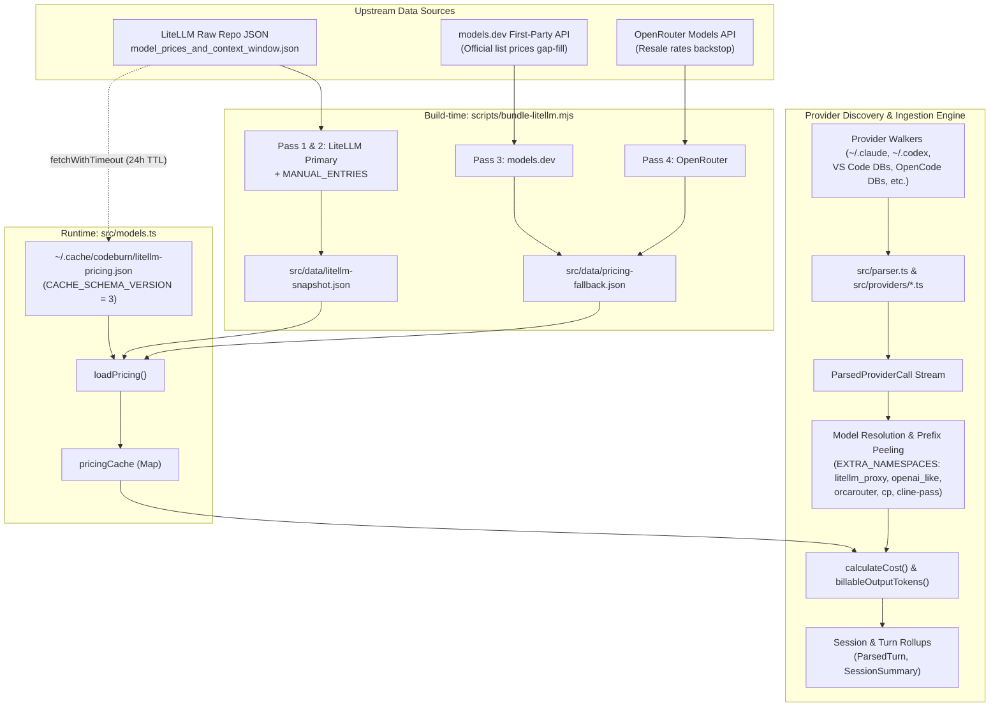

# Research: Codeburn LiteLLM Integration Architecture and Hooks

**Document ID:** `0063-codeburn-litellm-integration-architecture`  
**Target File:** `docs/research/0063-codeburn-litellm-integration-architecture.md`  
**Issue:** #63  
**Status:** Complete  

---

## 1. Executive Summary & Integration Architecture Overview

`codeburn` is a local-first token telemetry and AI spend intelligence engine. An investigation of the codebase in `repositories/codeburn` (`src/`, `scripts/`, `tests/`, `package.json`, etc.) establishes that **Codeburn does not operate as an inline HTTP proxy, custom LiteLLM callback/logger server, or webhook listener**. Instead, Codeburn integrates with LiteLLM across two key architectural boundaries:

1. **Upstream Pricing Catalog Source (Build-time & Runtime Caching Plane)**:
   - Codeburn uses LiteLLM's public repository (`BerriAI/litellm`) as its primary ground-truth pricing catalog (`model_prices_and_context_window.json`).
   - At build time, [`scripts/bundle-litellm.mjs:L20-L96`](file:///Users/robin.a.paul/Proj/token-analyzer/repositories/codeburn/scripts/bundle-litellm.mjs#L20-L96) fetches LiteLLM's pricing data, merges hand-curated overrides (`MANUAL_ENTRIES`), and bundles a compact JSON snapshot into [`src/data/litellm-snapshot.json`](file:///Users/robin.a.paul/Proj/token-analyzer/repositories/codeburn/src/data/litellm-snapshot.json).
   - At runtime, [`src/models.ts:loadPricing()`](file:///Users/robin.a.paul/Proj/token-analyzer/repositories/codeburn/src/models.ts#L305-L327) checks a local 24-hour on-disk cache at `~/.cache/codeburn/litellm-pricing.json`. If expired or missing, it dynamically fetches the latest pricing from LiteLLM's raw GitHub endpoint, falling back to the bundled snapshot on network failure or when isolated via environment variables.

2. **Model Normalization, Gateway Wrapper Peeling, and Proxy Namespace Handling**:
   - Codeburn ingests local transcripts, logs, and SQLite databases written by 40+ local AI developer tools (Claude Code, Codex, Copilot, Cursor, OpenCode, Kimi, Hermes, etc.).
   - When tools route completions through LiteLLM proxies or routing gateways (e.g. `litellm_proxy/<model>`, `openai_like/<model>`, `orcarouter/<model>`, `cp/<model>`, `cline-pass/<model>`), Codeburn's model resolution engine ([`src/models.ts:L854-L1057`](file:///Users/robin.a.paul/Proj/token-analyzer/repositories/codeburn/src/models.ts#L854-L1057)) strips routing wrappers and LiteLLM proxy prefixes, matches against known catalog namespaces, and calculates turn- and session-level costs against the resolved LiteLLM rates.



---

## 2. Configuration, Environment Variables, Payload Schemas, and Endpoints

### 2.1 Endpoints and URLs
- **Primary LiteLLM Catalog URL:**
  - `https://raw.githubusercontent.com/BerriAI/litellm/main/model_prices_and_context_window.json`
  - Citations: [`src/models.ts:L65`](file:///Users/robin.a.paul/Proj/token-analyzer/repositories/codeburn/src/models.ts#L65), [`scripts/bundle-litellm.mjs:L20`](file:///Users/robin.a.paul/Proj/token-analyzer/repositories/codeburn/scripts/bundle-litellm.mjs#L20)
- **Secondary Gap-Fill Endpoints (Bundler Only):**
  - `https://models.dev/api.json` ([`scripts/bundle-litellm.mjs:L21`](file:///Users/robin.a.paul/Proj/token-analyzer/repositories/codeburn/scripts/bundle-litellm.mjs#L21))
  - `https://openrouter.ai/api/v1/models` ([`scripts/bundle-litellm.mjs:L22`](file:///Users/robin.a.paul/Proj/token-analyzer/repositories/codeburn/scripts/bundle-litellm.mjs#L22))

### 2.2 Environment Variables
- `CODEBURN_PRICING_SNAPSHOT_ONLY`: When set (used in tests via [`tests/setup/env-isolation.ts:L52`](file:///Users/robin.a.paul/Proj/token-analyzer/repositories/codeburn/tests/setup/env-isolation.ts#L52)), disables runtime HTTP calls to `LITELLM_URL` and forces `loadPricing()` to price exclusively off the static bundled snapshot ([`src/models.ts:L313-L319`](file:///Users/robin.a.paul/Proj/token-analyzer/repositories/codeburn/src/models.ts#L313-L319)).
- `CODEBURN_CACHE_DIR` / `XDG_CACHE_HOME`: Controls the base cache directory where `litellm-pricing.json` is stored (`~/.cache/codeburn/` by default, [`src/cache-dir.ts:L1-L28`](file:///Users/robin.a.paul/Proj/token-analyzer/repositories/codeburn/src/cache-dir.ts#L1-L28)).
- `CODEBURN_CONFIG_DIR` / `XDG_CONFIG_HOME`: Controls the directory for `config.json` where user model aliases and price overrides are persisted (`~/.config/codeburn/config.json`, [`src/config.ts:L1-L70`](file:///Users/robin.a.paul/Proj/token-analyzer/repositories/codeburn/src/config.ts#L1-L70)).
- `CODEBURN_VERBOSE`: When set to `'1'`, enables `stderr` logging of unpriced / unknown model warnings ([`src/models.ts:L1175`](file:///Users/robin.a.paul/Proj/token-analyzer/repositories/codeburn/src/models.ts#L1175)).

### 2.3 Payload Schemas & Data Structures

#### 1. LiteLLM Upstream Entry (`LiteLLMEntry`)
Referenced in [`src/models.ts:L52-L58`](file:///Users/robin.a.paul/Proj/token-analyzer/repositories/codeburn/src/models.ts#L52-L58):
```typescript
type LiteLLMEntry = {
  input_cost_per_token?: number
  output_cost_per_token?: number
  cache_creation_input_token_cost?: number
  cache_read_input_token_cost?: number
  provider_specific_entry?: { fast?: number }
}
```

#### 2. Bundled Snapshot Entry (`SnapshotEntry`)
Referenced in [`src/models.ts:L63`](file:///Users/robin.a.paul/Proj/token-analyzer/repositories/codeburn/src/models.ts#L63) and [`scripts/bundle-litellm.mjs:L71`](file:///Users/robin.a.paul/Proj/token-analyzer/repositories/codeburn/scripts/bundle-litellm.mjs#L71):
```typescript
// 5-tuple: [inputCostPerToken, outputCostPerToken, cacheWriteCostPerToken, cacheReadCostPerToken, fastMultiplier]
type SnapshotEntry = [number, number, number | null, number | null, (number | null)?]
```

#### 3. On-Disk Cache Schema (`litellm-pricing.json`)
Referenced in [`src/models.ts:L66-L74, L268-L283`](file:///Users/robin.a.paul/Proj/token-analyzer/repositories/codeburn/src/models.ts#L66-L74):
```typescript
{
  version: 3,                 // CACHE_SCHEMA_VERSION
  timestamp: 1724937600000,   // Date.now() at fetch time (24h TTL)
  data: {
    "claude-3-7-sonnet": {
      inputCostPerToken: 0.000003,
      outputCostPerToken: 0.000015,
      cacheWriteCostPerToken: 0.00000375,
      cacheReadCostPerToken: 0.0000003,
      webSearchCostPerRequest: 0.01,
      fastMultiplier: 1,
      cacheWriteCostIsExplicit: true
    }
  }
}
```

#### 4. Internal In-Memory Model Costs (`ModelCosts`)
Referenced in [`src/models.ts:L10-L25`](file:///Users/robin.a.paul/Proj/token-analyzer/repositories/codeburn/src/models.ts#L10-L25):
```typescript
export type ModelCosts = {
  inputCostPerToken: number
  outputCostPerToken: number
  cacheWriteCostPerToken: number
  cacheReadCostPerToken: number
  webSearchCostPerRequest: number
  fastMultiplier: number
  cacheWriteCostIsExplicit?: boolean
}
```

---

## 3. LiteLLM-Specific Metadata & Routing Prefix Mapping

### 3.1 Routing Wrappers & Namespace Peeling
LiteLLM proxy deployments and multi-model gateways often prepend proxy tags and provider namespaces to the model string (e.g. `litellm_proxy/anthropic/claude-3-7-sonnet`, `openai_like/deepseek-v4-pro`, `orcarouter/deepseek/deepseek-v4-pro`).

Codeburn resolves these via:
1. **Catalog-Derived Namespaces & Extra Routing Namespaces** ([`src/models.ts:L889-L918`](file:///Users/robin.a.paul/Proj/token-analyzer/repositories/codeburn/src/models.ts#L889-L918)):
   ```typescript
   const EXTRA_NAMESPACES = [
     'cp', 'cline-pass', 'cline-free', 'cmd', 'antigravity', 'orcarouter',
     'litellm_proxy', 'openai_like',
     'zhipu', 'mimo', 'kimi',
   ]
   ```
   `getKnownNamespaces()` extracts all vendor prefixes present in the LiteLLM pricing keys (e.g. `anthropic`, `openai`, `google`, `qwen`, `x-ai`) and merges `EXTRA_NAMESPACES`, while explicitly removing local runners (`LOCAL_NAMESPACES = ['ollama']`) to prevent unpriced local tags from stripping to cloud rates.

2. **Recursive Prefix Peeling (`routedModelCandidates`)** ([`src/models.ts:L936-L975`](file:///Users/robin.a.paul/Proj/token-analyzer/repositories/codeburn/src/models.ts#L936-L975)):
   Iteratively strips router prefixes matching `ROUTER_PREFIXES` (`/^omniroute:/i`, `/^cp\//i`, `/^cline-pass\//i`, `/^cline-free\//i`, `/^cmd\//i`, `/^antigravity\//i`, `/^orcarouter\//i`).

3. **Known First Namespace Stripping (`stripKnownFirstNamespace`)** ([`src/models.ts:L920-L926`](file:///Users/robin.a.paul/Proj/token-analyzer/repositories/codeburn/src/models.ts#L920-L926)):
   Strips leading namespaces only if recognized in `getKnownNamespaces()` (e.g., `litellm_proxy/claude-sonnet-4-6` -> `claude-sonnet-4-6`). Unknown vendor trees stay intact and fail closed ($0 / unpriced) rather than guessing rates.

### 3.2 Mapping into Session and Turn Entities
During log parsing in [`src/parser.ts`](file:///Users/robin.a.paul/Proj/token-analyzer/repositories/codeburn/src/parser.ts) and individual provider adapters ([`src/providers/`](file:///Users/robin.a.paul/Proj/token-analyzer/repositories/codeburn/src/providers/)):

| Raw Field / Metadata | Codeburn Entity Property | Resolution & Mapping Logic |
| :--- | :--- | :--- |
| `model` / `model_provider` | `ParsedApiCall.model` / `ParsedProviderCall.model` | Canonicalized via `getCanonicalName()` & `resolveAlias()` ([`src/models.ts:L854-L870`](file:///Users/robin.a.paul/Proj/token-analyzer/repositories/codeburn/src/models.ts#L854-L870)) |
| Token Usage Fields (`input_tokens`, `output_tokens`, `cache_creation_input_tokens`, `cache_read_input_tokens`) | `ParsedApiCall.usage: TokenUsage` | Clamped to non-negative numbers via `safe()` ([`src/models.ts:L1210-L1228`](file:///Users/robin.a.paul/Proj/token-analyzer/repositories/codeburn/src/models.ts#L1210-L1228)) |
| `provider_specific_entry.fast` (LiteLLM) | `ModelCosts.fastMultiplier` | Applied to turn cost if `speed === 'fast'` ([`src/models.ts:L1216`](file:///Users/robin.a.paul/Proj/token-analyzer/repositories/codeburn/src/models.ts#L1216)) |
| Turn Cost Calculation | `ParsedApiCall.costUSD` | Computed via `calculateCost()` ([`src/models.ts:L1184-L1230`](file:///Users/robin.a.paul/Proj/token-analyzer/repositories/codeburn/src/models.ts#L1184-L1230)) using the resolved LiteLLM `ModelCosts` |
| Local Workspace / Repository | `SessionSummary.project` / `projectPath` | Derived from transcript cwd / workspace path ([`src/types.ts:L236-L240`](file:///Users/robin.a.paul/Proj/token-analyzer/repositories/codeburn/src/types.ts#L236-L240)) |
| Subscription / Proxy Overrides | `proxyPaths` in `config.json` | Marks directories routed over subscription proxies (e.g. Copilot proxy) as subscription-covered spend ([`src/main.ts:L708-L710`](file:///Users/robin.a.paul/Proj/token-analyzer/repositories/codeburn/src/main.ts#L708-L710)) |

---

## 4. Key File Citations & Reference Matrix

1. **Pricing Ingestion, Caching, and Calculation:**
   - [`src/models.ts:L52-L58`](file:///Users/robin.a.paul/Proj/token-analyzer/repositories/codeburn/src/models.ts#L52-L58) - `LiteLLMEntry` interface
   - [`src/models.ts:L65-L76`](file:///Users/robin.a.paul/Proj/token-analyzer/repositories/codeburn/src/models.ts#L65-L76) - `LITELLM_URL`, `CACHE_TTL_MS` (24h), `CACHE_SCHEMA_VERSION` (3)
   - [`src/models.ts:L218-L233`](file:///Users/robin.a.paul/Proj/token-analyzer/repositories/codeburn/src/models.ts#L218-L233) - `parseLiteLLMEntry()` parser and safety clamping
   - [`src/models.ts:L245-L276`](file:///Users/robin.a.paul/Proj/token-analyzer/repositories/codeburn/src/models.ts#L245-L276) - `fetchAndCachePricing()` live network fetch and disk persistence
   - [`src/models.ts:L305-L327`](file:///Users/robin.a.paul/Proj/token-analyzer/repositories/codeburn/src/models.ts#L305-L327) - `loadPricing()` cache-checking and fallback orchestration
   - [`src/models.ts:L356-L358`](file:///Users/robin.a.paul/Proj/token-analyzer/repositories/codeburn/src/models.ts#L356-L358) - `getPricingGenerationKey()` cache invalidation signature
   - [`src/models.ts:L889-L975`](file:///Users/robin.a.paul/Proj/token-analyzer/repositories/codeburn/src/models.ts#L889-L975) - `EXTRA_NAMESPACES`, `getKnownNamespaces()`, `stripKnownFirstNamespace()`, `ROUTER_PREFIXES`
   - [`src/models.ts:L1184-L1230`](file:///Users/robin.a.paul/Proj/token-analyzer/repositories/codeburn/src/models.ts#L1184-L1230) - `calculateCost()` mathematical costing engine

2. **Build-Time Bundling:**
   - [`scripts/bundle-litellm.mjs:L20-L96`](file:///Users/robin.a.paul/Proj/token-analyzer/repositories/codeburn/scripts/bundle-litellm.mjs#L20-L96) - Passes 1 and 2 fetching `model_prices_and_context_window.json` and bundling `src/data/litellm-snapshot.json`
   - [`scripts/bundle-litellm.mjs:L97-L178`](file:///Users/robin.a.paul/Proj/token-analyzer/repositories/codeburn/scripts/bundle-litellm.mjs#L97-L178) - Passes 3 and 4 gap-filling from `models.dev` and `OpenRouter`

3. **Session & Turn Data Models:**
   - [`src/types.ts:L1-L170`](file:///Users/robin.a.paul/Proj/token-analyzer/repositories/codeburn/src/types.ts#L1-L170) - `TokenUsage`, `ParsedTurn`, `ParsedApiCall`
   - [`src/providers/types.ts:L31-L97`](file:///Users/robin.a.paul/Proj/token-analyzer/repositories/codeburn/src/providers/types.ts#L31-L97) - `ParsedProviderCall` schema

4. **Testing & Isolation:**
   - [`tests/setup/env-isolation.ts:L52`](file:///Users/robin.a.paul/Proj/token-analyzer/repositories/codeburn/tests/setup/env-isolation.ts#L52) - `CODEBURN_PRICING_SNAPSHOT_ONLY` setting
   - [`tests/models.test.ts:L218-L240, L1273-L1300`](file:///Users/robin.a.paul/Proj/token-analyzer/repositories/codeburn/tests/models.test.ts#L218-L240) - LiteLLM entry parsing and prefix peeling unit tests
