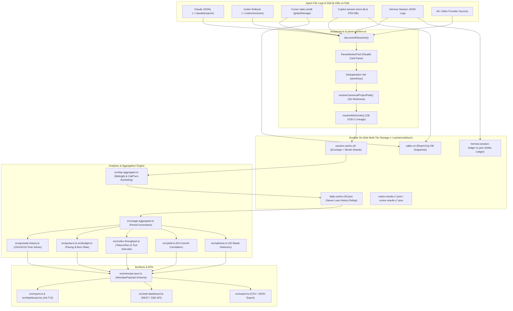

# Research: Codeburn Data Aggregation, Schema, and Metrics Model

**Document ID:** `0064-codeburn-data-aggregation-and-metrics-model`  
**Related Ticket:** GitHub Issue #64 (Research: Codeburn Data Aggregation, Schema, and Metrics Model)  
**Primary Source:** `repositories/codeburn`  
**Status:** Complete  

---

## 1. Executive Summary & Architectural Overview

The **CodeBurn** telemetry and spend-monitoring engine (`repositories/codeburn/src/`) provides local token, cost, and developer-activity aggregation across 40+ AI coding agent harnesses (including Claude Code, Codex CLI, Cursor, GitHub Copilot, Gemini CLI, Antigravity, OpenCode, Hermes, Devin, Grok, Kimi, and Kiro). CodeBurn operates as an ambient CLI and daemon feeding lightweight GUI consumers across macOS (Swift Menubar), Windows (Rust/Tauri + React), GNOME (GJS Extension), and Web UI (`codeburn web` / Astro dashboard).



---

## 2. Data Storage Model & On-Disk Schemas

CodeBurn adopts a multi-tier, zero-database server approach, relying exclusively on local file systems with strict permission controls (`0o600` / `0o700`) and transactional atomic file publishing via temporary files and `renameSync`/`rename` ([`session-cache.ts:L321-L327`](file:///Users/robin.a.paul/Proj/token-analyzer/repositories/codeburn/src/session-cache.ts#L321-L327), [`daily-cache.ts:L1300-L1320`](file:///Users/robin.a.paul/Proj/token-analyzer/repositories/codeburn/src/daily-cache.ts#L1300-L1320)).

### 2.1 Cache Directory Resolution
Base cache resolution is centralized in [`src/cache-dir.ts:L11-L14`](file:///Users/robin.a.paul/Proj/token-analyzer/repositories/codeburn/src/cache-dir.ts#L11-L14):
- Default cache path: `~/.cache/codeburn`
- Override environment variable: `CODEBURN_CACHE_DIR`
- User configuration and guard thresholds: `~/.config/codeburn/config.json` and `~/.config/codeburn/guard.json` ([`src/guard/store.ts:L5-L15`](file:///Users/robin.a.paul/Proj/token-analyzer/repositories/codeburn/src/guard/store.ts#L5-L15)).

### 2.2 SQLite Read-Only Ingestion & Sidecar Isolation
CodeBurn integrates a pure read-only SQLite abstraction layer ([`src/sqlite.ts:L9-L30`](file:///Users/robin.a.paul/Proj/token-analyzer/repositories/codeburn/src/sqlite.ts#L9-L30)) using Node.js's built-in `node:sqlite` (`DatabaseSync`):
- **WAL-Mode Safe Reading:** Configures `PRAGMA busy_timeout = 1000` ([`src/sqlite.ts:L426-L429`](file:///Users/robin.a.paul/Proj/token-analyzer/repositories/codeburn/src/sqlite.ts#L426-L429)) to handle concurrent database writes by IDEs.
- **BLOB Decoding Guard:** Node's `node:sqlite` aborts the V8 process on invalid UTF-8 in `TEXT` columns (common in Cursor chat blobs with truncated multi-byte characters). CodeBurn queries string fields as `CAST(... AS BLOB)` and decodes via `blobToText` using `TextDecoder('utf-8', { fatal: false })` ([`src/sqlite.ts:L35-L47`](file:///Users/robin.a.paul/Proj/token-analyzer/repositories/codeburn/src/sqlite.ts#L35-L47)).
- **Sidecar & Read-Only Directory Cache (`sqlite-ro`):** When reading SQLite databases located in read-only directories or locked volumes where `-shm` and `-wal` sidecars cannot be created, `openReadonlyCache` writes an isolated fingerprint-named snapshot to `~/.cache/codeburn/sqlite-ro/<sourceKey>.<fingerprint>.db` ([`src/sqlite.ts:L329-L370`](file:///Users/robin.a.paul/Proj/token-analyzer/repositories/codeburn/src/sqlite.ts#L329-L370)). Eviction cleans up snapshots untouched for 24 hours ([`src/sqlite.ts:L190-L316`](file:///Users/robin.a.paul/Proj/token-analyzer/repositories/codeburn/src/sqlite.ts#L190-L316)).

### 2.3 Session Cache Schema (`src/session-cache.ts`)
The session cache (`session-cache.v9`, [`src/session-cache.ts:L197-L206`](file:///Users/robin.a.paul/Proj/token-analyzer/repositories/codeburn/src/session-cache.ts#L197-L206)) stores parsed turn data in provider-month shards to eliminate multi-hundred-megabyte JSON rewrites on single-session appends:
- **Envelope File (`envelope.json`):** Tracks cache version, hydration completeness flag (`complete`), and shard map per provider ([`src/session-cache.ts:L426-L432`](file:///Users/robin.a.paul/Proj/token-analyzer/repositories/codeburn/src/session-cache.ts#L426-L432)).
- **Month Sharding:** Each shard file (`<provider>.<YYYY-MM>.json`) stores files bucketed by their oldest turn's month (`bucket`), while tracking their newest turn's month (`until`) to enable date-range query pruning ([`src/session-cache.ts:L415-L472`](file:///Users/robin.a.paul/Proj/token-analyzer/repositories/codeburn/src/session-cache.ts#L415-L472)). Turn-less or failed files reside in an undated bucket `0000-00` ([`src/session-cache.ts:L437`](file:///Users/robin.a.paul/Proj/token-analyzer/repositories/codeburn/src/session-cache.ts#L437)).
- **File Fingerprinting:** Every cached file is stamped with filesystem `dev`, `ino`, `mtimeMs`, and `sizeBytes` ([`src/session-cache.ts:L96-L101`](file:///Users/robin.a.paul/Proj/token-analyzer/repositories/codeburn/src/session-cache.ts#L96-L101)).
- **Environment & Parser Version Fingerprinting:** `computeEnvFingerprint` hashes provider-specific discovery environment variables and parser version identifiers ([`src/session-cache.ts:L247-L300`](file:///Users/robin.a.paul/Proj/token-analyzer/repositories/codeburn/src/session-cache.ts#L247-L300), [`L546-L552`](file:///Users/robin.a.paul/Proj/token-analyzer/repositories/codeburn/src/session-cache.ts#L546-L552)).

```typescript
// Key cached types in src/session-cache.ts
export type CachedUsage = {
  inputTokens: number
  outputTokens: number
  cacheCreationInputTokens: number
  cacheReadInputTokens: number
  cachedInputTokens: number
  reasoningTokens: number
  webSearchRequests: number
  cacheCreationOneHourTokens: number
}

export type CachedCall = {
  provider: string
  model: string
  usage: CachedUsage
  costUSD?: number
  isEstimated?: boolean
  speed: 'standard' | 'fast'
  timestamp: string
  tools: string[]
  bashCommands: string[]
  skills: string[]
  subagentTypes: string[]
  deduplicationKey: string
  project?: string
  projectPath?: string
  workingDirectory?: string
  toolSequence?: ToolCall[][]
  locAdded?: number
  locRemoved?: number
  interrupted?: boolean
  userModified?: boolean
  toolErrors?: number
  editFailed?: number
  activeDurationMs?: number
  activeGeneratedTokens?: number
  toolWaitMs?: number
  nanoAiu?: number
  supplementaryAccounting?: boolean
}

export type CachedFile = {
  fingerprint: FileFingerprint
  lastCompleteLineOffset?: number
  canonicalCwd?: string
  workingDirectory?: string
  canonicalProjectName?: string
  mcpInventory: string[]
  turns: CachedTurn[]
  title?: string
  prLinks?: string[]
  isSidechain?: boolean
  parentSessionId?: string
  agentSpawnLinks?: Record<string, string>
  lineage?: SessionLineage
  failed?: boolean
}
```

### 2.4 Daily Cache Schema (`src/daily-cache.ts`)
The daily cache (`daily-cache.v29.json`, [`src/daily-cache.ts:L177-L207`](file:///Users/robin.a.paul/Proj/token-analyzer/repositories/codeburn/src/daily-cache.ts#L177-L207)) maintains a 10-year rolling rollup of finalized days:
- **"Never-Lose History" Architecture:** AI agents delete transcript files after retention limits (e.g. Claude Code ~30 days). CodeBurn retains historical daily slices across version upgrades by adopting older cache files (`adoptOlderDailyCaches`) and carrying forward sourceless days (`carried: true`) ([`src/daily-cache.ts:L105-L120`](file:///Users/robin.a.paul/Proj/token-analyzer/repositories/codeburn/src/daily-cache.ts#L105-L120), [`L264-L269`](file:///Users/robin.a.paul/Proj/token-analyzer/repositories/codeburn/src/daily-cache.ts#L264-L269)).
- **Timezone Invalidation & Midnight Boundary:** Days are bucketed by local wall-clock midnight. The cache records `tzKey` (IANA timezone); if the machine's timezone changes, history is re-derived to prevent misalignment across midnight boundaries ([`src/daily-cache.ts:L278-L283`](file:///Users/robin.a.paul/Proj/token-analyzer/repositories/codeburn/src/daily-cache.ts#L278-L283)).
- **Daily Entry Structure:**
  ```typescript
  export type DailyEntry = {
    date: string // YYYY-MM-DD
    cost: number
    savingsUSD: number
    calls: number
    sessions: number
    inputTokens: number
    outputTokens: number
    cacheReadTokens: number
    cacheWriteTokens: number
    editTurns: number
    oneShotTurns: number
    models: Record<string, ModelDayStats>
    categories: Record<string, CategoryDayStats>
    providers: Record<string, ProviderDaySlice>
    projects?: Record<string, ProjectDayStats>
    carried?: true
  }
  ```

### 2.5 Hermes Sidecar Session Ledger (`src/hermes-session-ledger.ts`)
For agent frameworks like Hermes that persist cumulative lifetime counters rather than discrete delta events, CodeBurn maintains `hermes-session-ledger.v1.json` ([`src/hermes-session-ledger.ts:L25-L63`](file:///Users/robin.a.paul/Proj/token-analyzer/repositories/codeburn/src/hermes-session-ledger.ts#L25-L63)). It records session cursors (`lastSeen`) and emits observation deltas with `supplementaryAccounting: true` for weight-0 incremental billing.

---

## 3. Session Lifecycle Boundaries & Ingestion

### 3.1 Source Ingestion & Transcript File Formats
CodeBurn handles transcript discovery across multiple storage formats:
1. **Append-Only JSONL Transcripts:** Claude Code (`~/.claude/projects/<slug>/<sessionId>.jsonl`), Codex (`~/.codex/sessions/**/*.jsonl`), Dsh, Kimi, Crush, OpenClaude. Incremental parsing uses byte-offset resumption via `lastCompleteLineOffset` ([`src/session-cache.ts:L105`](file:///Users/robin.a.paul/Proj/token-analyzer/repositories/codeburn/src/session-cache.ts#L105)).
2. **SQLite Database Stores:** Cursor (`state.vscdb` in `globalStorage`), OpenCode (`opencode.db`), GitHub Copilot (`session-store.db` and OTel SQLite stores).
3. **Structured JSON Logs & State Directories:** Hermes (`~/.hermes/sessions/`), Lingtai, Devin, Kimi Code (`state.json`).

### 3.2 Canonical Project Grouping & Working Directory Resolution
Sessions are grouped into `ProjectSummary` containers using strict git workspace resolution ([`src/parser.ts:L124-L165`](file:///Users/robin.a.paul/Proj/token-analyzer/repositories/codeburn/src/parser.ts#L124-L165)):
- **Linked Git Worktrees:** Traverses `.git` parent pointers to canonicalize linked git worktrees to their primary repository path, preventing fragmented project reporting across ephemeral branch worktrees.
- **Cowork & Container Isolation:** Sessions running inside Docker containers or ephemeral desktop outputs directories (`isCoworkSession`, [`src/parser.ts:L102-L110`](file:///Users/robin.a.paul/Proj/token-analyzer/repositories/codeburn/src/parser.ts#L102-L110)) preserve space names instead of container-local paths (`/sessions/*`).

### 3.3 Strict Provider-Recorded Lineage & Work Units (CB-1 / CB-2)
To link parent sessions with spawned subagents (sidechains, tasks, background workers), CodeBurn enforces a strict **zero-inference** rule ([`src/types.ts:L207-L234`](file:///Users/robin.a.paul/Proj/token-analyzer/repositories/codeburn/src/types.ts#L207-L234), [`src/work-units.ts:L1-L21`](file:///Users/robin.a.paul/Proj/token-analyzer/repositories/codeburn/src/work-units.ts#L1-L21)):
- Relationships are recognized **ONLY** when durably recorded by the provider on disk (e.g. Claude `sessionId` inside sidechains, `agentSpawnLinks`, Kimi `parentAgentId`).
- Time-adjacency, shared working directories, or filesystem nesting are forbidden as evidence.
- `resolveWorkUnits()` ([`src/work-units.ts:L74-L157`](file:///Users/robin.a.paul/Proj/token-analyzer/repositories/codeburn/src/work-units.ts#L74-L157)) deterministically resolves roots, child session IDs, and roles (`root` | `child` | `unknown`) and derives trace IDs (`deriveTraceId`).

### 3.4 Turn Slicing & Boundary Bucketing Alignment
CodeBurn resolves turn vs. call alignment using a dual-bucketing rule ([`src/day-aggregator.ts:L97-L115`](file:///Users/robin.a.paul/Proj/token-analyzer/repositories/codeburn/src/day-aggregator.ts#L97-L115)):
1. **Turn-Level Descriptors:** Category classification, `editTurns`, and `oneShotTurns` are anchored to the user-message timestamp (the prompt instant).
2. **Call-Level Metrics:** Token usage, cost USD, savings USD, model counts, and project totals are bucketed by each assistant call's individual execution timestamp. This guarantees that sessions spanning midnight reconcile exactly with daily rolling sums.

### 3.5 Resident Serve Caching & Burst Windows
In resident server mode (`codeburn serve`), sub-second UI polling is optimized via:
- `parseBurstWindowMs()`: Reuses parses within a configurable window (up to 60s) for identical queries whose range end moves with wall-clock time ([`src/parser.ts:L4281-L4325`](file:///Users/robin.a.paul/Proj/token-analyzer/repositories/codeburn/src/parser.ts#L4281-L4325)).
- `parseReuseValidator`: Backed by filesystem watchers (`fs.watch`), extending memo reuse up to 5 minutes when directories remain clean ([`src/parser.ts:L4286-L4299`](file:///Users/robin.a.paul/Proj/token-analyzer/repositories/codeburn/src/parser.ts#L4286-L4299)).

---

## 4. Time-Series Metrics, Burn Rates, Power & Rolling Aggregations

### 4.1 Granular Time-Series Model (`src/granular-history.ts`)
For interactive dashboards, `buildGranularHistory` compiles multi-resolution time series ([`src/granular-history.ts:L34-L82`](file:///Users/robin.a.paul/Proj/token-analyzer/repositories/codeburn/src/granular-history.ts#L34-L82)):
- **Dynamic Bucket Sizing:**
  - $\le 48\text{ hours} \implies 15\text{-minute buckets}$
  - $\le 8\text{ days} \implies 1\text{-hour buckets}$
  - $> 8\text{ days} \implies 1\text{-day buckets}$
- **Series Selection & Legend Collisions:** Selects top 6 models and top 6 sessions by cost and tokens ([`src/granular-history.ts:L111-L121`](file:///Users/robin.a.paul/Proj/token-analyzer/repositories/codeburn/src/granular-history.ts#L111-L121)), using collision-resistant label resolvers (`buildSessionLabels`, [`L188-L250`](file:///Users/robin.a.paul/Proj/token-analyzer/repositories/codeburn/src/granular-history.ts#L188-L250)).

### 4.2 Quota Pacing & Burn Projection Engine (`src/quota.ts`)
CodeBurn models subscription quotas (5-hour, weekly, monthly, credit pools) with linear pacing calculations ([`src/quota.ts:L10-L98`](file:///Users/robin.a.paul/Proj/token-analyzer/repositories/codeburn/src/quota.ts#L10-L98)):
- **Expected vs. Used Fraction:**
  $$\text{expectedFraction} = \frac{\text{elapsedSeconds}}{\text{windowSeconds}}$$
  $$\text{deltaFraction} = \text{usedFraction} - \text{expectedFraction}$$
- **Reset Projection:**
  $$\text{projectedAtReset} = \frac{\text{usedFraction}}{\text{expectedFraction}}$$
- **Exhaustion ETA (`exhaustsAt`):**
  $$\text{exhaustsAt} = \text{now} + \left(\frac{1 - \text{usedFraction}}{\text{usedPerSecond}}\right)$$
- **Noise Suppression Guards:** Pacing is suppressed until at least 3% of the window has elapsed (`QUOTA_PACE_MIN_ELAPSED_FRACTION = 0.03`) and exhaustion ETAs are omitted on short burst windows $\le 6\text{ hours}$ (`QUOTA_PACE_ETA_MAX_WINDOW_SECONDS = 21600`).

### 4.3 Budget Status & Run-Rate Forecasting (`src/budget.ts`, `src/plan-usage.ts`)
Tracks spending limits across daily, weekly, and monthly tiers:
- **Run-Rate Projection:** $\text{projected} = \frac{\text{spent} \times \text{totalDays}}{\text{elapsedDays}}$ ([`src/budget.ts:L52`](file:///Users/robin.a.paul/Proj/token-analyzer/repositories/codeburn/src/budget.ts#L52)).
- **State Thresholds:** `under` ($<80\%$), `warn` ($80\%\text{--}99\%$), `over` ($\ge 100\%$) ([`src/budget.ts:L53`](file:///Users/robin.a.paul/Proj/token-analyzer/repositories/codeburn/src/budget.ts#L53)).
- **Copilot AIU Conversions:** 1 nano-AIU = $10^{-9}\text{ credits}$; 1 credit = $\$0.01$ ([`src/copilot-aiu.ts`](file:///Users/robin.a.paul/Proj/token-analyzer/repositories/codeburn/src/copilot-aiu.ts), [`src/types.ts:L166-L169`](file:///Users/robin.a.paul/Proj/token-analyzer/repositories/codeburn/src/types.ts#L166-L169)).

### 4.4 Real-Time Throughput & Tool Wait Timing (`src/codex-throughput.ts`)
Evaluates token decode speed and execution timing across Codex rollouts ([`src/codex-throughput.ts:L6-L130`](file:///Users/robin.a.paul/Proj/token-analyzer/repositories/codeburn/src/codex-throughput.ts#L6-L130)):
- Metrics: `generatedTokensPerSecond`, `activeGeneratedTokensPerSecond`, `activeDurationSeconds`, `toolWaitSeconds`.
- `mergeToolIntervals()` clips tool execution windows to task durations, merges overlapping intervals, and caps total tool time.

### 4.5 Session Yield & Outcome Attribution (`src/yield.ts`)
Correlates AI session timestamps with git repository logs (`git log --all`) to classify spend ([`src/yield.ts:L8-L55`](file:///Users/robin.a.paul/Proj/token-analyzer/repositories/codeburn/src/yield.ts#L8-L55)):
- `productive`: Session produced commits that survived on main branches.
- `reverted`: Commits were subsequently reverted or discarded.
- `abandoned`: Session incurred cost/edits but produced zero git commits.
- `ambiguous`: Monorepo or cross-worktree overlap prevented deterministic attribution.

### 4.6 Behavioral Weighting & Supplementary Accounting (`src/behavioral-weight.ts`)
To prevent non-interactive background events (e.g. Copilot compaction rollups, Hermes observation deltas) from inflating call counts:
- `isBehavioralCall()` assigns weight 1 to user-prompted requests and weight 0 to supplementary accounting records ([`src/behavioral-weight.ts:L14-L37`](file:///Users/robin.a.paul/Proj/token-analyzer/repositories/codeburn/src/behavioral-weight.ts#L14-L37)).
- Tokens and dollar costs are 100% preserved in all sums; only request/call counts are weighted.

### 4.7 Pricing Engine & Reasoning Token Semantics (`src/models.ts`)
Pricing relies on LiteLLM tables (`src/data/litellm-snapshot.json`) with heuristic fallbacks ([`src/models.ts:L10-L100`](file:///Users/robin.a.paul/Proj/token-analyzer/repositories/codeburn/src/models.ts#L10-L100)):
- **Cache Multipliers:** Default cache write = $1.25\times\text{input}$, cache read = $0.10\times\text{input}$.
- **Reasoning Token Billing (`billableOutputTokens`):**
  - Inclusive providers (`claude`, `codex`, `copilot`): Reasoning tokens are already part of `outputTokens`.
  - Exclusive providers (Grok, DeepSeek, OpenCode): Billable output is calculated as $\text{outputTokens} + \text{reasoningTokens}$ ([`src/models.ts:L36-L43`](file:///Users/robin.a.paul/Proj/token-analyzer/repositories/codeburn/src/models.ts#L36-L43)).

---

## 5. Menubar Payload Surface (`src/menubar-json.ts`)

The primary contract between the CodeBurn CLI and GUI clients is `MenubarPayload` ([`src/menubar-json.ts:L189-L380`](file:///Users/robin.a.paul/Proj/token-analyzer/repositories/codeburn/src/menubar-json.ts#L189-L380)):
- `current`: Real-time period aggregates (cost, savings, tokens, cache hits, top activities, models, projects, model efficiency, file churn, PR attribution, branch attribution, retry tax, routing waste).
- `optimize`: Waste detection findings and dollar impact ([`src/optimize.ts`](file:///Users/robin.a.paul/Proj/token-analyzer/repositories/codeburn/src/optimize.ts)).
- `history.daily`: 365-day backfill for trend charts.
- `history.timeline`: Granular bucketed history.
- `hydration`: Progress telemetry for cold-start index convergence ([`src/menubar-json.ts:L183-L187`](file:///Users/robin.a.paul/Proj/token-analyzer/repositories/codeburn/src/menubar-json.ts#L183-L187)).

---

## 6. Citation Index

| Component | Source File | Line Range | Key Identifier / Symbol |
|---|---|---|---|
| Core Types | `repositories/codeburn/src/types.ts` | 1–389 | `TokenUsage`, `ParsedApiCall`, `SessionSummary`, `SessionLineage` |
| SQLite Read-Only Wrapper | `repositories/codeburn/src/sqlite.ts` | 1–459 | `openDatabase`, `blobToText`, `openReadonlyCache` |
| Session Cache (v9) | `repositories/codeburn/src/session-cache.ts` | 1–550 | `SessionCache`, `CachedFile`, `cacheFileSpan`, `markCacheDirty` |
| Daily History Cache (v29) | `repositories/codeburn/src/daily-cache.ts` | 1–400 | `DailyCache`, `DailyEntry`, `ensureCacheHydrated` |
| Day Aggregator | `repositories/codeburn/src/day-aggregator.ts` | 1–250 | `aggregateProjectsIntoDays`, `dateKeyInTz` |
| Usage Aggregator | `repositories/codeburn/src/usage-aggregator.ts` | 1–200 | `buildPeriodData`, `hydrateCache` |
| Menubar Payload Schema | `repositories/codeburn/src/menubar-json.ts` | 1–612 | `MenubarPayload`, `PeriodData`, `buildMenubarPayload` |
| Granular Time-Series | `repositories/codeburn/src/granular-history.ts` | 1–250 | `GranularHistory`, `granularBucketMinutes`, `buildGranularHistory` |
| Codex Throughput & Timing | `repositories/codeburn/src/codex-throughput.ts` | 1–180 | `CodexThroughputPoint`, `mergeToolIntervals` |
| Work Units & Lineage | `repositories/codeburn/src/work-units.ts` | 1–158 | `resolveWorkUnits`, `workUnitSessionKey` |
| Quota Pacing & Burn Engine | `repositories/codeburn/src/quota.ts` | 1–100 | `QuotaWindow`, `QuotaPace`, `computePace` |
| Budget Tracking | `repositories/codeburn/src/budget.ts` | 1–63 | `BudgetStatus`, `computeBudgetStatus` |
| Plan Usage & Copilot AIU | `repositories/codeburn/src/plan-usage.ts` | 1–100 | `PlanUsage`, `copilotCreditSpend` |
| Spend Flow Graph | `repositories/codeburn/src/spend-flow.ts` | 1–100 | `computeSpendFlow`, `SpendFlow` |
| Session Yield Analysis | `repositories/codeburn/src/yield.ts` | 1–100 | `YieldSummary`, `resolveRepoIdentity` |
| Model Efficiency | `repositories/codeburn/src/model-efficiency.ts` | 1–65 | `ModelEfficiency`, `aggregateModelEfficiency` |
| Behavioral Weighting | `repositories/codeburn/src/behavioral-weight.ts` | 1–37 | `isBehavioralCall`, `isBehavioralTurn` |
| Workflow Intelligence | `repositories/codeburn/src/workflow-insights.ts` | 1–200 | `scanUserCorrections`, `aggregateFileChurn` |
| Pricing Engine | `repositories/codeburn/src/models.ts` | 1–100 | `ModelCosts`, `billableOutputTokens`, `buildCosts` |
| Hermes Session Ledger | `repositories/codeburn/src/hermes-session-ledger.ts` | 1–100 | `HermesSessionLedger`, `HermesObservation` |
| Optimization Detectors | `repositories/codeburn/src/optimize.ts` | 1–200 | Waste detector constants and thresholds |
| Main Parser | `repositories/codeburn/src/parser.ts` | 1690–4350 | `buildSessionSummary`, `parseBurstWindowMs`, `parseAllSessions` |

---

## Resolution Summary for GitHub Issue #64
Investigation of `repositories/codeburn` confirms that CodeBurn implements a high-performance, multi-tier aggregation and metrics architecture:
1. **Data Storage & Schemas:** Uses atomic, versioned on-disk JSON structures (`session-cache.v9` per-provider month shards, `daily-cache.v29.json` 10-year rolling rollups, `hermes-session-ledger.v1.json`) paired with read-only Node.js SQLite integration (`src/sqlite.ts`) with snapshot isolation (`sqlite-ro`).
2. **Session Lifecycles & Boundaries:** Groups sessions via git worktree canonicalization, validates provider-recorded lineage (`SessionLineage`, `resolveWorkUnits`) without heuristic guessing, aligns turn vs. call bucketing across midnight boundaries, and supports burst reuse in resident daemon processes.
3. **Metrics, Burn Rates & Heuristics:** Features adaptive time-series granularity (15m/1h/1d), mathematical quota pacing (`expectedFraction`, `deltaFraction`, `projectedAtReset`, `exhaustsAt`), token throughput and tool-wait interval merging, git-correlated session yield analysis, behavioral weight discrimination, and pricing coverage heuristics.

The research findings and citation index have been prepared for documentation at `/Users/robin.a.paul/Proj/token-analyzer/docs/research/0064-codeburn-data-aggregation-and-metrics-model.md`.
