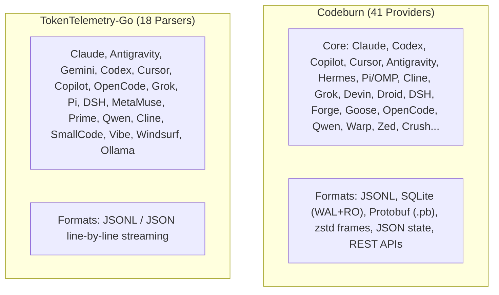
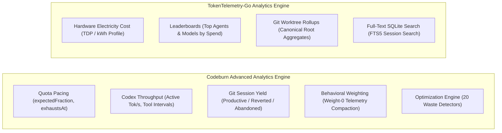

# Research: Comparative Gap Analysis between Codeburn and TokenTelemetry-Go

**Document ID:** `0065-codeburn-tokentelemetry-gap-analysis`  
**Related Ticket:** GitHub Issue #65  
**Target Path:** `docs/research/0065-codeburn-tokentelemetry-gap-analysis.md`  
**Primary Sources:**
- `docs/research/0061-codeburn-log-parsers-and-ingestion.md`
- `docs/research/0062-codeburn-token-calculation-and-pricing-engine.md`
- `docs/research/0063-codeburn-litellm-integration-architecture.md`
- `docs/research/0064-codeburn-data-aggregation-and-metrics-model.md`
- `repositories/tokentelemetry-go`
- `repositories/codeburn`
**Status:** Complete  

---

## 1. Executive Summary

This research document provides a comprehensive comparative gap analysis between **Codeburn** (TypeScript/Node.js-based telemetry engine) and **TokenTelemetry-Go** (Go-based client-server telemetry engine).

| Dimension | Codeburn (`repositories/codeburn`) | TokenTelemetry-Go (`repositories/tokentelemetry-go`) | Primary Gaps in TokenTelemetry-Go |
| :--- | :--- | :--- | :--- |
| **Agent / Provider Parsers** | **41 providers** supported across JSONL, SQLite DBs, Protobuf binaries, JSON state files, and REST APIs. | **18 providers** registered; parses flat JSON/JSONL transcripts via line scanners. | Lacks SQLite DB ingestion (Cursor `state.vscdb`, Copilot `agent-traces.db`), Protobuf wire decoders (Antigravity `.pb`), and 23+ provider adapters. |
| **Token Calculation & Reasoning** | Normalized `TokenUsage` with explicit reasoning tokens, provider output invariants (`REASONING_INCLUDED_IN_OUTPUT`), 5m vs. 1h cache write tiers ($1.6\times$ multiplier). | Basic `TokenUsage` (Input, Output, CacheRead, CacheCreation); lacks reasoning token field and 1h ephemeral cache write tier distinction. | Reasoning tokens can be double-counted or dropped; ephemeral 1h cache write markup missing. |
| **Pricing Engine & Sync** | Dynamic 24h on-disk TTL caching of LiteLLM rate catalog from raw GitHub; recursive prefix peeling (`EXTRA_NAMESPACES`, `ROUTER_PREFIXES`); suffix peeling (`:thinking`, `:cloud`, `-TEE`). | Static embedded catalog (`pricing_data.json`, 933KB); fixed prefix stripping (12 prefixes); no runtime network sync. | Cannot refresh rates without recompiling; lacks proxy wrapper peeling and LiteLLM fast multipliers. |
| **Storage Architecture** | Zero-DB server; multi-tier filesystem caching (`session-cache.v9` month shards, `daily-cache.v29.json` 10-year rolling rollup, `sqlite-ro` snapshots). | Centralized SQLite database (`tokentelemetry.db`) with WAL mode, serialized transactions, and migrations. | Lacks "never-lose history" preservation when agents prune logs; memory-heavy batch loads for multi-GB rollouts. |
| **Time-Series & Analytics** | Dynamic multi-resolution time series (15m, 1h, 1d); strict midnight split; quota pacing & burn rate (`exhaustsAt`); token throughput; git session yield; 20 waste detectors. | Daily aggregations in SQLite (`daily_summaries`); hardware power estimation; leaderboard ranking; git worktree tree aggregation. | Lacks sub-daily time series (15m/1h), quota pacing / burnout projection, token decode throughput, session yield attribution, and waste detectors. |

---

## 2. Agent/Provider Parsers and Transcript Format Inventory

### 2.1 Provider Catalog Comparison



### 2.2 Comprehensive Provider Support Matrix

| Provider / Agent | Codeburn Support | TokenTelemetry-Go Support | Codeburn Source & Formats | TokenTelemetry-Go Source & Formats | Gaps / Differences in TokenTelemetry-Go |
| :--- | :---: | :---: | :--- | :--- | :--- |
| **Claude Code** | ✅ | ✅ | `src/providers/claude.ts`<br>JSONL (`~/.claude/projects/`) & Desktop Cowork directories. | `internal/scanner/parsers/claude.go`<br>JSONL (`.claude/projects`). | TT-Go lacks Cowork desktop session discovery and advisor (`/advisor`) sub-turn splitting. |
| **OpenAI Codex** | ✅ | ✅ | `src/providers/codex.ts`<br>JSONL rollouts (`~/.codex/sessions/`), diff LOC counter, worker-pool parsing. | `internal/scanner/parsers/codex.go`<br>JSONL (`.codex/sessions`). | TT-Go defaults model to `o3-mini`; lacks worker-pool zero-alloc byte scanning for multi-GB rollouts; cumulative usage handling differs. |
| **GitHub Copilot** | ✅ | ⚠️ Partial | `src/providers/copilot.ts`<br>SQLite `agent-traces.db`, `session-store.db`, JetBrains storage, nano-AIU credit tracking. | `internal/scanner/parsers/copilot.go`<br>Plaintext JSON/JSONL matching `copilot` or `chatsessions`. | **Major Gap:** TT-Go cannot read Copilot's SQLite databases, JetBrains directories, or nano-AIU credit conversions. |
| **Cursor** | ✅ | ⚠️ Partial | `src/providers/cursor.ts`<br>SQLite `state.vscdb` in global/workspace storage, bubble turn reconstruction. | `internal/scanner/parsers/cursor.go`<br>Plain JSON/JSONL (`.cursor/projects/`). | **Major Gap:** TT-Go cannot parse Cursor's primary SQLite storage (`state.vscdb`), bubble chat history, or Composer checkpoints. |
| **Cursor Agent** | ✅ | ❌ | `src/providers/cursor-agent.ts`<br>Transcripts (`.txt`) + SQLite `ai-code-tracking.db`. | Not implemented. | Missing in TT-Go. |
| **Antigravity** | ✅ | ⚠️ Partial | `src/providers/antigravity.ts`<br>Protobuf wire decode (`.pb`), SQLite (`.db`), live LS RPC. | `internal/scanner/parsers/antigravity.go`<br>JSONL transcripts (`transcript.jsonl`). | **Major Gap:** TT-Go only parses `.jsonl` dumps; lacks Protobuf binary decoders and live LS RPC clients. |
| **DeepSeek Harness (DSH)** | ✅ | ✅ | `src/providers/dsh.ts`<br>Concatenated zstd frames (`session.jsonl.zstd`), magic byte validation. | `internal/scanner/parsers/dsh.go`<br>JSONL / compressed streams with deep lifecycle and metric extraction. | TT-Go provides rich DSH lifecycle structures, but lacks standalone frame-by-frame resilient zstd chunk decoders. |
| **Google Gemini CLI** | ✅ | ✅ | `src/providers/gemini.ts`<br>JSON transcripts (`session-*.json`), thoughts billing folding. | `internal/scanner/parsers/gemini.go`<br>JSON chat transcripts. | Parity in basic parsing; Codeburn includes thought billing adjustments. |
| **Grok Build** | ✅ | ✅ | `src/providers/grok.ts`<br>JSON metadata + JSONL ACP RPC (`updates.jsonl`). | `internal/scanner/parsers/grok.go`<br>JSONL updates and metadata. | Both handle long-prompt thresholds; Codeburn handles reasoning subtraction normalization. |
| **OpenCode** | ✅ | ⚠️ Partial | `src/providers/opencode.ts`<br>SQLite `opencode*.db` & JSON files. | `internal/scanner/parsers/opencode.go`<br>JSONL files. | TT-Go lacks SQLite `opencode.db` parsing. |
| **Cline / Roo / Kilo / Bob** | ✅ | ⚠️ Partial | `src/providers/cline.ts`, `roo-code.ts`, `kilo-code.ts`, `ibm-bob.ts`<br>VS Code globalStorage tasks. | `internal/scanner/parsers/cline.go`<br>Generic cline tasks JSON. | TT-Go lacks dedicated adapters for Roo Code, KiloCode (SQLite), and IBM Bob. |
| **Hermes** | ✅ | ❌ | `src/providers/hermes.ts`<br>SQLite databases + sidecar delta ledger (`hermes-session-ledger.v1.json`). | Not implemented. | Missing in TT-Go. |
| **Kiro** | ✅ | ❌ | `src/providers/kiro.ts`<br>JSON/JSONL with metered credit conversion ($0.04/credit). | Not implemented. | Missing in TT-Go. |
| **Kimi / Kimi Code** | ✅ | ❌ | `src/providers/kimi.ts`, `kimicode.ts`<br>Wire JSONL + `state.json` lineage. | Not implemented. | Missing in TT-Go. |
| **Devin** | ✅ | ❌ | `src/providers/devin.ts`<br>JSON trajectories & SQLite `sessions.db`. | Not implemented. | Missing in TT-Go. |
| **Droid** | ✅ | ❌ | `src/providers/droid.ts`<br>JSONL + settings; turn token remainder spreading. | Not implemented. | Missing in TT-Go. |
| **Forge & Goose** | ✅ | ❌ | `src/providers/forge.ts`, `goose.ts`<br>SQLite databases (`.forge.db`, `sessions.db`). | Not implemented. | Missing in TT-Go. |
| **Warp & Zed** | ✅ | ❌ | `src/providers/warp.ts`, `zed.ts`<br>SQLite `warp.sqlite`, `threads.db` (zstd blobs). | Not implemented. | Missing in TT-Go. |
| **Vercel AI Gateway** | ✅ | ❌ | `src/providers/vercel-gateway.ts`<br>REST API `/v1/report` ingestion. | Not implemented. | Missing in TT-Go. |
| **MetaMuse, Prime, SmallCode, Windsurf, Ollama** | ⚠️ Generic / Local | ✅ | `src/providers/pi.ts`, local savings accounting in `src/models.ts`. | `internal/scanner/parsers/metamuse.go`, `prime.go`, `smallcode.go`, `windsurf.go`, `ollama.go`. | TT-Go has explicit dedicated parser implementations for these tools. |

---

## 3. Token Calculation, Reasoning Tokens, Cache Tiers, and Rate Catalog Sync

### 3.1 Token Usage Data Models

- **Codeburn (`src/types.ts:1-9`)**:
  ```typescript
  export type TokenUsage = {
    inputTokens: number
    outputTokens: number
    cacheCreationInputTokens: number
    cacheReadInputTokens: number
    cachedInputTokens: number
    reasoningTokens: number
    webSearchRequests: number
  }
  ```
- **TokenTelemetry-Go (`internal/models/session.go:6-11`)**:
  ```go
  type TokenUsage struct {
    InputTokens         int64 `json:"input_tokens"`
    OutputTokens        int64 `json:"output_tokens"`
    CacheReadTokens     int64 `json:"cache_read_tokens"`
    CacheCreationTokens int64 `json:"cache_creation_tokens"`
  }
  ```
  *Gap:* `TokenUsage` in TT-Go lacks `ReasoningTokens`, `CachedInputTokens`, and `WebSearchRequests`.

### 3.2 Reasoning Token Normalization and Invariants

- **Codeburn Invariant (`src/models.ts:27-48`)**:
  ```typescript
  const REASONING_INCLUDED_IN_OUTPUT = new Set(['claude', 'codex', 'copilot'])
  export function billableOutputTokens(provider: string, outputTokens: number, reasoningTokens: number): number {
    return REASONING_INCLUDED_IN_OUTPUT.has(provider) ? outputTokens : outputTokens + reasoningTokens
  }
  ```
  - On **Claude**, **Codex**, and **Copilot**, thinking/reasoning tokens are already part of `output_tokens`. Codeburn avoids double-billing.
  - On **Grok**, **DeepSeek**, and **OpenCode**, reasoning tokens are additive.
- **TokenTelemetry-Go Approach**:
  - TT-Go records string `Thinking` or `ReasoningEffort` on message turns, but does not have a dedicated `ReasoningTokens` metric on `TokenUsage` or `Session`.
  - In `internal/scanner/parsers/codex.go:133-135`, TT-Go tests `u.TotalTokens > (grossInput + outputTokens)` and adds reasoning tokens to `outputTokens`.

### 3.3 Prompt Cache Write Tiers (5-minute vs. 1-hour Ephemeral)

- **Codeburn**:
  - Distinguishes standard 5-minute ephemeral cache creation from 1-hour ephemeral cache creation (`src/types.ts:30-31`, `src/parser.ts:1166-1185`).
  - Implements the $1.6\times$ multiplier for 1-hour cache writes:
    $$C_{\text{write,1h}} = \text{tokens}_{1\text{h}} \times \text{cacheWriteCostPerToken} \times 1.6$$
    (`ONE_HOUR_CACHE_WRITE_MULTIPLIER_FROM_FIVE_MINUTE_RATE = 1.6`, `src/models.ts:76`, `1226`).
- **TokenTelemetry-Go**:
  - In `internal/scanner/parsers/claude.go:46-48`, the parser struct defines `Ephemeral1hInputTokens`, but discards it during turn and session aggregation (`claude.go:137-142`).
  - `CalculateCost` (`internal/pricing/engine.go:46-53`) applies a single static fallback markup of $1.25\times$ to all `CacheCreationTokens` without 1-hour tier scaling.

### 3.4 Rate Catalog Synchronization and Resolution

- **Codeburn Pipeline (`scripts/bundle-litellm.mjs`, `src/models.ts:245-327`)**:
  1. Build-time bundling from LiteLLM + `MANUAL_ENTRIES` + `models.dev` first-party makers + OpenRouter backstop.
  2. Runtime dynamic fetching of raw LiteLLM JSON with 24-hour TTL caching at `~/.cache/codeburn/litellm-pricing.json` (`CACHE_SCHEMA_VERSION = 3`).
  3. Strict resolution hierarchy: User Overrides $\rightarrow$ Aliases $\rightarrow$ Exact Cache $\rightarrow$ Router Prefix Peeling $\rightarrow$ Prefix Overrides $\rightarrow$ Longest Prefix $\rightarrow$ Case-Insensitive Index $\rightarrow$ Suffix Peeling.
  4. Explicit cache write flag (`cacheWriteCostIsExplicit`) to prevent charging write markups on providers that do not charge for cache writes (e.g. OpenAI).
- **TokenTelemetry-Go Pipeline (`internal/pricing/dataset.go`, `resolver.go`)**:
  1. Embeds static JSON snapshot (`pricing_data.json`, 933KB) at compile time via `//go:embed`.
  2. No dynamic runtime network fetching or cache invalidation.
  3. Resolution hierarchy: SQLite `pricing_overrides` $\rightarrow$ Provider Exact $\rightarrow$ Curated Exact $\rightarrow$ Curated Fuzzy Longest Key $\rightarrow$ Bundled Exact $\rightarrow$ Bundled Fuzzy Longest Key $\rightarrow$ Default Fallback.

---

## 4. LiteLLM Integration and Model Routing Prefix Peeling

| Capability | Codeburn (`src/models.ts`) | TokenTelemetry-Go (`internal/pricing/resolver.go`) |
| :--- | :--- | :--- |
| **Gateway Routing Prefixes** | Strips `omniroute:`, `cp/`, `cline-pass/`, `cline-free/`, `cmd/`, `antigravity/`, `orcarouter/` (`ROUTER_PREFIXES: L936-L947`). | Strips 12 static prefixes: `fireworks/`, `together/`, `openrouter/`, `anthropic/`, `openai/`, `google/`, `bedrock/`, `us.*`, `eu.`, `global.` (`NormalizeModelID: L13-L36`). |
| **Proxy Wrapper Namespaces** | Dynamically detects known vendor namespaces; peels `litellm_proxy/`, `openai_like/`, `zhipu/`, `mimo/`, `kimi/` (`EXTRA_NAMESPACES: L889-L918`). | Lacks proxy wrapper peeling (`litellm_proxy/`, `openai_like/`, `orcarouter/`). |
| **Local Namespace Guard** | Explicitly excludes `LOCAL_NAMESPACES = ['ollama']` from namespace stripping so local models never strip to cloud rates (`L899`). | Local models must match explicit local patterns or fall back to default rates. |
| **Pricing Variant Suffixes** | Strips variant suffixes: `:thinking`, `:cloud`, `-TEE` (`L977-L985`). | Suffix peeling not implemented. |
| **Fast Inference Multiplier** | Parses `provider_specific_entry.fast` into `ModelCosts.fastMultiplier` and scales turn costs (`L1216`). | Fast multipliers from LiteLLM provider entries not supported. |
| **Web Search Surcharges** | Adds $0.01 per search request (`WEB_SEARCH_COST`, `L75`, `1228`). | Web search requests not metered in cost engine. |

---

## 5. Data Storage Models, Time-Series Aggregation, Session Lineage, and Metrics

### 5.1 Storage Architecture & On-Disk Schemas

- **Codeburn Architecture:**
  - **Zero-Database Server:** Pure filesystem JSON storage (`~/.cache/codeburn/`).
  - `session-cache.v9/`: Partitioned into provider-month shards (`<provider>.<YYYY-MM>.json`) with envelope tracking to avoid multi-hundred megabyte file rewrites (`src/session-cache.ts:415-472`).
  - `daily-cache.v29.json`: 10-year rolling rollup with "never-lose history" that adopts older versions and carries forward sourceless historical days (`src/daily-cache.ts:105-120`).
  - `sqlite-ro/`: Isolated read-only database snapshot cache with WAL sidecar guards (`src/sqlite.ts:329-370`).
- **TokenTelemetry-Go Architecture:**
  - **Centralized SQLite Database (`tokentelemetry.db`):** Uses `modernc.org/sqlite` in WAL mode with separate single-writer and multi-reader connection pools (`internal/store/db.go:59-96`).
  - Strict relational schema: `sessions`, `message_turns`, `subagent_runs`, `daily_summaries`, `pricing_overrides`, `scanner_checkpoints` (`internal/store/migrations/0001_initial.sql`).
  - Distributed Client-Server Topology: Collector (`tt`) buffers and streams `IngestionBatch` payloads over HTTP to Hub (`tt-server`) (`CONTEXT.md:61-76`, `internal/api/ingest.go`).

### 5.2 Time-Series & Aggregation Models

- **Codeburn Dynamic Bucketing (`src/granular-history.ts:34-82`)**:
  - $\le 48\text{ hours} \implies 15\text{-minute buckets}$
  - $\le 8\text{ days} \implies 1\text{-hour buckets}$
  - $> 8\text{ days} \implies 1\text{-day buckets}$
  - Turn vs. Call midnight split: Prompts anchor turn categories while individual assistant call timestamps anchor token and cost totals (`src/day-aggregator.ts:97-115`).
- **TokenTelemetry-Go Daily Rollups (`internal/store/summaries.go:49-86`)**:
  - Rollups aggregated by `date` (YYYY-MM-DD), `agent_name`, `project_name`, `model_name` into `daily_summaries`.
  - Sub-daily time series (15m, 1h) are not stored or queried.

### 5.3 Session Lineage and Work Units

- **Codeburn Work Units (`CB-1` / `CB-2`, `src/work-units.ts:74-157`)**:
  - Strict zero-inference rule: Subagent linkages are recognized **only** when explicitly recorded by provider logs (Claude sidechains, Kimi `parentAgentId`, Codex `thread_spawn`). Time/folder adjacency guessing is strictly prohibited.
  - Recursively resolves roots, child IDs, and trace IDs (`deriveTraceId`).
- **TokenTelemetry-Go Lineage (`internal/models/session.go:54-64`, `internal/store/migrations/0001_initial.sql:53-64`)**:
  - Modeled via `subagent_runs` table (`parent_session_id`, `child_session_id`, `agent_type`, `tokens`, `cost_usd`).
  - Populated during parser execution when parent metadata is present.

### 5.4 Advanced Metrics and Observability



1. **Quota Pacing & Burn Projection (`src/quota.ts:10-98`)**:
   - Codeburn computes expected vs. used fraction, reset run-rate projection, and burnout ETA (`exhaustsAt`), with noise suppression on windows $\le 6\text{h}$.
   - TT-Go tracks budget limits in `internal/api/budgets.go`, but does not compute real-time exhaustion ETAs or pacing fractions.
2. **Token Decode Throughput & Tool Interval Merging (`src/codex-throughput.ts:6-130`)**:
   - Codeburn computes `generatedTokensPerSecond`, `activeGeneratedTokensPerSecond`, and merges overlapping tool execution intervals.
   - TT-Go computes average duration but lacks active decode throughput and tool interval clipping.
3. **Session Yield Analysis (`src/yield.ts:8-55`)**:
   - Codeburn inspects `git log --all` to classify spend as `productive`, `reverted`, `abandoned`, or `ambiguous`.
   - TT-Go does not perform git commit survival correlation.
4. **Behavioral Weighting (`src/behavioral-weight.ts:14-37`)**:
   - Codeburn assigns weight 0 to non-interactive background events (compaction, ledger sync) to prevent inflating turn counts while preserving 100% of tokens and costs.
   - TT-Go counts all parsed lines as turns.
5. **Hardware Power & Electricity Estimation**:
   - TT-Go provides a native power calculator (`CalculateElectricityCost` in `internal/pricing/power.go`) based on hardware profile TDP and local utility rates ($/kWh).

---

## 6. Detailed Architectural Differences and Missing Capabilities in TokenTelemetry-Go

### Summary of Missing Capabilities in TokenTelemetry-Go

1. **SQLite Agent Log Ingestion:**
   - TokenTelemetry-Go cannot read SQLite database stores generated by major coding assistants (Cursor's `state.vscdb`, Copilot's `agent-traces.db`, OpenCode, Goose, Forge, Warp, Zed).
2. **Protobuf Wire Decoders:**
   - TokenTelemetry-Go lacks Protobuf binary decoders for Antigravity `.pb` conversation logs.
3. **Reasoning Token First-Class Representation:**
   - `models.TokenUsage` lacks a `ReasoningTokens` field, and the engine lacks provider-level reasoning inclusion invariants (`REASONING_INCLUDED_IN_OUTPUT`), risking token miscounts or double-billing.
4. **Multi-Tier Ephemeral Cache Write Pricing:**
   - Lacks 5m vs. 1h ephemeral cache write tier separation and the $1.6\times$ 1-hour multiplier.
5. **Dynamic Runtime LiteLLM Catalog Sync:**
   - Pricing relies on a static embedded JSON dataset; cannot fetch latest rates or update TTL caches without binary recompilation or manual SQLite overrides.
6. **Router Wrapper Peeling:**
   - Lacks peeling for proxy wrappers (`litellm_proxy/`, `openai_like/`, `orcarouter/`, `cline-pass/`, `omniroute:`), suffix variants (`:thinking`, `:cloud`, `-TEE`), and `fastMultiplier` parsing.
7. **Sub-Daily Granular Time Series:**
   - Aggregates are strictly daily (`daily_summaries`); lacks 15-minute and 1-hour adaptive time-series rollups.
8. **Advanced Observability Metrics:**
   - Lacks quota exhaustion ETAs (`exhaustsAt`), active token decode throughput, tool wait interval merging, git commit session yield analysis, and automated waste detectors.

---

## 7. Integration & Modernization Recommendations for TokenTelemetry-Go

1. **Integrate Read-Only SQLite Parser Support:**
   - Implement a readonly SQLite wrapper in Go using `_pragma=mode=ro` and `PRAGMA busy_timeout` to ingest Cursor `state.vscdb`, Copilot `agent-traces.db`, OpenCode, and Goose databases without file locking issues.
2. **Upgrade `TokenUsage` and Enforce Reasoning Invariants:**
   - Add `ReasoningTokens int64`, `CacheCreationOneHourTokens int64`, and `CachedInputTokens int64` to `models.TokenUsage`.
   - Implement `BillableOutputTokens(provider, output, reasoning)` to enforce the single source of truth across inclusive (Claude, Codex, Copilot) and additive (Grok, DeepSeek) models.
3. **Implement 1-Hour Ephemeral Cache Write Multiplier:**
   - Update `pricing.CalculateCost` to calculate:
     $$\text{netCost} = \text{inputCost} + \text{readCost} + (\text{cacheWrite5m} \times \text{rate}_{\text{write}}) + (\text{cacheWrite1h} \times \text{rate}_{\text{write}} \times 1.6) + \text{outputCost}$$
4. **Implement Dynamic LiteLLM Sync with On-Disk Cache:**
   - Add an asynchronous rate syncer in `internal/pricing` that fetches `model_prices_and_context_window.json` from raw GitHub with a 24-hour TTL, writing to `~/.cache/tokentelemetry/litellm-pricing.json` and falling back to embedded `pricing_data.json`.
5. **Expand Prefix & Suffix Peeling Engine:**
   - Upgrade `NormalizeModelID` to support dynamic namespace detection, strip `ROUTER_PREFIXES` (`litellm_proxy/`, `openai_like/`, `orcarouter/`, `cp/`, `cline-pass/`), and peel suffix tags (`:thinking`, `:cloud`, `-TEE`).
6. **Add Granular Time-Series & Pacing Analytics:**
   - Implement SQL or in-memory dynamic bucketing (15m, 1h, 1d) in `internal/store/summaries.go` and `internal/api/stats.go`.
   - Implement `ComputeQuotaPace` in `internal/pricing` or `internal/collector` to compute `expectedFraction`, `deltaFraction`, `projectedAtReset`, and `exhaustsAt`.
7. **Add Git Session Yield & Throughput Metrics:**
   - Add git log inspection to correlate sessions with commit hashes, classifying spend into productive, reverted, and abandoned categories.

---

## 8. Citation Index

| Component / Subsystem | Repository | Source File | Line Range | Key Symbol / Identifier |
| :--- | :--- | :--- | :--- | :--- |
| **Provider Registry** | Codeburn | `src/providers/index.ts` | 196–254 | `CORE_PROVIDERS`, `LAZY_PROVIDERS` |
| **Parser Registry** | TT-Go | `internal/scanner/parsers/registry.go` | 14–42 | `NewDefaultRegistry`, `Register` |
| **Core Parser Engine** | Codeburn | `src/parser.ts` | 175–940, 5180+ | Zero-alloc JSONL scanner, `parseAllSessions` |
| **Scanner Engine** | TT-Go | `internal/scanner/engine.go` | 50–120 | `Engine`, `workerLoop`, `batchWriterLoop` |
| **Token Usage Models** | Codeburn | `src/types.ts` | 1–9 | `TokenUsage` |
| **Token Usage Models** | TT-Go | `internal/models/session.go` | 6–11 | `TokenUsage`, `MessageTurn`, `Session` |
| **Reasoning Output Invariant** | Codeburn | `src/models.ts` | 27–48 | `REASONING_INCLUDED_IN_OUTPUT`, `billableOutputTokens` |
| **1h Ephemeral Cache Multiplier** | Codeburn | `src/models.ts` | 76, 1226 | `ONE_HOUR_CACHE_WRITE_MULTIPLIER_FROM_FIVE_MINUTE_RATE` |
| **Pricing Calculation** | TT-Go | `internal/pricing/engine.go` | 33–60 | `CalculateCost`, `CalculateXAITurnCost` |
| **Model Rate Resolver** | TT-Go | `internal/pricing/resolver.go` | 9–120 | `NormalizeModelID`, `Resolve`, `FuzzyKeyMatches` |
| **LiteLLM Bundler** | Codeburn | `scripts/bundle-litellm.mjs` | 5–178 | `LITELLM_URL`, `MODELS_DEV_FIRST_PARTY`, `MANUAL_ENTRIES` |
| **Dynamic Rate Loader** | Codeburn | `src/models.ts` | 245–327 | `fetchAndCachePricing`, `loadPricing`, `CACHE_SCHEMA_VERSION` |
| **Prefix / Namespace Peeling** | Codeburn | `src/models.ts` | 889–985 | `EXTRA_NAMESPACES`, `ROUTER_PREFIXES`, `stripKnownFirstNamespace` |
| **Session Cache (v9)** | Codeburn | `src/session-cache.ts` | 415–472 | `SessionCache`, `CachedFile`, Month sharding |
| **Daily History Cache (v29)** | Codeburn | `src/daily-cache.ts` | 105–207 | `DailyCache`, `adoptOlderDailyCaches`, never-lose history |
| **SQLite Store & WAL Pools** | TT-Go | `internal/store/db.go` | 59–156 | `DB`, `Writer`, `Reader`, `WithTx` |
| **Granular Time-Series** | Codeburn | `src/granular-history.ts` | 34–82 | `buildGranularHistory`, `granularBucketMinutes` |
| **Quota Pacing Engine** | Codeburn | `src/quota.ts` | 10–98 | `computePace`, `expectedFraction`, `exhaustsAt` |
| **Codex Throughput** | Codeburn | `src/codex-throughput.ts` | 6–130 | `mergeToolIntervals`, `activeGeneratedTokensPerSecond` |
| **Session Yield Analysis** | Codeburn | `src/yield.ts` | 8–55 | `YieldSummary`, `resolveRepoIdentity` |
| **Work Units & Lineage** | Codeburn | `src/work-units.ts` | 74–157 | `resolveWorkUnits`, `deriveTraceId` |
| **Power & Electricity Engine**| TT-Go | `internal/pricing/power.go` | 1–80 | `CalculateElectricityCost`, `PowerConfig` |

---

## 9. Resolution Summary for GitHub Issue #65

Investigation and comparative gap analysis between **Codeburn** and **TokenTelemetry-Go** across all 4 key areas confirm:
1. **Parsers & Ingestion:** Codeburn provides 41 provider adapters across JSONL, SQLite DBs (WAL readonly isolation), Protobuf binary wire decoders, and REST APIs. TokenTelemetry-Go has 18 parsers scanning flat JSON/JSONL transcripts, lacking SQLite database ingestion (Cursor `state.vscdb`, Copilot `agent-traces.db`) and Protobuf decoding.
2. **Token Calculation & Pricing Engine:** Codeburn normalizes reasoning tokens with provider output invariants (`REASONING_INCLUDED_IN_OUTPUT`), prices 1-hour ephemeral cache writes at $1.6\times$, and dynamically refreshes LiteLLM rate catalogs with 24-hour on-disk caching. TokenTelemetry-Go uses an embedded static JSON dataset and lacks reasoning token fields, 1-hour cache write multipliers, and runtime catalog sync.
3. **LiteLLM & Gateway Prefix Peeling:** Codeburn peels proxy wrappers (`litellm_proxy/`, `openai_like/`, `orcarouter/`), router prefixes, and suffix variants (`:thinking`, `:cloud`, `-TEE`), with local namespace guards. TokenTelemetry-Go has a static 12-prefix stripper without proxy wrapper or suffix peeling.
4. **Storage & Analytics:** Codeburn uses zero-DB sharded file caches (`session-cache.v9`, `daily-cache.v29.json`) with never-lose history rollups, dynamic multi-resolution time series (15m/1h/1d), quota pacing with exhaustion ETAs (`exhaustsAt`), token throughput, and git session yield. TokenTelemetry-Go uses a central SQLite database with WAL pools, daily rollups, and hardware power estimation.
