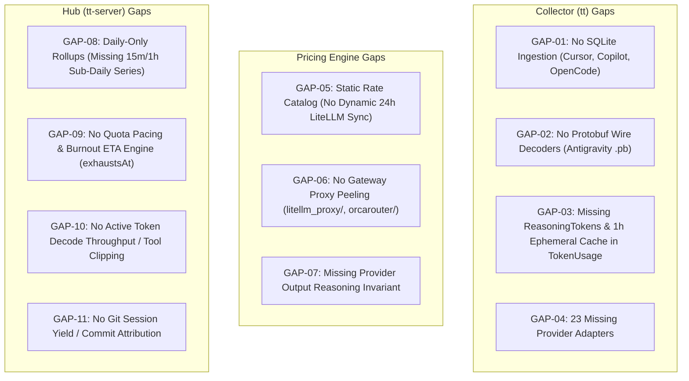

# TokenTelemetry-Go Gap Analysis & Feature Integration Specification

**Document Status:** Master Specification  
**Target Repository:** `repositories/tokentelemetry-go`  
**Reference Benchmark:** `repositories/codeburn`  
**Domain Vocabulary:** [`CONTEXT.md`](file:///Users/robin.a.paul/Proj/token-analyzer/repositories/tokentelemetry-go/CONTEXT.md)  
**Related Research:** [`docs/research/0065-codeburn-tokentelemetry-gap-analysis.md`](file:///Users/robin.a.paul/Proj/token-analyzer/docs/research/0065-codeburn-tokentelemetry-gap-analysis.md)  

---

## 1. Executive Summary & Objectives

`TokenTelemetry-Go` is a high-performance single-binary telemetry and analytics engine designed for local AI coding agents. It follows a distributed topology consisting of:
- **Collector (`tt`)**: Workstation CLI watching agent transcript directories, parsing message turns, and transmitting ingestion batches.
- **Hub (`tt-server`)**: Telemetry backend server providing SQLite persistence, REST/SSE APIs, aggregation, and hosting the embedded Astro Web UI.

A comparative architecture audit against **Codeburn** (`repositories/codeburn`) surfaces key functional and parity gaps in four core areas:
1. **Parser & Format Coverage:** TokenTelemetry-Go supports 18 agent parsers (strictly scanning plaintext JSON/JSONL), whereas Codeburn supports 41 agent sources, including SQLite stores (Cursor `state.vscdb`, Copilot `agent-traces.db`) and Protobuf binaries (Antigravity `.pb`).
2. **Token Calculation & Reasoning Semantics:** TokenTelemetry-Go lacks first-class reasoning token metrics, provider output invariants (`REASONING_INCLUDED_IN_OUTPUT`), and the $1.6\times$ 1-hour ephemeral cache write markup.
3. **Pricing Engine & LiteLLM Synchronization:** TokenTelemetry-Go embeds a static JSON dataset at compile time, lacking dynamic 24-hour rate updates from LiteLLM and proxy wrapper peeling (`litellm_proxy/`, `openai_like/`, `orcarouter/`).
4. **Time-Series & Pacing Analytics:** TokenTelemetry-Go records daily summaries but lacks sub-daily time series (15m/1h), quota pacing / burnout projection (`exhaustsAt`), active token decode throughput, and git commit session yield attribution.

This specification details the architectural enhancements and phased roadmap to port these capabilities into `repositories/tokentelemetry-go`.

---

## 2. Gap Catalog & Subsystem Comparison



### 2.1 Detailed Gap Matrix

| ID | Subsystem | Codeburn Reference | TokenTelemetry-Go Current | Actionable Specification |
| :--- | :--- | :--- | :--- | :--- |
| **GAP-01** | Collector / Parsers | `src/sqlite.ts`<br>Reads Cursor `state.vscdb`, Copilot `agent-traces.db`, OpenCode, KiloCode, Goose, Forge, Warp, Zed. | `internal/scanner/engine.go`<br>Only scans plaintext `.jsonl`/`.json` lines via filesystem walkers. | Implement a read-only SQLite reader in Go (`modernc.org/sqlite` with `_pragma=mode=ro`) to parse SQLite stores without locking. |
| **GAP-02** | Collector / Parsers | `src/providers/antigravity.ts`<br>Decodes Antigravity `.pb` binary transcripts and Language Server RPC. | `internal/scanner/parsers/antigravity.go`<br>Only parses JSONL transcripts. | Add Protobuf wire decoding for Antigravity `.pb` conversation logs. |
| **GAP-03** | Core Models / Tokens | `src/types.ts:1-9`<br>`TokenUsage` contains `reasoningTokens`, `cacheCreationOneHourTokens`, `cachedInputTokens`, `webSearchRequests`. | `internal/models/session.go:6-11`<br>`TokenUsage` only has `InputTokens`, `OutputTokens`, `CacheReadTokens`, `CacheCreationTokens`. | Extend `models.TokenUsage` with `ReasoningTokens`, `CacheCreationOneHourTokens`, `CachedInputTokens`, and `WebSearchRequests`. |
| **GAP-04** | Collector / Parsers | `src/providers/index.ts`<br>41 supported provider adapters. | `internal/scanner/parsers/registry.go`<br>18 registered parsers. | Port high-priority missing adapters (Kiro, Hermes, Kimi Code, Devin, Droid, Roo Code). |
| **GAP-05** | Pricing Engine | `src/models.ts:245-327`<br>Fetches LiteLLM raw GitHub JSON; 24h disk TTL cache (`~/.cache/codeburn/litellm-pricing.json`). | `internal/pricing/dataset.go`<br>Static embedded JSON (`pricing_data.json`, 933KB); no runtime network sync. | Add async background LiteLLM rate synchronizer with on-disk caching at `~/.cache/tokentelemetry/litellm-pricing.json`. |
| **GAP-06** | Pricing Resolver | `src/models.ts:889-985`<br>Peels `ROUTER_PREFIXES` (`litellm_proxy/`, `openai_like/`, `orcarouter/`, `cp/`, `cline-pass/`), strips suffixes (`:thinking`, `:cloud`, `-TEE`). | `internal/pricing/resolver.go:13-36`<br>Strips 12 static vendor prefixes. | Upgrade `NormalizeModelID` to peel gateway proxies, suffix variants, and support `fastMultiplier`. |
| **GAP-07** | Pricing Engine | `src/models.ts:27-43`<br>`billableOutputTokens` prevents double-counting reasoning on Claude, Codex, Copilot. | `internal/scanner/parsers/codex.go:133-135`<br>Ad-hoc output addition. | Implement `BillableOutputTokens(provider, output, reasoning)` as the single source of truth across pricing and reporting. |
| **GAP-08** | Hub / Time-Series | `src/granular-history.ts:34-82`<br>Dynamic bucketing: 15m ($\le 48\text{h}$), 1h ($\le 8\text{d}$), 1d ($>8\text{d}$). | `internal/store/summaries.go:49-86`<br>Strictly daily rollups in `daily_summaries`. | Add sub-daily time-series aggregation query endpoints (15m, 1h) in Hub API. |
| **GAP-09** | Hub / Analytics | `src/quota.ts:10-98`<br>Computes `expectedFraction`, `deltaFraction`, `projectedAtReset`, and `exhaustsAt`. | `internal/api/budgets.go`<br>Tracks budget thresholds without burn pacing or exhaustion ETAs. | Implement `ComputeQuotaPace` calculating real-time burn projection and burnout timestamp. |
| **GAP-10** | Collector / Metrics | `src/codex-throughput.ts:6-130`<br>Active generated tokens/sec and tool interval merging. | `internal/models/session.go`<br>Only tracks turn duration. | Add active decode throughput calculation (`TokensPerSecond`) and tool execution clipping. |
| **GAP-11** | Hub / Analytics | `src/yield.ts:8-55`<br>Correlates sessions with `git log --all` (`productive`, `reverted`, `abandoned`). | Not implemented. | Add git commit outcome attribution service in Hub. |

---

## 3. Phased Implementation Roadmap

> **Status update (2026-08-29):** This roadmap is superseded by the [Codeburn Parity Implementation Specification](codeburn-parity-implementation-spec.md), which verdicts each gap individually (accept / defer / reject with re-entry triggers). Recorded corrections: GAP-10's premise is stale — `TTFTMsAvg` and DSH latency/throughput already exist in TokenTelemetry-Go; and the observed `gemini-3.1-pro-preview` $0.00 billing was traced to model ID normalization, not catalog staleness.

### Phase 1: Core Token Model, Reasoning Invariants & Dynamic Pricing Engine
*Focus: Accuracy of token counting and pricing freshness.*

1. **Extend `internal/models/session.go`**:
   ```go
   type TokenUsage struct {
       InputTokens               int64 `json:"input_tokens" db:"input_tokens"`
       OutputTokens              int64 `json:"output_tokens" db:"output_tokens"`
       CacheReadTokens           int64 `json:"cache_read_tokens" db:"cache_read_tokens"`
       CacheCreationTokens       int64 `json:"cache_creation_tokens" db:"cache_creation_tokens"`
       CacheCreationOneHourTokens int64 `json:"cache_creation_one_hour_tokens" db:"cache_creation_one_hour_tokens"`
       CachedInputTokens         int64 `json:"cached_input_tokens" db:"cached_input_tokens"`
       ReasoningTokens           int64 `json:"reasoning_tokens" db:"reasoning_tokens"`
       WebSearchRequests         int64 `json:"web_search_requests" db:"web_search_requests"`
   }
   ```
2. **Implement Reasoning Invariant in `internal/pricing/engine.go`**:
   ```go
   var reasoningIncludedProviders = map[string]bool{
       "claude": true,
       "codex":  true,
       "copilot": true,
   }

   func BillableOutputTokens(provider string, outputTokens, reasoningTokens int64) int64 {
       if reasoningIncludedProviders[strings.ToLower(provider)] {
           return outputTokens
       }
       return outputTokens + reasoningTokens
   }
   ```
3. **Implement 1-Hour Ephemeral Cache Write Multiplier**:
   Update `CalculateCost` to apply $1.6\times$ rate markup to `CacheCreationOneHourTokens`.
4. **Implement Dynamic LiteLLM Sync with On-Disk Cache (`internal/pricing/syncer.go`)**:
   - Downloads `model_prices_and_context_window.json` from `BerriAI/litellm` in background with 24-hour TTL.
   - Persists cache to `~/.cache/tokentelemetry/litellm-pricing.json`.
   - Falls back gracefully to embedded `pricing_data.json`.
5. **Implement Gateway Proxy Peeling (`internal/pricing/resolver.go`)**:
   - Support stripping `litellm_proxy/`, `openai_like/`, `orcarouter/`, `cp/`, `cline-pass/`, `omniroute:`.
   - Strip suffixes `:thinking`, `:cloud`, `-TEE`.

---

### Phase 2: Read-Only SQLite & Protobuf Ingestion for Collector (`tt`)
*Focus: Broadening agent ingestion to match modern IDE stores.*

1. **Read-Only SQLite Ingestion Engine (`internal/scanner/sqlite_reader.go`)**:
   - Safe readonly SQLite connection pool using `_pragma=mode=ro&_pragma=busy_timeout=1000`.
   - Implements safe string extraction from BLOB fields to avoid process panics on corrupted UTF-8.
2. **Cursor SQLite Adapter (`internal/scanner/parsers/cursor_sqlite.go`)**:
   - Ingests `Cursor/User/globalStorage/state.vscdb` bubble chat history, tool calls, and model metadata.
3. **Copilot SQLite Adapter (`internal/scanner/parsers/copilot_sqlite.go`)**:
   - Ingests `agent-traces.db`, `session-store.db`, and JetBrains Copilot storage; maps nano-AIU to USD ($10^9\text{ nano-AIU} = \$0.01$).
4. **Antigravity Protobuf Decoder (`internal/scanner/parsers/antigravity_pb.go`)**:
   - Implements wire decoder for `.pb` conversation transcripts.

---

### Phase 3: Sub-Daily Time-Series & Observability Analytics for Hub (`tt-server`)
*Focus: Granular interactive dashboards and burn intelligence.*

1. **Dynamic Bucketing Endpoint (`internal/api/stats.go`)**:
   - Computes 15m, 1h, and 1d rollups on demand from `message_turns`.
2. **Quota Pacing Engine (`internal/analytics/pacing.go`)**:
   - Computes pacing metrics for subscription windows:
     $$\text{expectedFraction} = \frac{\text{elapsedSeconds}}{\text{windowSeconds}}$$
     $$\text{deltaFraction} = \text{usedFraction} - \text{expectedFraction}$$
     $$\text{exhaustsAt} = \text{now} + \left(\frac{1 - \text{usedFraction}}{\text{usedPerSecond}}\right)$$
3. **Git Session Yield Correlation (`internal/analytics/yield.go`)**:
   - Runs background git log inspection to classify session spend into productive, reverted, and abandoned commits.

---

## 4. Verification & Test Strategy

1. **Synthetic Transcripts & Fixtures**:
   - Port Codeburn test fixtures from `repositories/codeburn/tests/` into `repositories/tokentelemetry-go/test/fixtures/`.
   - Verify that SQLite parsers (Cursor, Copilot) produce identical turn and cost outputs in Go as in TypeScript.
2. **Pricing Engine Parity Tests**:
   - Run a test suite comparing Go pricing outputs against Codeburn test cases (`tests/models.test.ts`) across 100+ model configurations, reasoning variants, and cache tiers.
3. **Benchmark Tests**:
   - Ensure Collector parsing throughput exceeds 10,000 turns/second with zero memory leaks during multi-GB rollout scans.
