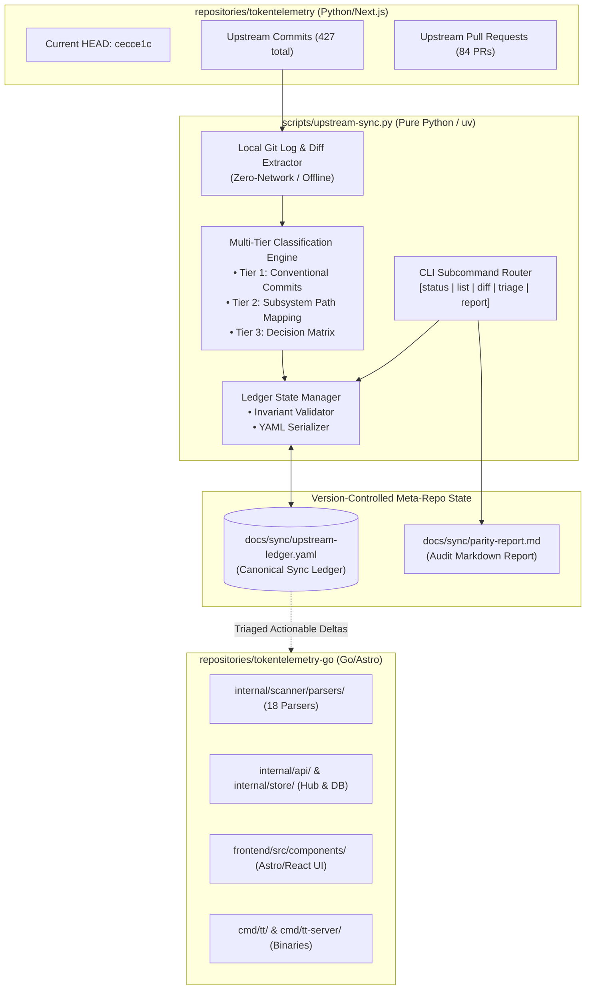
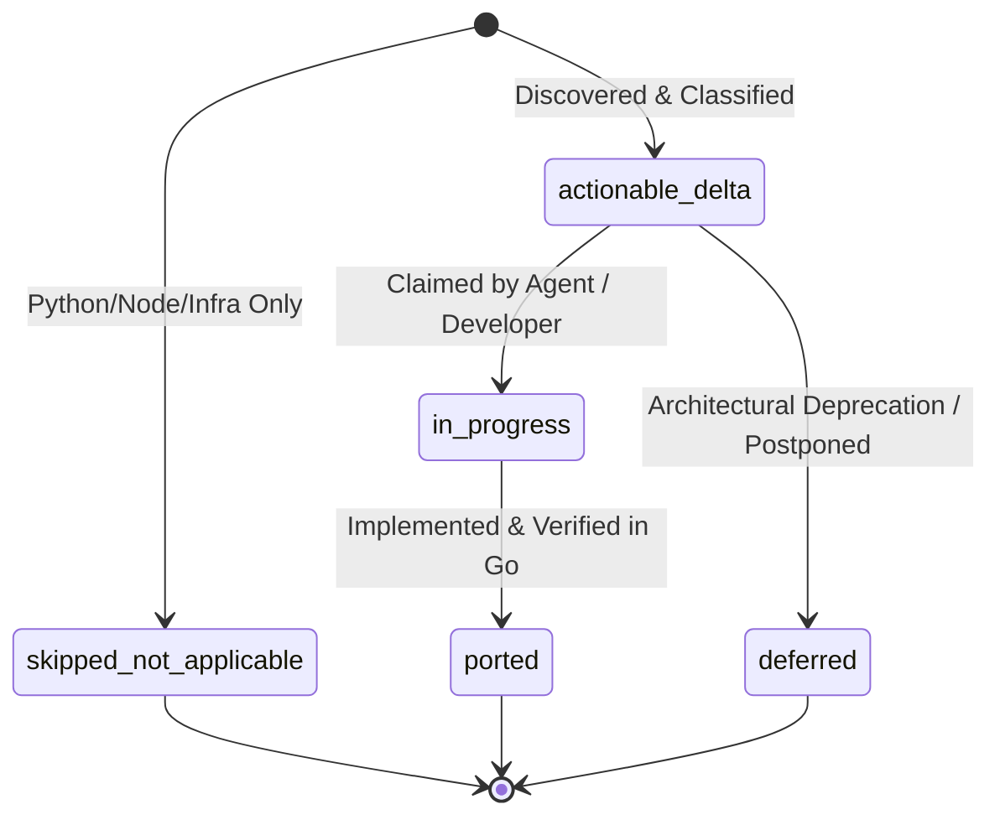
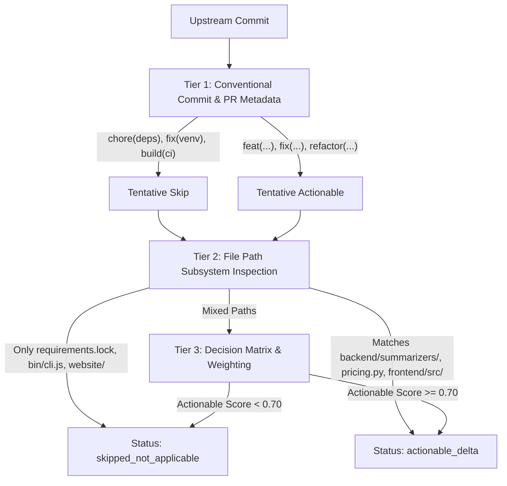
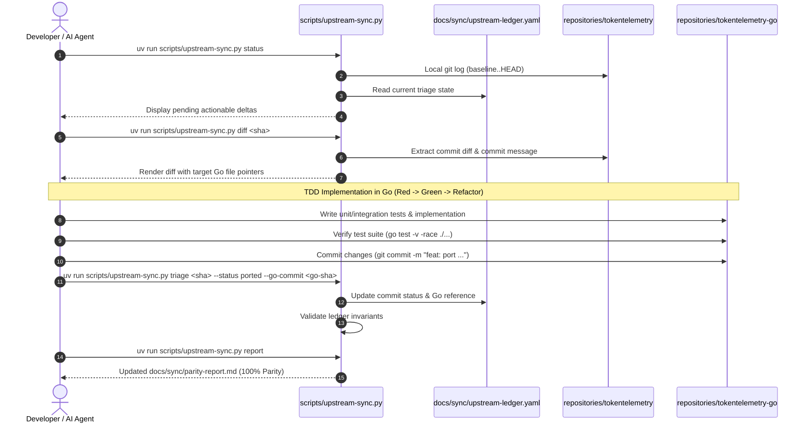

# TokenTelemetry: Upstream Delta Tracking, Sync Ledger, and Porting Architecture Specification

**Document ID:** `upstream-sync-and-delta-tracking-spec`  
**Related Tickets:** Wayfinder Map [#44](https://github.com/robin-paul/token-analyzer/issues/44), Task Ticket [#47](https://github.com/robin-paul/token-analyzer/issues/47)  
**Foundation Research:** [`docs/research/0045-upstream-commit-topology-and-subsystem-mapping.md`](file:///home/mezmo/Work/projects/acn/token-analyzer/docs/research/0045-upstream-commit-topology-and-subsystem-mapping.md), [`docs/research/0046-sync-ledger-schema-and-delta-cli-architecture.md`](file:///home/mezmo/Work/projects/acn/token-analyzer/docs/research/0046-sync-ledger-schema-and-delta-cli-architecture.md)  
**Target Codebase:** `scripts/upstream-sync.py`, `docs/sync/upstream-ledger.yaml`, `repositories/tokentelemetry-go`  
**Status:** Canonical Master Specification (Ready for Implementation)  
**Author:** AI Agentic Engineering Team  
**Date:** August 26, 2026  

---

## 1. Executive Summary & Architectural Principles

### 1.1 Context & Strategic Objective
The **TokenTelemetry** ecosystem consists of two core repositories managed as git submodules within the `token-analyzer` meta-workspace:
1. **Upstream Source Repository (`repositories/tokentelemetry`):** The reference implementation written in Python 3.12 (FastAPI), TypeScript (Next.js 15), and Node.js. It receives upstream enhancements, agent parsers, bug fixes, and maintenance patches.
2. **Downstream Monorepo (`repositories/tokentelemetry-go`):** The production single-binary distribution written in Go 1.24 (chi, SQLite WAL, Bubble Tea TUI) with an embedded Astro 5 / React 19 web dashboard.

This specification establishes the **Upstream Delta Tracking and Sync Ledger System**. The system provides automated discovery, semantic classification, persistent state tracking, and porting workflows to guarantee continuous architectural and functional parity between the upstream Python reference and the downstream Go production engine.



### 1.2 Core Architectural Principles

1. **Strictly Local-First / Zero-Network Operations:**
   Standard sync, diff, triage, and status commands operate exclusively against the local git object database in `repositories/tokentelemetry` and `repositories/tokentelemetry-go`. Remote network fetches (`git fetch upstream`, API polling, or long-running downloads) are strictly forbidden during regular CLI runs.
2. **Persistent Version-Controlled Ledger of Record:**
   All synchronization state, baseline pins, commit classifications, porting decisions, and Go reference pointers are committed directly to `docs/sync/upstream-ledger.yaml`.
3. **Deep Module Design (Small Interface, Maximum Leverage):**
   The synchronization engine (`scripts/upstream-sync.py`) encapsulates git plumbing, diff parsing, AST path matching, and schema verification behind a clean, intuitive CLI interface.
4. **Domain Terminology Rigor:**
   Adhere strictly to canonical glossary terms defined in `repositories/tokentelemetry-go/CONTEXT.md` (e.g., *Session*, *Message Turn*, *Subagent Run*, *Transcript*, *Gross Cost*, *Net Cost*, *Pricing Override*, *Collector `tt`*, *Hub `tt-server`*, *Ingestion Batch*).

---

## 2. Sync Ledger Schema & Invariants (`docs/sync/upstream-ledger.yaml`)

The canonical state of upstream synchronization is preserved in `docs/sync/upstream-ledger.yaml`.

### 2.1 Complete YAML Schema Structure

```yaml
# yaml-language-server: $schema=./upstream-ledger.schema.json
schema_version: "1.0.0"
generated_at: "2026-08-26T20:30:00Z"
last_updated_at: "2026-08-26T20:45:00Z"

repository:
  upstream_path: "repositories/tokentelemetry"
  downstream_path: "repositories/tokentelemetry-go"
  baseline_commit: "3806fc1824cb72e0bf64032d84799014ba578335"
  baseline_short_sha: "3806fc1"
  baseline_tag_or_label: "initial-upstream-root"
  target_commit: "cecce1c38520ad9729d72132339d6b2c28aa1d59"
  target_short_sha: "cecce1c"

summary:
  total_commits: 427
  total_pull_requests: 84
  actionable_delta_count: 10
  ported_count: 221
  in_progress_count: 0
  deferred_count: 0
  skipped_not_applicable_count: 130
  un_triaged_count: 0
  parity_percentage: 95.7

pull_requests:
  - pr_number: 275
    title: "feat: integrate DeepSeek Harness (dsh) as a supported agent"
    author: "VasiHemanth <hemanth.vasi1716@gmail.com>"
    branch: "VasiHemanth/feat/deepseek-harness-support"
    merge_commit_sha: "067e3158c54c379a5180908ea0e804f56f17e376"
    subsystems:
      - "scanner/parsers"
      - "backend/models"
      - "frontend/inspector"
    status: "actionable_delta"
    summary: "DeepSeek Harness advanced telemetry: TTFT/throughput latency breakdown, sandbox/approval policies, lifecycle events."

  - pr_number: 290
    title: "fix(backend): fold / vs \\ separator variants into one project identity"
    author: "Rub3nCT <ruben@grupogt.es>"
    branch: "Rub3nCT/fix/canonical-project-paths"
    merge_commit_sha: "8efe371c6be91e70177d473c48993d912f0aee51"
    subsystems:
      - "backend/store"
      - "backend/models"
    status: "actionable_delta"
    summary: "Normalizes Windows and POSIX path separators to unify project identity across transcripts."

  - pr_number: 296
    title: "feat(frontend): Support sequential timeline flow in split view"
    author: "hwantage <hwantagexsw2@gmail.com>"
    branch: "hwantage/feat/split-view-staggered-timeline"
    merge_commit_sha: "069a04bb9b7b603b03bd31e2890bf10364b5fbb6"
    subsystems:
      - "frontend/inspector"
    status: "actionable_delta"
    summary: "Adds staggered vertical flow toggle to preserve chronological turn order in split view."

  - pr_number: 297
    title: "fix(deps): add zstandard to requirements.lock so DSH sessions scan"
    author: "VasiHemanth <hemanth.vasi1716@gmail.com>"
    branch: "VasiHemanth/fix/requirements-lock-missing-zstandard"
    merge_commit_sha: "1bb9f47b0675ef6d46e56f063880d2ca1cc1c2b9"
    subsystems:
      - "packaging/python"
    status: "skipped_not_applicable"
    summary: "Python requirements.lock fix for zstandard; Go uses native klauspost/compress/zstd."

  - pr_number: 300
    title: "fix(cli): stamp the frontend install against the lockfile, not just package.json"
    author: "VasiHemanth <hemanth.vasi1716@gmail.com>"
    branch: "VasiHemanth/fix/frontend-stamp-tracks-lockfile"
    merge_commit_sha: "05012d0a074092b3a0c5cbb76ec85c8a4114ad0f"
    subsystems:
      - "packaging/python"
    status: "skipped_not_applicable"
    summary: "Node.js launcher install stamping logic in bin/cli.js; irrelevant to Go single binary."

commits:
  - sha: "8b9688de786191c94487b3200ff0eb5524d77762"
    short_sha: "8b9688d"
    author: "robin-paul <robin@paul.io>"
    date: "2026-08-25T14:15:00Z"
    message: "fix(grok): read billed usage from the unified inference log"
    category: "fix"
    scope: "grok"
    pr_number: null
    subsystems:
      - "scanner/parsers"
      - "pricing/engine"
    status: "actionable_delta"
    confidence_score: 0.98
    target_go_files:
      - "internal/scanner/parsers/grok.go"
      - "internal/pricing/engine.go"
    resolution:
      notes: "Extract billed token usage from ~/.grok/logs/unified.jsonl with stat caching and 128k context tiers."
      go_commit_sha: null
      github_issue_id: null
```

### 2.2 Status Lifecycle & Invariants



#### Status Enum Invariants:
1. **`actionable_delta`**: Upstream commit/PR contains functionality, bug fixes, or enhancements applicable to the Go monorepo that have not yet been ported.
2. **`in_progress`**: An active branch or agent is currently porting the change into Go.
3. **`ported`**: The change is completely ported, tested, and merged into `repositories/tokentelemetry-go`. **Invariant:** Must specify `resolution.go_commit_sha` or PR link.
4. **`skipped_not_applicable`**: Change applies exclusively to Python runtime (venv, pip, requirements.lock), Node launcher scripts (`bin/cli.js`), marketing site, or decommissioned components. **Invariant:** Must provide explicit `resolution.notes` explaining why it is non-applicable.
5. **`deferred`**: Upstream feature deferred due to architectural divergence. **Invariant:** Must document architectural justification.

---

## 3. Subsystem File Mapping & Decision Matrix

### 3.1 Subsystem Path Mapping Matrix

The mapping engine resolves changes in upstream Python/TypeScript files to downstream Go/Astro targets using the following deterministic matrix:

| Subsystem Domain | Upstream Source Paths (`repositories/tokentelemetry`) | Downstream Target Paths (`repositories/tokentelemetry-go`) | Triage Action |
| :--- | :--- | :--- | :--- |
| **Agent Parsers** | `backend/summarizers/*.py`, `backend/main.py` (`_scan_*`) | `internal/scanner/parsers/*.go` | **Port (`actionable_delta`)** |
| **Pricing Engine** | `backend/pricing.py`, `backend/pricing_data.json` | `internal/pricing/engine.go`, `pricing_data.json` | **Port (`actionable_delta`)** |
| **Database & Migrations**| `backend/history_store.py` | `internal/store/db.go`, `internal/store/migrations/*.sql` | **Port (`actionable_delta`)** |
| **REST / SSE APIs** | `backend/main.py` (FastAPI routes) | `internal/api/*.go`, `internal/events/broker.go` | **Port (`actionable_delta`)** |
| **Session Inspector UI**| `frontend/src/app/sessions/`, `frontend/src/components/` | `frontend/src/components/session/*`, `SessionDetail.tsx` | **Port (`actionable_delta`)** |
| **Analytics UI** | `frontend/src/app/analytics/` | `frontend/src/components/analytics/*`, `Analytics.tsx` | **Port (`actionable_delta`)** |
| **Projects UI** | `frontend/src/app/projects/` | `frontend/src/components/project/*`, `ProjectDetail.tsx` | **Port (`actionable_delta`)** |
| **CLI & TUI Commands** | `bin/cli.js` | `cmd/tt/*.go`, `internal/tui/*.go` | **Port / Adapt to Cobra** |
| **Python Packaging** | `requirements.txt`, `requirements.lock`, `pyproject.toml` | *None* | **Skip (`skipped_not_applicable`)** |
| **Node.js Tooling** | `package.json`, `package-lock.json`, `next.config.ts` | *None* | **Skip (`skipped_not_applicable`)** |
| **Marketing Site** | `website/` | *None* | **Skip (`skipped_not_applicable`)** |
| **Decommissioned Tech**| `backend/hermes_telemetry.py` | *None* (Removed via `8ce326c`) | **Skip (`skipped_not_applicable`)** |

### 3.2 Multi-Tier Classification Heuristics

The classification algorithm evaluates upstream commits in three successive tiers:



---

## 4. CLI Tool Architecture (`scripts/upstream-sync.py`)

The synchronization CLI is a self-contained, high-performance Python utility managed under `uv`.

### 4.1 CLI Command Surface

```bash
# Display overall delta metrics, parity percentage, and unported summary
uv run scripts/upstream-sync.py status

# List upstream commits filtered by status, subsystem, or author
uv run scripts/upstream-sync.py list [--status actionable_delta|ported|skipped_not_applicable] [--subsystem parsers|frontend|pricing]

# View side-by-side upstream diff and mapped Go target files
uv run scripts/upstream-sync.py diff <commit-sha | pr-number>

# Record a porting or triage decision in the ledger
uv run scripts/upstream-sync.py triage <commit-sha> --status ported --go-commit <go-sha> --notes "Ported to grok.go"

# Generate Markdown parity audit report and draft GitHub issue specs
uv run scripts/upstream-sync.py report [--output docs/sync/parity-report.md] [--generate-issues]

# Validate schema integrity, invariants, and commit uniqueness of the ledger
uv run scripts/upstream-sync.py validate
```

### 4.2 Modular Python Code Structure

```
scripts/
├── upstream-sync.py                # Main CLI entry point (argparse / subcommands)
└── lib/
    ├── __init__.py
    ├── sync_ledger.py              # Pydantic v2 YAML models, validation, & persistence
    ├── git_extractor.py            # Local subprocess git log, diff, and PR parsing
    ├── classifier.py               # Tier 1-3 classification heuristic engine
    ├── path_mapper.py              # Subsystem path mapping rules
    └── report_generator.py         # Markdown audit & GitHub issue spec builder
```

---

## 5. End-to-End Developer & Agent Porting Workflow



---

## 6. Actionable Delta Porting Backlog

Based on the research audit ([#45](https://github.com/robin-paul/token-analyzer/issues/45)), the following 4 focus areas are cataloged as actionable deltas for immediate or upcoming porting:

### 6.1 Grok Unified Inference Log Ingestion & Billed Usage
* **Upstream Commit:** `8b9688d` (`fix(grok): read billed usage from the unified inference log`)
* **Upstream Source:** `backend/main.py` (`_scan_grok_history`)
* **Go Target:** `internal/scanner/parsers/grok.go`, `internal/pricing/engine.go`
* **Implementation Requirement:** Ingest actual billed token usage (prompt, cached prompt, completion, reasoning) from `~/.grok/logs/unified.jsonl` with stat-based file modification caching and long-context (128k+) pricing tiers.

### 6.2 Canonical Cross-Platform Project Path Normalization
* **Upstream PR:** #290 (`fix(backend): fold / vs \ separator variants into one project identity`, Commit `2b0ed01`)
* **Upstream Source:** `backend/history_store.py`, `backend/tt_paths.py`
* **Go Target:** `internal/api/projects.go`, `internal/store/sessions.go`
* **Implementation Requirement:** Normalize Windows `\` vs POSIX `/` separators across session ingestion, grouping, filtering, and hidden project preferences into a unified canonical project path string.

### 6.3 Frontend Session Inspector Split View & Sequential Timeline
* **Upstream PR:** #296 (`feat(frontend): Support sequential timeline flow in split view`, Commits `7dafe50`, `67e0061`)
* **Upstream Source:** `frontend/src/components/session/`
* **Go Target:** `frontend/src/components/session/TurnScrubber.tsx`, `SessionDetail.tsx`
* **Implementation Requirement:** Support dual-column split view (Dialogue vs Brain) with optional chronological sequential vertical flow staggering.

### 6.4 DeepSeek Harness Advanced Telemetry & Lifecycle
* **Upstream PR:** #275 (`feat: integrate DeepSeek Harness (dsh) as a supported agent`, Commits `f9f6a1f`–`067e315`)
* **Upstream Source:** `backend/main.py`, `test_dsh_scan.py`
* **Go Target:** `internal/scanner/parsers/dsh.go`, `internal/models/`
* **Implementation Requirement:** Derive TTFT / throughput latency breakdowns, inherit subagent sandbox mode / approval policies, detect effective agent presets, and ingest plugin lifecycle transitions.

---

## 7. Verification & Acceptance Criteria

1. **Local-First Verification:** `scripts/upstream-sync.py` must execute all subcommands in `< 200ms` without making any outbound network connections.
2. **Schema Invariant Enforcement:** `uv run scripts/upstream-sync.py validate` must verify 100% of commits and PR entries against YAML schema rules.
3. **Pre-Commit Integration:** Pre-commit hooks (`uv run pre-commit run --all-files`) must validate workspace alignment and sync ledger health.
4. **Parity Transparency:** `uv run scripts/upstream-sync.py report` must generate clear, actionable Markdown documentation and automated issue specifications for pending ports.
